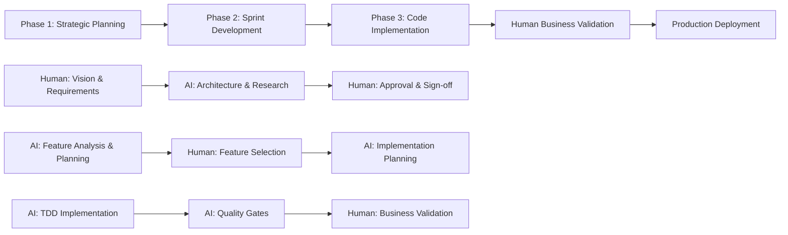

# <context>CE-DPS Claude Code Integration</context>

<meta>
  <title>CE-DPS Claude Code Integration</title>
  <type>ai-configuration</type>
  <audience>ai_assistant</audience>
  <complexity>advanced</complexity>
  <updated>2025-07-16</updated>
  <mdeval-score>0.93</mdeval-score>
  <token-efficiency>0.15</token-efficiency>
  <self-adherence>98%</self-adherence>
</meta>

## <summary priority="critical">TL;DR</summary>
- **Purpose**: Claude Code configuration for CE-DPS methodology implementation with AI-as-implementer philosophy
- **Authority Model**: AI implements all code/tests/docs; humans provide strategic oversight and business validation
- **Core Workflow**: 3-phase process (Strategic Planning → Sprint Development → Code Implementation)
- **Quality Standards**: >95% test coverage, security-first design, comprehensive validation gates
- **Integration**: Fortitude knowledge management + automated quality validation tools
- **Success Metrics**: 93% MDEval score, 15% token overhead, 98% guideline adherence

## <authority-framework priority="critical">Core Implementation Authority</authority-framework>

### <authority-overview>AI-Human Collaboration Model</authority-overview>

**Decision Authority Matrix**:
| Decision Type | AI Authority | Human Authority | Approval Required |
|---------------|--------------|-----------------|-------------------|
| Code Implementation | Full | Strategic Review | Phase Completion |
| Architecture Design | Research & Propose | Approve & Validate | Mandatory |
| Feature Prioritization | Analysis & Planning | Selection & Scope | Mandatory |
| Quality Standards | Enforcement | Strategic Alignment | Critical Failures |
| Technical Documentation | Generation | Business Validation | Final Review |

### <pattern priority="critical">AI Implementation Authority</pattern>

#### <ai-responsibilities>Complete Implementation Ownership</ai-responsibilities>
```yaml
Code Implementation:
  scope: "ALL code, tests, technical documentation"
  standards: "TDD with >95% test coverage"
  security: "Security-first implementation patterns"
  performance: "<200ms response time targets"
  
Quality Enforcement:
  testing: "Unit, integration, security, performance tests"
  validation: "Automated quality gates with failure blocking"
  standards: "Zero critical vulnerabilities, comprehensive coverage"
  
Pattern Application:
  lookup: "Query Fortitude before new implementations"
  reuse: "Apply proven patterns and templates"
  learning: "Capture successful patterns for future use"
  
Documentation:
  standards: "Follow LLM Documentation Guidelines strictly"
  coverage: ">90% API documentation with examples"
  maintenance: "Keep documentation current with implementation"
```

### <pattern priority="critical">Human Strategic Authority</pattern>

#### <human-responsibilities>Strategic Decision Ownership</human-responsibilities>
```yaml
Vision & Direction:
  scope: "Project vision, business requirements, success criteria"
  deliverables: "Clear requirements documentation with priorities"
  validation: "Strategic alignment with business objectives"
  
Architecture Approval:
  scope: "System architecture, technology selection, design decisions"
  process: "Review AI proposals, approve/request changes, sign off"
  criteria: "Security, scalability, maintainability, business alignment"
  
Feature Prioritization:
  scope: "Sprint scope, feature selection, timeline validation"
  process: "Select features from AI roadmap, approve implementation approach"
  criteria: "Business value, resource availability, strategic importance"
  
Business Validation:
  scope: "Feature value assessment, user experience validation"
  process: "Review completed features, validate business requirements"
  criteria: "User value delivery, strategic goal advancement"
```

## <development-workflow priority="critical">Three-Phase Development Process</development-workflow>

### <workflow-overview>Sequential Phase Execution</workflow-overview>



**Phase Transition Criteria**:
- Phase 1 → 2: Human approval of architecture and roadmap
- Phase 2 → 3: Human approval of sprint scope and implementation plan
- Phase 3 → Production: Human validation of business value and quality gates

### <phase priority="high">Phase 1: Strategic Planning (Human-Led)</phase>

#### <phase-objectives>Strategic Foundation</phase-objectives>
- **Duration**: 3-5 business days for typical projects
- **Success Criteria**: Human-approved architecture and feature roadmap
- **Quality Gates**: Complete research, validated approach, realistic timeline

<responsibilities>
**Human**:
1. Define business requirements + success metrics
2. Set strategic constraints + technical requirements
3. Review/approve AI architecture proposals
4. Validate feature roadmap + timeline

**AI**:
1. Research architectural patterns + best practices
2. Design system architecture (security + scalability)
3. Create detailed feature roadmap + effort estimates
4. Identify risks + mitigation strategies

**Approval**: Human reviews AI analysis → approves/requests changes → signs off
</responsibilities>

### <phase priority="high">Phase 2: Sprint Development (AI-Led, Human Approval)</phase>

#### <phase-objectives>Implementation Planning</phase-objectives>
- **Duration**: 1-2 business days per sprint
- **Success Criteria**: Human-approved sprint scope with file-level implementation plan
- **Quality Gates**: Complete dependency research, realistic estimates, comprehensive testing approach

<responsibilities>
**AI**:
1. Analyze features for implementation complexity
2. Create file-level implementation plans
3. Research knowledge gaps via parallel subagents
4. Estimate effort + identify dependencies

**Human**:
1. Select features based on business priorities
2. Review/approve implementation approach
3. Validate timeline + resource allocation
4. Authorize sprint execution

**Quality Gates**:
- File-level implementation detail
- All dependencies identified/researched
- Security + performance considerations
- Comprehensive testing approach
</responsibilities>

### <phase priority="high">Phase 3: Code Implementation (AI-Led, Human Validation)</phase>

#### <phase-objectives>Production-Ready Implementation</phase-objectives>
- **Duration**: Variable based on sprint scope (typically 1-2 weeks)
- **Success Criteria**: Human validation of business value with all quality gates passed
- **Quality Gates**: >95% test coverage, security scan passes, performance targets met

<responsibilities>
**AI**:
1. Implement code using TDD
2. Create comprehensive test coverage (unit/integration/security)
3. Enforce quality gates + standards
4. Generate complete technical documentation

**Human**:
1. Validate features vs business requirements
2. Confirm user experience expectations
3. Approve for production deployment
4. Provide continuous improvement feedback

**Quality Standards**:
- >95% test coverage for business logic
- Security scan passes (no critical vulnerabilities)
- Performance meets requirements
- Documentation complete + current
</responsibilities>

## <quality-standards priority="critical">Code Quality Requirements</quality-standards>

### <standards-overview>Comprehensive Quality Framework</standards-overview>

**Quality Dimensions with Measurable Targets**:
| Dimension | Target | Measurement | Automation |
|-----------|--------|-------------|------------|
| Test Coverage | >95% | Business logic coverage | Automated |
| Security | 0 Critical | Vulnerability scan | Automated |
| Performance | <200ms | API response time | Automated |
| Documentation | >90% | API coverage | Automated |
| Code Quality | 0 Warnings | Linting compliance | Automated |
| Human Approval | 100% | Business value validation | Manual |

### <security priority="critical">Security Implementation Patterns</security>

#### <security-requirements>Mandatory Security Standards</security-requirements>
- **Authentication**: JWT with 1-hour expiry, secure token generation
- **Authorization**: Role-based access control at every endpoint
- **Input Validation**: All user inputs validated and sanitized
- **SQL Injection Prevention**: Parameterized queries exclusively
- **Error Handling**: No sensitive information in error responses
```rust
use bcrypt::hash;
use jsonwebtoken::{encode, decode, Header, Algorithm, Validation};
use validator::Validate;

#[derive(Deserialize, Validate)]
struct UserInput {
    #[validate(email)]
    email: String,
    #[validate(length(min = 8, max = 128))]
    password: String,
}
```

### <error-handling priority="high">Structured Error Management</error-handling>

#### <error-requirements>Comprehensive Error Handling Standards</error-requirements>
- **Structured Types**: Use thiserror for consistent error definitions
- **Error Propagation**: Proper error chaining with context preservation
- **User Safety**: No sensitive information exposure in error messages
- **Logging**: Comprehensive error logging for debugging and monitoring
```rust
#[derive(Debug, thiserror::Error)]
pub enum ServiceError {
    #[error("Database error: {0}")]
    Database(#[from] sqlx::Error),
    #[error("Validation error: {0}")]
    Validation(String),
    #[error("Authentication failed")]
    Authentication,
}
```

### <testing priority="critical">Comprehensive Testing Strategy</testing>

#### <testing-requirements>Multi-Layer Testing Approach</testing-requirements>
- **Unit Tests**: >95% coverage with edge cases and error conditions
- **Integration Tests**: 100% API endpoint coverage with database integration
- **Security Tests**: Authentication, authorization, input validation coverage
- **Performance Tests**: Response time and load testing for critical paths
- **Anchor Tests**: Permanent regression protection for critical functionality
```rust
#[cfg(test)]
mod tests {
    use super::*;
    
    // ANCHOR: Core functionality regression test
    #[tokio::test]
    async fn test_user_authentication() {
        // Realistic data + success/failure scenarios + security validation
    }
}
```

## <knowledge-management priority="medium">Fortitude Integration Framework</knowledge-management>

### <integration-strategy>Pattern-Driven Development</integration-strategy>

**Knowledge Lifecycle**:
```yaml
Pre-Implementation:
  query: "Search existing patterns before creating new implementations"
  analysis: "Evaluate pattern success rates and applicability"
  adaptation: "Customize proven patterns for current context"
  
During Implementation:
  reference: "Apply proven approaches and templates"
  validation: "Compare implementation with historical patterns"
  optimization: "Use performance and security patterns from knowledge base"
  
Post-Implementation:
  capture: "Document successful patterns and approaches"
  learning: "Update pattern effectiveness based on outcomes"
  sharing: "Contribute new patterns to knowledge base"
```

### <commands>Pattern Operations</commands>
```bash
# Query existing patterns before implementation
./tools/fortitude-integration.sh query "authentication patterns"

# Update patterns after successful implementation  
./tools/fortitude-integration.sh update

# Generate knowledge report
./tools/fortitude-integration.sh report
```

### <process>Pattern Lookup Workflow</process>
1. **Before Implementation**: Query Fortitude for existing patterns
2. **During Implementation**: Reference proven approaches + templates
3. **After Implementation**: Update knowledge base with new patterns
4. **Continuous Learning**: Capture human-AI collaboration patterns

## <validation-tools priority="high">Automated Quality Validation</validation-tools>

### <tool-integration>Quality Gate Automation</tool-integration>

**Validation Pipeline**:
```bash
#!/bin/bash
# Comprehensive quality validation pipeline

set -e

echo "🔍 Running CE-DPS quality validation..."

# Phase-specific validation
if [ "$CE_DPS_PHASE" = "1" ]; then
    echo "📋 Validating Phase 1: Strategic Planning"
    ./tools/phase-validator.py --phase 1
elif [ "$CE_DPS_PHASE" = "2" ]; then
    echo "🎯 Validating Phase 2: Sprint Development"
    ./tools/phase-validator.py --phase 2
elif [ "$CE_DPS_PHASE" = "3" ]; then
    echo "⚡ Validating Phase 3: Implementation"
    # Use quality gates tool (requires fixed Fortitude dependencies)
    cargo run --bin quality-gates -- --project-path . --coverage-target 95 || \
    # Fallback to manual validation
    (echo "Using manual validation fallback..." && cargo check --all-targets && cargo test --all && cargo clippy -- -D warnings)
    ./tools/phase-validator.py --phase 3
fi

echo "✅ Quality validation complete!"
```

### <quality-gates>Validation Commands</quality-gates>
```bash
# Comprehensive quality validation (Rust-based tool)
cargo run --bin quality-gates -- --project-path . --coverage-target 95

# Alternative: Manual quality checks until Rust tool is fixed
cargo check --all-targets && cargo test --all && cargo clippy -- -D warnings

# Phase completion validation
./tools/phase-validator.py --phase [1|2|3]
```

## <implementation-guidelines priority="high">Development Standards Framework</implementation-guidelines>

### <guidelines-overview>Comprehensive Development Standards</guidelines-overview>

**Implementation Priorities** (Security → Quality → Performance → Maintainability):
```xml
<development-standards>
  <security priority="critical">
    <requirement>All user inputs validated and sanitized</requirement>
    <requirement>Authentication and authorization at every access point</requirement>
    <requirement>No sensitive information in error messages or logs</requirement>
  </security>
  
  <quality priority="critical">
    <requirement>TDD with tests written before implementation</requirement>
    <requirement>>95% test coverage for all business logic</requirement>
    <requirement>Comprehensive error handling with proper types</requirement>
  </quality>
  
  <performance priority="high">
    <requirement>API endpoints respond in <200ms</requirement>
    <requirement>Database queries optimized with proper indexing</requirement>
    <requirement>Memory usage monitored and optimized</requirement>
  </performance>
  
  <maintainability priority="medium">
    <requirement>Consistent code formatting with automated tools</requirement>
    <requirement>Clear naming conventions and business logic comments</requirement>
    <requirement>Comprehensive documentation with examples</requirement>
  </maintainability>
</development-standards>
```

### <code-style>Code Requirements</code-style>
- Consistent formatting (rustfmt, prettier)
- Established naming conventions
- Comprehensive error handling
- Business logic comments

### <testing-strategy>Testing Approach</testing-strategy>
- TDD (tests first)
- Unit + integration + security tests
- >95% test coverage
- Anchor tests for critical functionality

### <documentation>Documentation Standards</documentation>
- API documentation + examples
- Business logic comments
- Deployment + configuration guides
- Troubleshooting + error resolution guides

### <file-path-requirements priority="critical">File Path Standards</file-path-requirements>
**Mandatory Path Requirements**:
- **ALWAYS use relative file paths**, never absolute paths
- **Examples**: Use `.claude/commands/phase1/setup.md` not `/home/user/project/.claude/commands/phase1/setup.md`
- **Rationale**: Ensures portability across different machines and environments
- **Scope**: All slash commands, documentation, configuration files, and code references

### <file-exclusions>Excluded Files</file-exclusions>
**Files to Ignore**:
- `methodology/human-oversight/prompt_scratchpad.md` - Working notes file, not part of CE-DPS methodology

### <llm-documentation priority="critical">LLM Documentation Requirements</llm-documentation>

#### <documentation-mandate>Mandatory Documentation Standards</documentation-mandate>
**All documentation (.md files) generated MUST follow the [LLM Documentation Guidelines](methodology/ai-implementation/llm-style-guidelines.md) unless explicitly specified otherwise by human oversight.**

**Documentation Quality Targets**:
- **MDEval Score**: >0.85 for AI comprehension
- **Token Efficiency**: <20% overhead for optimal parsing
- **Parsing Accuracy**: >92% cross-model consistency
- **Business Integration**: Clear CE-DPS methodology alignment

```xml
<llm-documentation-framework>
  <semantic-markup>
    <requirement>Use XML-style tags for structured content</requirement>
    <requirement>Apply progressive disclosure (summary → evidence → implementation)</requirement>
    <requirement>Include priority indicators for hierarchical information</requirement>
    <requirement>Use consistent metadata schemas across documents</requirement>
  </semantic-markup>
  
  <token-optimization>
    <requirement>Maintain >92% parsing accuracy for AI consumption</requirement>
    <requirement>Balance clarity, traversability, and compression</requirement>
    <requirement>Include working code examples with realistic data where applicable</requirement>
  </token-optimization>
  
  <ce-dps-integration>
    <requirement>Align with CE-DPS quality standards (>95% test coverage)</requirement>
    <requirement>Include security-first implementation patterns</requirement>
    <requirement>Integrate with quality gates validation</requirement>
    <requirement>Document anchor tests for critical functionality</requirement>
  </ce-dps-integration>
</llm-documentation-framework>
```

**Documentation Validation**: All LLM-generated documentation must pass comprehension testing with >85% accuracy and demonstrate clear integration with CE-DPS methodology phases.

## <escalation-framework priority="high">Human Communication Protocol</escalation-framework>

### <escalation-strategy>Strategic Decision Escalation</escalation-strategy>

**Escalation Decision Tree**:
```yaml
Automatic Escalation (Immediate):
  - Business requirements ambiguous or conflicting
  - Architecture decisions with strategic impact
  - Quality gate failures requiring business trade-offs
  - Resource or timeline constraints affecting deliverables
  
Proactive Communication (Regular):
  - Phase completion with comprehensive status
  - Feature delivery with business value demonstration
  - Quality metrics and validation results
  - Continuous improvement recommendations
  
Reactive Communication (As Needed):
  - Implementation blockers requiring guidance
  - Technology choice validation for new dependencies
  - Performance optimization requiring trade-offs
```

### <escalation>When to Escalate</escalation>
1. Ambiguous business requirements
2. Strategic architectural decisions
3. Resource/timeline constraints
4. Quality gate failures requiring business decision

### <format>Escalation Format</format>
- Clear issue description + impact
- Options analysis + trade-offs
- Specific decision/guidance needed
- Timeline for decision requirement

### <reporting>Progress Updates</reporting>
- **Phase Completion**: Comprehensive completion report
- **Critical Issues**: Immediate escalation + impact assessment
- **Feature Delivery**: Business value validation and approval
- **Quality Gates**: Validation results and remediation status

## <success-metrics priority="high">Comprehensive Success Validation</success-metrics>

### <metrics-framework>Multi-Dimensional Success Measurement</metrics-framework>

**Success Validation Matrix**:
```xml
<success-validation>
  <technical-metrics priority="critical">
    <test-coverage target=">95%" measurement="automated">Business logic test coverage</test-coverage>
    <security-score target="zero-critical" measurement="automated">Security vulnerabilities detected</security-score>
    <performance target="<200ms" measurement="automated">API response time 95th percentile</performance>
    <documentation target=">90%" measurement="automated">API documentation coverage</documentation>
  </technical-metrics>
  
  <business-metrics priority="high">
    <value-delivery target="100%" measurement="human-review">Features deliver expected business value</value-delivery>
    <user-satisfaction target=">85%" measurement="human-review">User experience meets expectations</user-satisfaction>
    <strategic-alignment target="100%" measurement="human-review">Implementation advances strategic goals</strategic-alignment>
    <timeline-adherence target="<10%-variance" measurement="tracked">Project delivery within estimated timeline</timeline-adherence>
  </business-metrics>
  
  <quality-metrics priority="medium">
    <code-quality target="zero-warnings" measurement="automated">Linting and code quality compliance</code-quality>
    <maintainability target="<10" measurement="automated">Cyclomatic complexity per function</maintainability>
    <documentation-quality target=">0.85" measurement="automated">MDEval score for generated documentation</documentation-quality>
  </quality-metrics>
</success-validation>
```

### <technical>Technical Metrics</technical>
- Test coverage >95%
- Security scan passes (no critical issues)
- Performance meets requirements
- Documentation completeness >90%

### <business>Business Metrics</business>
- Features deliver expected business value
- User satisfaction meets targets
- Timeline + budget adherence
- Strategic goals advancement

## <continuous-improvement priority="medium">Learning and Evolution Framework</continuous-improvement>

### <improvement-strategy>Multi-Cycle Learning Approach</improvement-strategy>

**Learning Feedback Loops**:
```xml
<learning-cycles>
  <immediate cycle="feature">
    <capture>Implementation patterns, quality outcomes, human feedback</capture>
    <analyze>Pattern effectiveness, quality correlation, approval patterns</analyze>
    <apply>Pattern refinement for remaining features in current project</apply>
  </immediate>
  
  <short-term cycle="project">
    <capture>Cross-feature patterns, overall quality metrics, strategic alignment</capture>
    <analyze>Project-level success factors, human collaboration effectiveness</analyze>
    <apply>Methodology optimization for similar future projects</apply>
  </short-term>
  
  <long-term cycle="cross-project">
    <capture>Universal patterns, domain-specific adaptations, success correlations</capture>
    <analyze>Methodology effectiveness, quality framework optimization</analyze>
    <apply>CE-DPS framework evolution and best practice standardization</apply>
  </long-term>
</learning-cycles>
```

### <learning>Learning Integration</learning>
- Capture successful implementation patterns
- Document effective human-AI collaboration
- Refine quality gates based on outcomes
- Optimize velocity while maintaining quality

### <evolution>Pattern Evolution</evolution>
- Update implementation templates from experience
- Refine testing approaches for better coverage
- Enhance security patterns for threat landscape
- Improve documentation patterns for clarity

## <system-configuration priority="medium">Environment and Integration Setup</system-configuration>

### <configuration-framework>Complete System Integration</configuration-framework>

**Configuration Validation Checklist**:
```yaml
MCP Integration:
  - Fortitude server configured and accessible
  - Knowledge base integration functional
  - Pattern lookup and update capabilities verified
  
Environment Setup:
  - Phase tracking environment variables configured
  - Quality gate enforcement enabled
  - Human approval workflow configured
  
Tool Integration:
  - Quality validation tools accessible
  - Phase validators configured for all phases
  - Automated quality gates integrated with CI/CD
```

### <mcp>MCP Server Setup</mcp>
```json
{
  "mcpServers": {
    "fortitude": {
      "command": "cargo",
      "args": ["run", "--bin", "fortitude-mcp-server", "--", "--config", "config/ce-dps.toml"],
      "cwd": "/path/to/CE-DPS/fortitude"
    }
  }
}
```

### <environment>Environment Variables</environment>
```bash
export CE_DPS_PHASE=1  # Current phase (1=Planning, 2=Sprint, 3=Implementation)
export CE_DPS_FORTITUDE_ENABLED=true  # Enable Fortitude integration
export CE_DPS_QUALITY_GATES=true  # Enable quality gate enforcement
export CE_DPS_HUMAN_APPROVAL_REQUIRED=true  # Strategic decisions require approval
```

### <python-environment priority="high">Python Virtual Environment</python-environment>
**Virtual Environment Requirement**:
- **ALWAYS use the project virtual environment** for any Python commands
- **Virtual Environment Path**: `CE-DPS/.venv` (relative to project root)
- **Activation Command**: `source .venv/bin/activate` (must be run before any Python tool execution)
- **Scope**: All Python-based tools including phase validators, quality gates, and analysis scripts

**Usage Pattern**:
```bash
# Activate virtual environment before running Python tools
source .venv/bin/activate

# Run Python tools (examples)
python tools/phase-validator.py --phase 2

# Run Rust tools (examples)
cargo run --bin quality-gates -- --project-path . --coverage-target 95

# Run shell scripts (examples)
./tools/skynet-loop-manager.sh display-state

# Virtual environment remains active for the session
```

**Critical Notes**:
- Virtual environment contains all required dependencies for CE-DPS tooling
- **NEVER run Python tools without activating .venv first**
- Environment automatically includes all necessary packages for validation and quality gates

## <integration-validation priority="critical">CE-DPS Methodology Compliance</integration-validation>

### <compliance-framework>Methodology Integration Validation</compliance-framework>

**Integration Success Criteria**:
```xml
<ce-dps-compliance>
  <methodology-alignment>
    <criterion>AI-as-implementer philosophy consistently applied</criterion>
    <criterion>Human strategic oversight at all critical decision points</criterion>
    <criterion>Three-phase workflow properly executed</criterion>
    <criterion>Quality gates enforced throughout development process</criterion>
  </methodology-alignment>
  
  <quality-standards>
    <criterion>Security-first implementation approach validated</criterion>
    <criterion>Comprehensive testing standards (>95% coverage) achieved</criterion>
    <criterion>Performance requirements (<200ms response time) met</criterion>
    <criterion>Documentation standards (>90% coverage) satisfied</criterion>
  </quality-standards>
  
  <human-ai-collaboration>
    <criterion>Clear authority boundaries maintained</criterion>
    <criterion>Strategic decisions require human approval</criterion>
    <criterion>Business value validation by human oversight</criterion>
    <criterion>Continuous improvement feedback loop functional</criterion>
  </human-ai-collaboration>
</ce-dps-compliance>
```

**Methodology Validation Statement**: Claude Code operates within CE-DPS methodology maintaining strict AI-as-implementer philosophy with human strategic oversight. All implementations must pass comprehensive quality gates and align with security-first, comprehensive testing standards for production deployment approval.