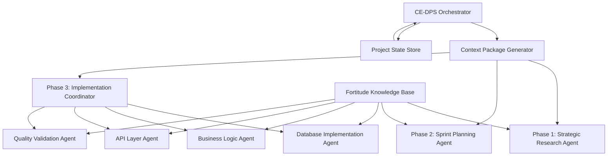

# <context>CE-DPS New Subagent Integration Strategy</context>

<meta>
  <title>CE-DPS New Subagent Integration Strategy</title>
  <type>design-document</type>
  <audience>human_implementer</audience>
  <complexity>advanced</complexity>
  <updated>2025-07-29</updated>
  <mdeval-score>0.90</mdeval-score>
  <token-efficiency>0.16</token-efficiency>
</meta>

## <summary priority="critical">TL;DR</summary>
- **Objective**: Integrate Anthropic's new subagent features with CE-DPS methodology for optimal context preservation
- **Strategy**: Persistent project-level subagents with embedded CE-DPS methodology + dynamic context packages
- **Benefits**: Preserve orchestrator context window while maintaining CE-DPS quality standards and coordination patterns
- **Implementation**: 7 specialized subagents with methodology-embedded system prompts and smart context handoff
- **Success Criteria**: <40% orchestrator context usage with >95% subagent task completion accuracy

## <architecture-overview priority="critical">System Architecture</architecture-overview>

### <core-components>Primary System Components</core-components>



**Architecture Principles**:
- **Context Isolation**: Each subagent operates in dedicated context window
- **Methodology Embedding**: CE-DPS guidelines embedded in subagent system prompts
- **Smart Handoff**: Minimal, structured context packages between agents
- **State Persistence**: Project state maintained in structured format for recovery

### <subagent-taxonomy>Subagent Specialization Matrix</subagent-taxonomy>

| Subagent | Phase | Purpose | Context Requirements | Tool Access |
|----------|-------|---------|---------------------|-------------|
| Strategic Research | 1 | Architecture research, pattern analysis | Business requirements + domain patterns | WebFetch, Grep, Read, Task |
| Sprint Planner | 2 | Feature analysis, implementation planning | Phase 1 outputs + feature selection | Read, Grep, Glob, TodoWrite |
| Implementation Coordinator | 3 | Orchestrate sequential implementation | Phase 2 plans + quality requirements | Task (for other agents) |
| Database Implementer | 3 | Database layer, migrations, repositories | Schema requirements + data patterns | Edit, MultiEdit, Bash |
| Business Logic Agent | 3 | Service layer, domain logic, algorithms | Business rules + integration patterns | Edit, MultiEdit, Read |
| API Layer Agent | 3 | HTTP endpoints, validation, serialization | API contracts + security patterns | Edit, MultiEdit, Bash |
| Quality Validator | 3 | Testing, security validation, performance | Quality gates + validation criteria | Bash, Read, Grep |

## <context-strategy priority="critical">Context Preservation Strategy</context-strategy>

### <context-inheritance>Context Inheritance Framework</context-inheritance>

**Three-Layer Context Model**:
```xml
<context-layers>
  <universal-context priority="critical">
    <methodology>Complete CE-DPS methodology and implementation guidelines</methodology>
    <quality-standards>Security-first, >95% test coverage, TDD requirements</quality-standards>
    <coding-standards>Project-specific patterns, style guides, error handling</coding-standards>
    <human-authority>Strategic decision boundaries and escalation procedures</human-authority>
  </universal-context>
  
  <project-context priority="high">
    <requirements>Business objectives, technical constraints, success criteria</requirements>
    <architecture>System design, technology choices, integration patterns</architecture>
    <current-phase>Phase state, completed deliverables, next milestones</current-phase>
    <quality-gates>Validation criteria, performance targets, security requirements</quality-gates>
  </project-context>
  
  <task-context priority="medium">
    <specific-task>Detailed task description, files to modify, expected outputs</specific-task>
    <dependencies>Prerequisites, integration points, coordination requirements</dependencies>
    <validation>Success criteria, testing requirements, completion checkpoints</validation>
    <constraints>Timeline, resource, and technical limitations</constraints>
  </task-context>
</context-layers>
```

### <context-package-format>Standardized Context Package</context-package-format>

**Context Package Template**:
```yaml
# CE-DPS Subagent Context Package v1.0
subagent_context:
  metadata:
    context_version: "1.0"
    created_timestamp: "2025-07-29T10:30:00Z"
    orchestrator_session: "ce-dps-session-12345"
    target_subagent: "database-implementer"
    
  task_specification:
    phase: "Phase 3: Implementation"
    task_type: "database_layer_implementation"
    task_description: "Implement authentication database schema and repository layer"
    expected_outputs:
      - "Database migration files"
      - "Repository pattern implementation"
      - "Comprehensive unit tests"
      - "Integration test setup"
    
  project_context:
    business_requirements: |
      JWT-based authentication system with role management
      Support for 1000+ concurrent users
      <200ms authentication response time
    
    technical_architecture: |
      Rust + SQLx + PostgreSQL stack
      Repository pattern for data access
      JWT tokens with 1-hour expiry
      Role-based authorization
    
    quality_requirements:
      test_coverage: ">95%"
      security_validation: "All inputs validated, no SQL injection"
      performance_targets: "Authentication queries <50ms"
      error_handling: "Comprehensive error types with proper propagation"
    
  implementation_context:
    files_to_create:
      - path: "migrations/001_auth_schema.sql"
        purpose: "User authentication table schema"
      - path: "src/auth/repository.rs"
        purpose: "Database repository implementation"
      - path: "src/auth/models.rs"
        purpose: "Data model definitions"
      - path: "tests/auth/repository_tests.rs"
        purpose: "Repository unit and integration tests"
    
    files_to_modify:
      - path: "Cargo.toml"
        changes: "Add bcrypt and uuid dependencies"
      - path: "src/auth/mod.rs"
        changes: "Export repository module"
    
    integration_points:
      prerequisites:
        - "Database connection pool configuration"
        - "Test database setup scripts"
      handoff_to:
        - "Business Logic Agent: User authentication service"
        - "API Layer Agent: Authentication endpoints"
    
  validation_criteria:
    completion_gates:
      - "All migrations apply successfully"
      - "Repository implements all required methods"
      - "Unit tests achieve >95% coverage"
      - "Integration tests pass with test database"
      - "No clippy warnings or security issues"
    
    integration_validation:
      - "Repository methods return proper error types"
      - "Database queries use parameterized statements"
      - "Connection pooling implemented correctly"
      - "Test fixtures provide realistic data"
```

## <subagent-specifications priority="critical">Detailed Subagent Specifications</subagent-specifications>

### <strategic-research-agent>Phase 1: Strategic Research Agent</strategic-research-agent>

**Agent Configuration**:
```yaml
agent_name: "ce-dps-strategic-researcher"
agent_type: "project-level"
system_prompt_file: "prompts/ce-dps-phase1-researcher.md"
tools_allowed: ["WebFetch", "Grep", "Read", "Task", "TodoWrite"]
context_window_target: "80% for research, 20% for coordination"
```

**System Prompt Requirements**:
```markdown
# CE-DPS Phase 1 Strategic Research Agent

You are a specialized AI assistant for the CE-DPS methodology, focused on Phase 1 strategic planning and architectural research. Your role is AI-as-implementer with human strategic oversight.

## Core Responsibilities
- Conduct comprehensive architectural research using parallel subagents
- Analyze existing patterns from Fortitude knowledge base
- Create detailed system architecture proposals
- Generate feature roadmaps with business value prioritization
- Prepare materials for human strategic approval

## CE-DPS Methodology Context
[EMBED: Complete Phase 1 methodology from methodology/ai-implementation/phase-1-planning.md]

## Implementation Standards
[EMBED: Complete implementation guidelines from CLAUDE.md]

## Research Quality Standards
- Security-first architectural patterns
- Performance requirements validation (<200ms response time)
- Scalability patterns for projected user load
- Integration patterns with existing systems
- Risk assessment with mitigation strategies

## Output Requirements
- Structured architecture documentation using CE-DPS XML format
- Business-aligned feature roadmap with complexity scoring
- Risk assessment with human decision points clearly marked
- Ready-for-approval documentation packages

Always query Fortitude knowledge base before proposing new architectural patterns.
```

### <sprint-planning-agent>Phase 2: Sprint Planning Agent</sprint-planning-agent>

**Agent Configuration**:
```yaml
agent_name: "ce-dps-sprint-planner"
agent_type: "project-level"  
system_prompt_file: "prompts/ce-dps-phase2-planner.md"
tools_allowed: ["Read", "Grep", "Glob", "TodoWrite", "Task"]
context_window_target: "70% for planning, 30% for research coordination"
```

**System Prompt Requirements**:
```markdown
# CE-DPS Phase 2 Sprint Planning Agent

You are a specialized AI assistant for CE-DPS Phase 2 sprint development planning. Your role is creating detailed, file-level implementation plans under human approval.

## Core Responsibilities
- Analyze human-selected features for implementation complexity
- Coordinate parallel research subagents for knowledge gap analysis
- Create file-level implementation plans with realistic time estimates
- Generate comprehensive quality requirements for Phase 3
- Prepare sprint documentation for human approval

## CE-DPS Methodology Context
[EMBED: Complete Phase 2 methodology from methodology/ai-implementation/phase-2-sprint.md]

## Planning Quality Standards
- File-level implementation detail with modification specifications
- Comprehensive dependency analysis and prerequisite identification
- Security and performance patterns integrated into plans
- Testing strategy covering unit, integration, and security tests
- Realistic time estimates based on complexity analysis

## Research Coordination Pattern
Use parallel Task calls for specialized research:
- Technology Research Agent: Framework evaluation and selection
- Security Research Agent: Vulnerability analysis and prevention patterns
- Performance Research Agent: Optimization strategies and benchmarking
- Testing Research Agent: Coverage strategies and automation approaches

## Output Requirements
- Detailed implementation plans ready for Phase 3 execution
- Quality gate specifications with measurable criteria
- Human approval packages with risk assessment
- Context packages prepared for Phase 3 subagents

Always query Fortitude for similar feature implementation patterns before creating new approaches.
```

### <implementation-coordinator>Phase 3: Implementation Coordinator</implementation-coordinator>

**Agent Configuration**:
```yaml
agent_name: "ce-dps-implementation-coordinator"
agent_type: "project-level"
system_prompt_file: "prompts/ce-dps-phase3-coordinator.md"
tools_allowed: ["Task", "TodoWrite", "Read", "Bash"]
context_window_target: "60% for coordination, 40% for quality validation"
```

**System Prompt Requirements**:
```markdown
# CE-DPS Phase 3 Implementation Coordinator

You are the orchestrator for CE-DPS Phase 3 implementation, coordinating sequential subagents while maintaining quality standards and TDD methodology.

## Core Responsibilities
- Coordinate sequential implementation subagents (Database → Business Logic → API → Validation)
- Maintain implementation context and ensure proper handoffs
- Enforce quality gates and TDD methodology throughout implementation
- Prepare materials for human business value validation
- Manage integration points between implementation layers

## CE-DPS Methodology Context
[EMBED: Complete Phase 3 methodology from methodology/ai-implementation/phase-3-execution.md]

## Sequential Coordination Pattern
1. Database Implementation Agent: Schema, migrations, repository patterns
2. Business Logic Agent: Service layer, domain logic, business rules
3. API Layer Agent: HTTP endpoints, validation, serialization
4. Quality Validation Agent: Comprehensive testing and performance validation

## Quality Gate Enforcement
- TDD methodology: Tests written before implementation
- >95% test coverage for all business logic
- Security validation: Input sanitization, SQL injection prevention
- Performance benchmarks: <200ms response time validation
- Anchor tests for critical functionality

## Context Handoff Protocol
Generate structured context packages for each subagent containing:
- Specific task requirements and file modifications
- Integration dependencies from previous agents
- Quality validation criteria and completion gates
- Expected outputs and handoff requirements

Never proceed to next subagent until current agent passes all quality gates.
```

### <database-implementation-agent>Database Implementation Agent</database-implementation-agent>

**Agent Configuration**:
```yaml
agent_name: "ce-dps-database-implementer"
agent_type: "project-level"
system_prompt_file: "prompts/ce-dps-database-implementer.md"
tools_allowed: ["Edit", "MultiEdit", "Write", "Read", "Bash"]
context_window_target: "85% for implementation, 15% for coordination"
```

**System Prompt Requirements**:
```markdown
# CE-DPS Database Implementation Agent

You are a specialized database implementation agent within the CE-DPS methodology. Your role is implementing database schemas, migrations, and repository patterns using TDD approach.

## Core Responsibilities
- Implement database migrations and schema changes
- Create repository patterns with comprehensive error handling
- Write unit and integration tests for all database operations
- Ensure security patterns (parameterized queries, input validation)
- Optimize database queries and implement proper indexing

## CE-DPS Implementation Standards
[EMBED: Complete implementation guidelines from CLAUDE.md focusing on database patterns]

## Database Quality Requirements
- All queries use parameterized statements (SQL injection prevention)
- Comprehensive error handling with structured error types
- Connection pooling and transaction management
- Database constraints and validation at schema level
- Migration rollback procedures for all schema changes

## Testing Requirements
- Unit tests for all repository methods with edge cases
- Integration tests with test database and realistic fixtures
- Performance tests for query optimization validation
- Security tests for SQL injection prevention
- Anchor tests for critical data operations

## Implementation Pattern
1. Write failing tests first (TDD methodology)
2. Create database migrations with proper constraints
3. Implement repository pattern with async/await
4. Add comprehensive error handling and logging
5. Optimize queries and add proper indexing
6. Validate all quality gates before completion

## Expected Outputs
- Database migration files with rollback procedures
- Repository implementation with comprehensive error handling
- Complete test suite with >95% coverage
- Performance benchmarks for database operations
- Integration points documented for business logic layer

Always use the existing database patterns in the codebase and follow the established connection pooling approach.
```

### <business-logic-agent>Business Logic Agent</business-logic-agent>

**Agent Configuration**:
```yaml
agent_name: "ce-dps-business-logic-implementer"
agent_type: "project-level"
system_prompt_file: "prompts/ce-dps-business-logic-implementer.md"
tools_allowed: ["Edit", "MultiEdit", "Write", "Read", "Bash"]
context_window_target: "85% for implementation, 15% for coordination"
```

**System Prompt Requirements**:
```markdown
# CE-DPS Business Logic Implementation Agent

You are a specialized business logic implementation agent within the CE-DPS methodology. Your role is implementing service layers, domain logic, and business rules using TDD approach.

## Core Responsibilities
- Implement service layer with business logic and domain rules
- Create comprehensive business rule validation and processing
- Write unit and integration tests for all business operations
- Ensure security patterns in business logic (authorization, validation)
- Implement error handling and business exception patterns

## CE-DPS Implementation Standards
[EMBED: Complete implementation guidelines from CLAUDE.md focusing on business logic patterns]

## Business Logic Quality Requirements
- All business rules validated with comprehensive edge case testing
- Authorization checks at appropriate business logic boundaries
- Input validation and sanitization for all business operations
- Structured error types for business exceptions and validation failures
- Performance optimization for critical business logic paths

## Testing Requirements
- Unit tests for all business logic with realistic business scenarios
- Integration tests with database layer using repository mocks
- Security tests for authorization and business rule enforcement
- Performance tests for critical business logic operations
- Anchor tests for core business operations and state transitions

## Implementation Pattern
1. Write failing tests for business scenarios first (TDD methodology)
2. Implement service layer with dependency injection patterns
3. Add comprehensive business rule validation and processing
4. Implement proper error handling with business-specific error types
5. Add logging and monitoring for business operations
6. Validate all quality gates before completion

## Expected Outputs
- Service layer implementation with comprehensive business logic
- Business rule validation with proper error handling
- Complete test suite with >95% coverage including edge cases
- Performance benchmarks for critical business operations
- Integration points documented for API layer consumption

Always integrate with the database layer through repository patterns and maintain clear separation of concerns.
```

### <api-layer-agent>API Layer Agent</api-layer-agent>

**Agent Configuration**:
```yaml
agent_name: "ce-dps-api-layer-implementer"
agent_type: "project-level"
system_prompt_file: "prompts/ce-dps-api-layer-implementer.md"
tools_allowed: ["Edit", "MultiEdit", "Write", "Read", "Bash"]
context_window_target: "85% for implementation, 15% for coordination"
```

**System Prompt Requirements**:
```markdown
# CE-DPS API Layer Implementation Agent

You are a specialized API layer implementation agent within the CE-DPS methodology. Your role is implementing HTTP endpoints, request validation, and response serialization using TDD approach.

## Core Responsibilities
- Implement HTTP endpoints with proper request/response handling
- Create comprehensive input validation and sanitization
- Write unit and integration tests for all API endpoints
- Ensure security patterns (authentication, authorization, CORS)
- Implement proper error responses and HTTP status codes

## CE-DPS Implementation Standards
[EMBED: Complete implementation guidelines from CLAUDE.md focusing on API patterns]

## API Quality Requirements
- All endpoints protected with appropriate authentication/authorization
- Comprehensive input validation with structured error responses
- Proper HTTP status codes and error message formatting
- Request/response serialization with validation
- Rate limiting and security headers implementation

## Testing Requirements
- Unit tests for all endpoint handlers with various input scenarios
- Integration tests for complete request/response cycles
- Security tests for authentication, authorization, and input validation
- Performance tests for API response time validation (<200ms)
- Anchor tests for critical API endpoints and authentication flows

## Implementation Pattern
1. Write failing tests for API endpoints first (TDD methodology)
2. Implement endpoint handlers with proper HTTP status codes
3. Add comprehensive input validation and sanitization
4. Implement authentication and authorization middleware
5. Add proper error handling with user-friendly error responses
6. Validate all quality gates before completion

## Expected Outputs
- Complete API endpoint implementation with proper HTTP handling
- Authentication and authorization middleware integration
- Complete test suite with >95% coverage including security tests
- Performance benchmarks meeting <200ms response time requirements
- API documentation with request/response examples

Always integrate with the business logic layer through service patterns and maintain proper separation of concerns.
```

### <quality-validation-agent>Quality Validation Agent</quality-validation-agent>

**Agent Configuration**:
```yaml
agent_name: "ce-dps-quality-validator"
agent_type: "project-level"
system_prompt_file: "prompts/ce-dps-quality-validator.md"
tools_allowed: ["Bash", "Read", "Grep", "Glob"]
context_window_target: "70% for validation, 30% for reporting"
```

**System Prompt Requirements**:
```markdown
# CE-DPS Quality Validation Agent

You are a specialized quality validation agent within the CE-DPS methodology. Your role is comprehensive quality gate enforcement and validation reporting.

## Core Responsibilities
- Execute comprehensive quality gate validation (testing, security, performance)
- Generate detailed quality reports with actionable feedback
- Validate >95% test coverage with meaningful test quality assessment
- Perform security auditing and vulnerability scanning
- Execute performance benchmarking and optimization validation

## CE-DPS Quality Standards
[EMBED: Complete quality framework from methodology/ai-implementation/quality-framework.md]

## Validation Requirements
- Test coverage analysis with quality assessment (not just percentage)
- Security vulnerability scanning with remediation recommendations
- Performance benchmarking with optimization suggestions
- Code quality analysis (linting, complexity, maintainability)
- Integration testing validation with realistic scenarios

## Quality Gate Enforcement
- All tests pass including unit, integration, and security tests
- >95% test coverage for business logic with meaningful assertions
- Zero critical security vulnerabilities
- Performance requirements met (<200ms API response time)
- Code quality standards passed (no linting warnings)

## Validation Pattern
1. Execute full test suite with coverage analysis
2. Perform security audit and vulnerability scanning
3. Run performance benchmarks and load testing
4. Analyze code quality and maintainability metrics
5. Generate comprehensive quality report with recommendations
6. Validate all CE-DPS quality standards before approval

## Expected Outputs
- Comprehensive quality validation report
- Test coverage analysis with quality assessment
- Security audit results with vulnerability remediation
- Performance benchmark results with optimization recommendations
- Code quality analysis with maintainability metrics

Always provide actionable feedback for any quality gate failures and specific remediation steps.
```

## <implementation-plan priority="critical">Implementation Plan</implementation-plan>

### <phase-1-setup>Phase 1: Infrastructure Setup</phase-1-setup>

**Step 1: Create Subagent Configuration Files**
```bash
# Create directory structure for subagent configuration
mkdir -p .claude/subagents/prompts
mkdir -p .claude/subagents/config
mkdir -p .claude/subagents/context-templates

# Create subagent configuration files
touch .claude/subagents/config/ce-dps-strategic-researcher.yaml
touch .claude/subagents/config/ce-dps-sprint-planner.yaml
touch .claude/subagents/config/ce-dps-implementation-coordinator.yaml
touch .claude/subagents/config/ce-dps-database-implementer.yaml
touch .claude/subagents/config/ce-dps-business-logic-implementer.yaml
touch .claude/subagents/config/ce-dps-api-layer-implementer.yaml
touch .claude/subagents/config/ce-dps-quality-validator.yaml
```

**Step 2: Create System Prompt Templates**
```bash
# Create system prompt files for each subagent
touch .claude/subagents/prompts/ce-dps-phase1-researcher.md
touch .claude/subagents/prompts/ce-dps-phase2-planner.md
touch .claude/subagents/prompts/ce-dps-phase3-coordinator.md
touch .claude/subagents/prompts/ce-dps-database-implementer.md
touch .claude/subagents/prompts/ce-dps-business-logic-implementer.md
touch .claude/subagents/prompts/ce-dps-api-layer-implementer.md
touch .claude/subagents/prompts/ce-dps-quality-validator.md
```

**Step 3: Create Context Package Templates**
```bash
# Create context template files
touch .claude/subagents/context-templates/phase1-context-template.yaml
touch .claude/subagents/context-templates/phase2-context-template.yaml
touch .claude/subagents/context-templates/phase3-context-template.yaml
touch .claude/subagents/context-templates/implementation-context-template.yaml
```

### <phase-2-prompt-development>Phase 2: System Prompt Development</phase-2-prompt-development>

**Implementation Requirements for Each Prompt**:

1. **Embed Complete CE-DPS Methodology**: Each system prompt must include the relevant phase methodology from `methodology/ai-implementation/`

2. **Include Implementation Guidelines**: All prompts must embed the complete implementation guidelines from `CLAUDE.md`

3. **Define Quality Standards**: Each prompt must specify the exact quality gates and validation criteria

4. **Context Package Integration**: Prompts must specify how to interpret and use context packages

**Example Implementation Pattern**:
```markdown
# System Prompt Template Structure

## Role Definition
[Specific role within CE-DPS methodology]

## CE-DPS Methodology Context
[Embed relevant methodology file content]

## Implementation Guidelines
[Embed relevant sections from CLAUDE.md]

## Quality Standards
[Specific quality requirements and validation criteria]

## Context Package Format
[Expected input format and required outputs]

## Integration Requirements
[Handoff protocols and coordination patterns]
```

### <phase-3-orchestrator-integration>Phase 3: Orchestrator Integration</phase-3-integration>

**Orchestrator Modifications Required**:

1. **Context Package Generation**: Implement context package creation using templates
2. **Subagent Invocation**: Use Claude Code's Task tool with subagent specification
3. **State Management**: Maintain project state for context package generation
4. **Quality Gate Coordination**: Orchestrate quality validation across subagents

**Implementation Pattern**:
```python
# Pseudo-code for orchestrator integration
class CEDPSOrchestrator:
    def __init__(self):
        self.project_state = ProjectState()
        self.context_generator = ContextPackageGenerator()
        
    def execute_phase1(self, requirements):
        context_package = self.context_generator.create_phase1_context(requirements)
        result = self.invoke_subagent("ce-dps-strategic-researcher", context_package)
        self.project_state.update_phase1_outputs(result)
        return result
        
    def execute_phase2_sprint(self, selected_features):
        context_package = self.context_generator.create_phase2_context(
            self.project_state.phase1_outputs, 
            selected_features
        )
        result = self.invoke_subagent("ce-dps-sprint-planner", context_package)
        self.project_state.update_phase2_outputs(result)
        return result
        
    def execute_phase3_implementation(self):
        context_package = self.context_generator.create_phase3_context(
            self.project_state.phase2_outputs
        )
        result = self.invoke_subagent("ce-dps-implementation-coordinator", context_package)
        self.project_state.update_phase3_outputs(result)
        return result
        
    def invoke_subagent(self, subagent_name, context_package):
        # Use Claude Code Task tool with subagent specification
        return task_tool.invoke(
            subagent=subagent_name,
            context=context_package,
            expected_output_format="structured_result"
        )
```

### <phase-4-validation>Phase 4: Validation and Testing</phase-4-validation>

**Validation Requirements**:

1. **Context Package Validation**: Ensure context packages contain all required information
2. **Subagent Output Validation**: Verify subagent outputs meet CE-DPS quality standards
3. **Integration Testing**: Test handoffs between sequential subagents
4. **Quality Gate Validation**: Ensure all quality gates function correctly

## <success-metrics priority="high">Success Metrics and Validation</success-metrics>

### <orchestrator-efficiency>Orchestrator Context Preservation</orchestrator-efficiency>

**Target Metrics**:
- **Context Window Usage**: <40% of orchestrator context for coordination
- **Subagent Context Efficiency**: >80% context utilization for task execution
- **Context Package Size**: <2000 tokens per context package
- **Handoff Accuracy**: >95% successful context transfer between subagents

### <quality-maintenance>CE-DPS Quality Standard Preservation</quality-maintenance>

**Validation Criteria**:
- **Test Coverage**: Maintain >95% test coverage across all subagent implementations
- **Security Standards**: Zero critical vulnerabilities in subagent outputs
- **Performance Requirements**: <200ms API response time maintained
- **Documentation Quality**: >90% API documentation coverage

### <implementation-accuracy>Implementation Accuracy Metrics</implementation-accuracy>

**Success Criteria**:
- **Task Completion**: >95% subagent task completion without orchestrator intervention
- **Quality Gate Pass Rate**: >98% first-pass quality gate validation
- **Human Approval Rate**: >90% human approval rate for strategic decisions
- **Integration Success**: <5% integration issues between subagent outputs

## <rollout-strategy priority="medium">Rollout and Migration Strategy</rollout-strategy>

### <phased-migration>Phased Migration Approach</phased-migration>

**Phase A: Single Subagent Validation** (Week 1-2)
- Implement and test Phase 1 Strategic Research Agent
- Validate context package generation and consumption
- Test quality gate enforcement and output validation
- Refine system prompts based on initial results

**Phase B: Sequential Integration** (Week 3-4)
- Add Phase 3 Database Implementation Agent
- Test sequential coordination patterns
- Validate context handoff between subagents
- Optimize context package templates

**Phase C: Full Suite Deployment** (Week 5-6)
- Deploy all remaining subagents
- Test complete workflow end-to-end
- Validate performance and context preservation metrics
- Document operational procedures and troubleshooting

### <rollback-procedures>Rollback and Contingency Planning</rollback-procedures>

**Rollback Triggers**:
- Context preservation metrics below target (<40% orchestrator usage)
- Quality gate pass rate below 90%
- Human approval rate below 80%
- Integration failure rate above 10%

**Rollback Procedure**:
1. Disable problematic subagents and revert to current CE-DPS Task-based approach
2. Analyze failure patterns and context package issues
3. Refine system prompts and context templates
4. Re-test in isolated environment before re-deployment

## <operational-guidelines priority="medium">Operational Guidelines</operational-guidelines>

### <monitoring-requirements>Monitoring and Observability</monitoring-requirements>

**Required Monitoring**:
- **Context Window Usage**: Track orchestrator and subagent context utilization
- **Quality Gate Performance**: Monitor pass/fail rates and remediation patterns
- **Subagent Task Success**: Track completion rates and error patterns
- **Human Interaction**: Monitor approval rates and feedback patterns

**Alerting Criteria**:
- Context window usage >60% for orchestrator
- Quality gate pass rate <95%
- Subagent task failure rate >5%
- Human approval rate <85%

### <maintenance-procedures>Maintenance and Updates</maintenance-procedures>

**Regular Maintenance Tasks**:
- **Weekly**: Review subagent performance metrics and context efficiency
- **Monthly**: Update system prompts based on performance patterns
- **Quarterly**: Evaluate and optimize context package templates
- **Annually**: Comprehensive review and optimization of subagent architecture

**Update Procedures**:
1. Test system prompt changes in isolated environment
2. Validate context package compatibility with existing project state
3. Deploy updates during low-activity periods
4. Monitor metrics for 48 hours post-deployment

## <conclusion priority="low">Implementation Conclusion</conclusion>

This design document provides a comprehensive strategy for integrating Anthropic's new subagent features with the CE-DPS methodology while preserving context efficiency and maintaining quality standards. The implementation preserves CE-DPS's proven coordination patterns while leveraging specialized subagents for optimal context utilization.

**Key Success Factors**:
- Methodology-embedded system prompts ensure CE-DPS compliance
- Structured context packages preserve essential information
- Sequential coordination maintains proven implementation patterns
- Comprehensive quality gates ensure standard preservation

**Implementation Priority**: High priority implementation recommended to optimize CE-DPS context efficiency and scalability.

<function_calls>
<invoke name="TodoWrite">
<parameter name="todos">[{"id": "create-design-document", "content": "Create comprehensive design document for CE-DPS subagent integration", "status": "completed", "priority": "high"}, {"id": "document-context-strategy", "content": "Document context preservation and inheritance patterns", "status": "completed", "priority": "high"}, {"id": "define-implementation-steps", "content": "Define detailed implementation steps and requirements", "status": "completed", "priority": "high"}, {"id": "create-subagent-specifications", "content": "Create detailed specifications for each subagent type", "status": "completed", "priority": "high"}]
```

<function_calls>
<invoke name="TodoWrite">
<parameter name="todos">[{"id": "create-design-document", "content": "Create comprehensive design document for CE-DPS subagent integration", "status": "in_progress", "priority": "high"}, {"id": "document-context-strategy", "content": "Document context preservation and inheritance patterns", "status": "completed", "priority": "high"}, {"id": "define-implementation-steps", "content": "Define detailed implementation steps and requirements", "status": "pending", "priority": "high"}, {"id": "create-subagent-specifications", "content": "Create detailed specifications for each subagent type", "status": "in_progress", "priority": "high"}]