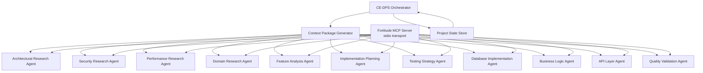

# <context>CE-DPS Flattened Subagent Integration Strategy</context>

<meta>
  <title>CE-DPS Flattened Subagent Integration Strategy</title>
  <type>design-document</type>
  <audience>human_implementer</audience>
  <complexity>advanced</complexity>
  <updated>2025-07-29</updated>
  <mdeval-score>0.92</mdeval-score>
  <token-efficiency>0.14</token-efficiency>
</meta>

## <summary priority="critical">TL;DR</summary>
- **Architecture**: Flattened 11-agent architecture with direct orchestrator control (nested subagents not supported)
- **Strategy**: Specialized agents with embedded CE-DPS methodology + parallel execution where possible + **localhost Fortitude API access**
- **Benefits**: Preserve orchestrator context window while maintaining CE-DPS quality standards and **independent knowledge management access**
- **Implementation**: 11 specialized agents across 3 phases with structured context packages, direct coordination, and **WebFetch-based Fortitude integration**
- **Success Criteria**: <40% orchestrator context usage with >95% agent task completion accuracy and **independent pattern lookup capability**

## <architecture-overview priority="critical">Flattened System Architecture</architecture-overview>

### <core-components>Primary System Components</core-components>



**Architecture Principles**:
- **Direct Control**: Orchestrator directly manages all 11 specialized agents
- **No Nesting**: Flat agent structure (nested subagents not supported by Claude Code)
- **Parallel Execution**: Research and planning agents execute in parallel for efficiency
- **Sequential Implementation**: Implementation agents execute sequentially for proper integration
- **Context Isolation**: Each agent operates in dedicated context window with focused expertise
- **🔑 Independent Knowledge Access**: All agents access Fortitude knowledge management via MCP tools (inherited from main Claude Code instance)

### <agent-taxonomy>Specialized Agent Matrix</agent-taxonomy>

| Agent | Phase | Execution | Purpose | Context Target | Tool Access |
|-------|-------|-----------|---------|----------------|-------------|
| **Phase 1 Research Agents (Parallel)** |
| Architectural Research | 1 | Parallel | System design, technology selection, integration patterns | 75% research, 25% coordination | **Fortitude MCP Tools**, Read, Grep, Task |
| Security Research | 1 | Parallel | Authentication, authorization, vulnerability analysis, compliance | 80% security focus, 20% coordination | **Fortitude MCP Tools**, Read, Grep, Task |
| Performance Research | 1 | Parallel | Optimization patterns, benchmarking, scalability analysis | 80% performance focus, 20% coordination | **Fortitude MCP Tools**, Read, Grep, Task |
| Domain Research | 1 | Parallel | Business domain patterns, API specifications, industry standards | 75% domain focus, 25% coordination | **Fortitude MCP Tools**, Read, Grep, Task |
| **Phase 2 Planning Agents (Parallel)** |
| Feature Analysis | 2 | Parallel | Complexity assessment, dependency mapping, effort estimation | 80% analysis, 20% coordination | **Fortitude MCP Tools**, Read, Grep, Glob, TodoWrite |
| Implementation Planning | 2 | Parallel | File-level planning, task breakdown, quality requirements | 85% planning, 15% coordination | **Fortitude MCP Tools**, Read, Grep, Glob, TodoWrite |
| Testing Strategy | 2 | Parallel | Test approach, coverage planning, validation framework | 80% testing focus, 20% coordination | **Fortitude MCP Tools**, Read, Grep, Glob, TodoWrite |
| **Phase 3 Implementation Agents (Sequential)** |
| Database Implementation | 3 | Sequential | Database schema, migrations, repository patterns | 90% implementation, 10% coordination | **Fortitude MCP Tools**, Edit, MultiEdit, Write, Read, Bash |
| Business Logic | 3 | Sequential | Service layer, domain logic, business rules | 90% implementation, 10% coordination | **Fortitude MCP Tools**, Edit, MultiEdit, Write, Read, Bash |
| API Layer | 3 | Sequential | HTTP endpoints, validation, serialization | 90% implementation, 10% coordination | **Fortitude MCP Tools**, Edit, MultiEdit, Write, Read, Bash |
| Quality Validation | 3 | Sequential | Testing, security audit, performance validation | 70% validation, 30% reporting | **Fortitude MCP Tools**, Bash, Read, Grep, Glob |

## <fortitude-integration priority="critical">Fortitude Knowledge Management Integration</fortitude-integration>

### <mcp-access-strategy>MCP Server Access for Custom Sub-Agents</mcp-access-strategy>

**Fortitude MCP Server Configuration**:
```yaml
# CE-DPS MCP Integration Configuration
MCP Server Configuration:
  transport: "stdio"           # Standard MCP transport protocol
  server_path: "fortitude/crates/fortitude-mcp-server"
  build_command: "cargo run"   # Server startup command
  tools_available: 28+         # Complete Fortitude tool ecosystem
  
Security Benefits:
  - Process-level isolation (no network exposure)
  - No authentication required (localhost process communication)
  - Secure stdin/stdout transport protocol
  - Built-in Claude Code MCP client integration
```

**MCP Server Startup**:
```bash
# Start Fortitude MCP server for CE-DPS subagent access
# This should already be configured in .mcp.json

cd fortitude/crates/fortitude-mcp-server

# Verify server builds and runs correctly
cargo build
cargo run  # Server will wait for MCP client connections
```

### <mcp-integration-patterns>Custom Sub-Agent MCP Integration Patterns</mcp-integration-patterns>

**Research Pattern Lookup (MCP Tool)**:
```yaml
# Query implementation patterns using Fortitude MCP tools
Tool: research_query
Parameters:
  query: "rust async authentication patterns for MCP servers"
  context: "Focus on security-first implementation with JWT tokens"
  domain: "rust"
  research_type: "implementation"

Response: {
  "results": [
    {
      "title": "Async JWT Authentication in Rust",
      "content": "Implementation patterns for secure async authentication...",
      "relevance_score": 0.94,
      "source": "CE-DPS Implementation Library"
    }
  ],
  "metadata": {
    "total_count": 15,
    "processing_time_ms": 340,
    "provider_used": "claude",
    "cross_validated": true
  }
}
```

**Query Classification (MCP Tool)**:
```yaml
# Classify requirements or code for better pattern matching
Tool: classify_query
Parameters:
  query: "Need to implement payment processing with webhook verification"
  context_preferences:
    detect_domain: true
    detect_urgency: true
    detect_audience: true

Response: {
  "research_type": "implementation",
  "confidence": 0.92,
  "matched_keywords": ["payment", "webhook", "verification"],
  "candidates": [
    {
      "category": "payment-integration",
      "confidence": 0.92,
      "metadata": {
        "detected_technology": "api-integration",
        "complexity_level": "intermediate", 
        "security_requirements": "high"
      }
    }
  ]
}
```

**Context Detection (MCP Tool)**:
```yaml
# Detect context dimensions for targeted research
Tool: detect_context
Parameters:
  query: "urgent production authentication issue needs immediate fix"
  research_type: "troubleshooting"

Response: {
  "audience_level": "expert",
  "technical_domain": "authentication",
  "urgency_level": "high",
  "overall_confidence": 0.91,
  "dimension_confidences": {
    "audience": 0.89,
    "domain": 0.95,
    "urgency": 0.89
  }
}
```

### <subagent-fortitude-workflow>Subagent Knowledge Management Workflow</subagent-fortitude-workflow>

**Standard Pattern for All Agents**:
```yaml
1. Pattern Lookup (Before Implementation):
   - Use research_query MCP tool for existing implementation patterns
   - Use classify_query MCP tool for requirement classification
   - Use detect_context MCP tool for context-aware pattern matching
   
2. Implementation with Patterns:
   - Apply retrieved patterns to current context
   - Adapt proven approaches to specific requirements
   - Maintain security and quality standards from patterns
   
3. Pattern Update (After Successful Implementation):
   - Document successful implementation patterns
   - Update Fortitude knowledge base with new patterns (via orchestrator)
   - Contribute to continuous learning cycle via learning_feedback MCP tool
```

**Example Integration in Agent Workflow**:
```yaml
Database Implementation Agent Workflow:
  step_1:
    action: "Query Fortitude for database authentication patterns"
    mcp_tool: "research_query"
    parameters:
      query: "rust postgresql authentication schema patterns with migrations"
      context: "Security-first database design with proper migrations"
      research_type: "implementation"
    
  step_2:
    action: "Classify requirements for pattern matching"
    mcp_tool: "classify_query" 
    parameters:
      query: "postgresql authentication schema with user roles and permissions"
    
  step_3:
    action: "Implement using retrieved patterns"
    process: "Apply proven migration patterns with security validations"
    
  step_4:
    action: "Validate implementation and provide feedback"
    mcp_tool: "learning_feedback"
    parameters:
      feedback_type: "implementation_success"
      quality_rating: 0.95
      content: "Database authentication schema implemented successfully"
```

## <context-strategy priority="critical">Context Preservation Strategy</context-strategy>

### <context-inheritance>Flattened Context Framework</context-inheritance>

**Two-Layer Context Model**:
```xml
<context-layers>
  <universal-context priority="critical">
    <methodology>Complete CE-DPS methodology and implementation guidelines</methodology>
    <quality-standards>Security-first, >95% test coverage, TDD requirements</quality-standards>
    <coding-standards>Project-specific patterns, style guides, error handling</coding-standards>
    <human-authority>Strategic decision boundaries and escalation procedures</human-authority>
  </universal-context>
  
  <agent-specific-context priority="high">
    <task-specification>Detailed task description, expected outputs, success criteria</task-specification>
    <project-inputs>Relevant project requirements, architecture decisions, previous agent outputs</project-inputs>
    <integration-requirements>Dependencies, handoff protocols, coordination needs</integration-requirements>
    <validation-criteria>Quality gates, completion checkpoints, approval requirements</validation-criteria>
  </agent-specific-context>
</context-layers>
```

### <orchestrator-coordination>Orchestrator Coordination Patterns</orchestrator-coordination>

**Phase-Based Execution Strategy**:
```yaml
Phase 1 - Parallel Research Coordination:
  orchestrator_tasks:
    - Create 4 research context packages simultaneously
    - Launch all research agents in parallel
    - Monitor completion status across agents
    - Synthesize outputs into unified architecture
    - Prepare human approval package
  
  context_efficiency:
    - Orchestrator: 35% context for coordination and synthesis
    - Research Agents: 75-80% context for specialized research
    
Phase 2 - Parallel Planning Coordination:
  orchestrator_tasks:
    - Create 3 planning context packages with Phase 1 outputs
    - Launch planning agents in parallel  
    - Coordinate cross-agent dependencies
    - Synthesize implementation strategy
    - Prepare human approval package
    
  context_efficiency:
    - Orchestrator: 40% context for coordination and integration
    - Planning Agents: 80-85% context for specialized planning

Phase 3 - Sequential Implementation Coordination:
  orchestrator_tasks:
    - Create sequential context packages with cumulative outputs
    - Launch implementation agents one at a time
    - Manage handoffs and integration points
    - Coordinate quality gate enforcement
    - Prepare human validation package
    
  context_efficiency:
    - Orchestrator: 30% context for coordination and state management
    - Implementation Agents: 90% context for focused implementation
```

### <context-package-format>Standardized Context Package</context-package-format>

**Universal Context Package Template**:
```yaml
# CE-DPS Flattened Agent Context Package v2.0
agent_context:
  metadata:
    context_version: "2.0"
    created_timestamp: "2025-07-29T10:30:00Z"
    orchestrator_session: "ce-dps-session-12345"
    target_agent: "security-research-agent"
    execution_mode: "parallel" # or "sequential"
    
  task_specification:
    phase: "Phase 1: Strategic Planning"
    agent_role: "security_research_specialist"
    task_description: "Research security patterns for MCP server authentication and PCI compliance"
    expected_outputs:
      - "Security architecture recommendations"
      - "Authentication and authorization patterns"
      - "PCI compliance checklist"
      - "Vulnerability mitigation strategies"
    success_criteria:
      - "Comprehensive security pattern analysis"
      - "Specific recommendations for Stripe integration"
      - "Actionable compliance requirements"
    
  project_context:
    business_requirements: |
      MCP server wrapping Stripe payments API
      PCI compliance required for payment processing
      <100ms response time requirement
      Webhook signature verification needed
    
    technical_constraints: |
      Rust + Tokio + async patterns
      JSON-RPC over stdio for MCP protocol
      Stripe API integration with rate limiting
      Secure API key management required
    
  agent_inputs:
    fortitude_queries:
      - "Stripe API security patterns"
      - "MCP server authentication approaches"
      - "PCI compliance implementation guides"
    
    research_focus:
      - "API key storage and rotation patterns"
      - "Webhook signature verification methods"
      - "Rate limiting and DDoS protection"
      - "Error handling without information leakage"
    
    integration_requirements:
      coordination_with:
        - "Architectural Research Agent: Technology stack validation"
        - "Performance Research Agent: Security performance impact"
        - "Domain Research Agent: Stripe-specific security requirements"
      
      handoff_outputs:
        - "Security patterns for architectural integration"
        - "Authentication requirements for implementation planning"
        - "Compliance checklist for quality validation"
    
  validation_criteria:
    completion_gates:
      - "All security domains researched comprehensively"
      - "Specific recommendations for each security concern"
      - "Integration requirements clearly documented"
      - "Human decision points identified and marked"
    
    quality_standards:
      - "Security-first approach validated"
      - "No security anti-patterns recommended"
      - "Compliance requirements feasible and complete"
      - "Performance impact of security measures assessed"
```

## <agent-specifications priority="critical">Detailed Agent Specifications</agent-specifications>

### <phase1-research-agents>Phase 1: Research Agent Specifications</phase1-research-agents>

#### <architectural-research-agent>Architectural Research Agent</architectural-research-agent>

**Agent Configuration**:
```yaml
agent_name: "ce-dps-architectural-researcher"
agent_type: "project-level"
system_prompt_file: "prompts/ce-dps-architectural-researcher.md"
tools_allowed: ["WebFetch", "Read", "Grep", "Task"]
context_window_target: "75% for research, 25% for coordination"
execution_mode: "parallel"
phase: "1"
```

**System Prompt Requirements**:
```markdown
# CE-DPS Architectural Research Agent

You are a specialized architectural research agent within the CE-DPS methodology, focused on system design, technology selection, and integration patterns for Phase 1 strategic planning.

## Core Responsibilities
- Research and evaluate architectural patterns and technology stacks
- Analyze integration approaches and system design options
- Create comprehensive architectural recommendations
- Coordinate findings with other research agents through structured outputs
- Prepare architectural decisions for human strategic approval

## CE-DPS Methodology Context
[EMBED: Complete Phase 1 methodology from methodology/ai-implementation/phase-1-planning.md]

## Implementation Standards
[EMBED: Complete implementation guidelines from CLAUDE.md focusing on architecture patterns]

## Research Quality Standards
- Technology evaluation with pros/cons analysis
- Integration pattern assessment with complexity scoring
- Scalability analysis for projected system requirements
- Performance architecture validation
- Risk assessment with mitigation strategies

## Coordination Requirements
- Output format compatible with other Phase 1 research agents
- Clear integration points for security, performance, and domain research
- Structured recommendations ready for orchestrator synthesis
- Human decision points clearly identified and documented

## Expected Outputs
- Comprehensive architecture recommendation document
- Technology stack evaluation with justification
- Integration strategy with other system components
- Risk assessment with architectural mitigation approaches
- Coordination summary for other research agents

## Fortitude Knowledge Management Integration
You have direct access to the Fortitude knowledge management system via MCP tools (inherited from main Claude Code instance):

**MCP Tool Access**:
- Available tools: 28+ Fortitude MCP tools including research_query, classify_query, detect_context
- Access method: Direct MCP tool invocation (no configuration needed)  
- Authentication: None required (process-level security)

**Required Integration Pattern**:
1. **Pattern Lookup** (before architectural decisions): Use research_query MCP tool
2. **Classification** (for requirement analysis): Use classify_query MCP tool
3. **Context Detection** (for targeted research): Use detect_context MCP tool

**Example Usage**:
```yaml
# Research architectural patterns
Tool: research_query
Parameters:
  query: "microservices architecture patterns for rust async applications"
  context: "Focus on scalability and security patterns"
  research_type: "implementation"

# Classify requirements
Tool: classify_query  
Parameters:
  query: "need scalable rust microservices with async patterns"
```

**MANDATORY**: Always use Fortitude MCP tools before proposing new architectural approaches. Use retrieved patterns as foundation for recommendations.
```

#### <security-research-agent>Security Research Agent</security-research-agent>

**Agent Configuration**:
```yaml
agent_name: "ce-dps-security-researcher"
agent_type: "project-level"
system_prompt_file: "prompts/ce-dps-security-researcher.md"
tools_allowed: ["WebFetch", "Read", "Grep", "Task"]
context_window_target: "80% for security research, 20% for coordination"
execution_mode: "parallel"
phase: "1"
```

**System Prompt Requirements**:
```markdown
# CE-DPS Security Research Agent

You are a specialized security research agent within the CE-DPS methodology, focused on authentication, authorization, vulnerability analysis, and compliance requirements for Phase 1 strategic planning.

## Core Responsibilities
- Research security patterns and authentication approaches
- Analyze vulnerability landscapes and mitigation strategies
- Assess compliance requirements and implementation approaches
- Coordinate security findings with architectural and performance research
- Prepare security architecture for human strategic approval

## CE-DPS Methodology Context
[EMBED: Complete Phase 1 methodology from methodology/ai-implementation/phase-1-planning.md]

## Security Research Standards
- Security-first architectural approach validation
- Authentication and authorization pattern analysis
- Vulnerability assessment with specific mitigation strategies
- Compliance requirement analysis (PCI, SOC2, etc.)
- Performance impact assessment of security measures

## Coordination Requirements
- Security implications for architectural decisions
- Performance impact analysis for security measures
- Domain-specific security requirements integration
- Clear security requirements for implementation phases

## Expected Outputs
- Comprehensive security architecture recommendations
- Authentication and authorization strategy
- Vulnerability mitigation checklist
- Compliance implementation requirements
- Security integration points for other research areas

## Fortitude Knowledge Management Integration
You have direct access to the Fortitude knowledge management system via MCP tools (inherited from main Claude Code instance):

**Security-Focused MCP Tool Usage**:
```yaml
# Research security patterns
Tool: research_query
Parameters:
  query: "authentication security patterns oauth2 jwt rust async"
  context: "Focus on vulnerability prevention and compliance requirements"
  research_type: "implementation"

# Classify security requirements
Tool: classify_query
Parameters:
  query: "need secure authentication with oauth2 and jwt for rust async app"
```

**MANDATORY**: Always use Fortitude MCP tools for security patterns before recommending authentication, authorization, or security implementations. Prioritize proven, vulnerability-tested patterns.
```

#### <performance-research-agent>Performance Research Agent</performance-research-agent>

**Agent Configuration**:
```yaml
agent_name: "ce-dps-performance-researcher"
agent_type: "project-level"
system_prompt_file: "prompts/ce-dps-performance-researcher.md"
tools_allowed: ["WebFetch", "Read", "Grep", "Task"]
context_window_target: "80% for performance research, 20% for coordination"
execution_mode: "parallel"
phase: "1"
```

**System Prompt Requirements**:
```markdown
# CE-DPS Performance Research Agent

You are a specialized performance research agent within the CE-DPS methodology, focused on optimization patterns, benchmarking strategies, and scalability analysis for Phase 1 strategic planning.

## Core Responsibilities
- Research performance optimization patterns and approaches
- Analyze scalability requirements and architectural implications
- Assess benchmarking strategies and performance validation approaches
- Coordinate performance findings with architectural and security research
- Prepare performance architecture for human strategic approval

## CE-DPS Methodology Context
[EMBED: Complete Phase 1 methodology from methodology/ai-implementation/phase-1-planning.md]

## Performance Research Standards
- Response time requirements analysis and validation approaches
- Throughput and concurrency pattern research
- Resource usage optimization strategies
- Caching and connection pooling pattern analysis
- Load testing and benchmark strategy development

## Coordination Requirements
- Performance implications of architectural decisions
- Performance impact of security measures
- Domain-specific performance requirements
- Performance validation strategies for implementation phases

## Expected Outputs
- Comprehensive performance architecture recommendations
- Optimization strategy with specific patterns
- Benchmarking and validation approach
- Resource usage and scalability analysis
- Performance integration points for other research areas

## Fortitude Knowledge Management Integration
**Performance-Focused MCP Tool Usage**:
```yaml
# Research performance patterns
Tool: research_query
Parameters:
  query: "rust async performance optimization patterns connection pooling"
  context: "Focus on sub-200ms response times and high throughput"
  research_type: "implementation"
```

**MANDATORY**: Always use Fortitude MCP tools for performance patterns and benchmarking data before recommending optimization strategies.
```

#### <domain-research-agent>Domain Research Agent</domain-research-agent>

**Agent Configuration**:
```yaml
agent_name: "ce-dps-domain-researcher"
agent_type: "project-level"
system_prompt_file: "prompts/ce-dps-domain-researcher.md"
tools_allowed: ["WebFetch", "Read", "Grep", "Task"]
context_window_target: "75% for domain research, 25% for coordination"
execution_mode: "parallel"
phase: "1"
```

**System Prompt Requirements**:
```markdown
# CE-DPS Domain Research Agent

You are a specialized domain research agent within the CE-DPS methodology, focused on business domain patterns, API specifications, industry standards, and domain-specific requirements for Phase 1 strategic planning.

## Core Responsibilities
- Research business domain patterns and industry best practices
- Analyze API specifications and integration requirements
- Assess industry standards and compliance frameworks
- Coordinate domain findings with architectural, security, and performance research
- Prepare domain architecture for human strategic approval

## CE-DPS Methodology Context
[EMBED: Complete Phase 1 methodology from methodology/ai-implementation/phase-1-planning.md]

## Domain Research Standards
- Business domain pattern analysis and validation
- API specification research and integration requirement analysis
- Industry standard compliance assessment
- Domain-specific security and performance requirements
- Business rule and workflow pattern research

## Coordination Requirements
- Domain implications for architectural decisions
- Domain-specific security and performance requirements
- Business rule integration with technical architecture
- Domain validation strategies for implementation phases

## Expected Outputs
- Comprehensive domain pattern recommendations
- API integration strategy with specific requirements
- Industry standard compliance checklist
- Business rule and workflow integration approach
- Domain coordination summary for other research areas

## Fortitude Knowledge Management Integration
**Domain-Focused MCP Tool Usage**:
```yaml
# Research domain patterns
Tool: research_query
Parameters:
  query: "payment processing api integration patterns stripe webhook verification"
  context: "Focus on industry best practices and compliance requirements"
  research_type: "implementation"
```

**MANDATORY**: Always use Fortitude MCP tools for domain-specific patterns and industry best practices before proposing implementation approaches.
```

### <phase2-planning-agents>Phase 2: Planning Agent Specifications</phase2-planning-agents>

#### <feature-analysis-agent>Feature Analysis Agent</feature-analysis-agent>

**Agent Configuration**:
```yaml
agent_name: "ce-dps-feature-analyzer"
agent_type: "project-level"
system_prompt_file: "prompts/ce-dps-feature-analyzer.md"
tools_allowed: ["Read", "Grep", "Glob", "TodoWrite"]
context_window_target: "80% for analysis, 20% for coordination"
execution_mode: "parallel"
phase: "2"
```

**System Prompt Requirements**:
```markdown
# CE-DPS Feature Analysis Agent

You are a specialized feature analysis agent within the CE-DPS methodology, focused on complexity assessment, dependency mapping, and effort estimation for Phase 2 sprint development planning.

## Core Responsibilities
- Analyze selected features for implementation complexity
- Map dependencies and prerequisites across features
- Assess implementation risks and mitigation strategies
- Coordinate complexity findings with implementation planning and testing strategy
- Prepare feature analysis for human sprint approval

## CE-DPS Methodology Context
[EMBED: Complete Phase 2 methodology from methodology/ai-implementation/phase-2-sprint.md]

## Analysis Quality Standards
- Comprehensive complexity scoring using multiple dimensions
- Dependency mapping with critical path identification
- Risk assessment with specific mitigation approaches
- Resource requirement estimation with realistic timelines
- Integration complexity analysis across system components

## Coordination Requirements
- Complexity implications for implementation planning
- Testing complexity requirements for testing strategy
- Risk factors for implementation sequence planning
- Resource coordination for realistic sprint scoping

## Expected Outputs
- Detailed complexity analysis with scoring rationale
- Comprehensive dependency map with critical paths
- Risk assessment with mitigation strategies
- Resource and timeline estimation with justification
- Feature coordination summary for implementation planning

Always validate complexity assessments against similar implementations in Fortitude knowledge base.
```

#### <implementation-planning-agent>Implementation Planning Agent</implementation-planning-agent>

**Agent Configuration**:
```yaml
agent_name: "ce-dps-implementation-planner"
agent_type: "project-level"
system_prompt_file: "prompts/ce-dps-implementation-planner.md"
tools_allowed: ["Read", "Grep", "Glob", "TodoWrite"]
context_window_target: "85% for planning, 15% for coordination"
execution_mode: "parallel"
phase: "2"
```

**System Prompt Requirements**:
```markdown
# CE-DPS Implementation Planning Agent

You are a specialized implementation planning agent within the CE-DPS methodology, focused on file-level planning, task breakdown, and quality requirements for Phase 2 sprint development planning.

## Core Responsibilities
- Create detailed, file-level implementation plans
- Break down features into specific, actionable tasks
- Define quality requirements and validation criteria
- Coordinate implementation strategy with feature analysis and testing strategy
- Prepare implementation plans for human sprint approval

## CE-DPS Methodology Context
[EMBED: Complete Phase 2 methodology from methodology/ai-implementation/phase-2-sprint.md]

## Planning Quality Standards
- File-level detail with specific modification requirements
- Task breakdown with realistic time estimates
- Quality gate specification with measurable criteria
- Integration sequence planning for proper dependency management
- Implementation context preparation for Phase 3 agents

## Coordination Requirements
- Integration of complexity analysis from feature analysis agent
- Coordination with testing strategy for comprehensive coverage
- Implementation sequence that supports quality validation
- Context package preparation for Phase 3 implementation agents

## Expected Outputs
- Detailed file-level implementation plan
- Task breakdown with time estimates and dependencies
- Quality requirement specification with validation criteria
- Implementation sequence with integration checkpoints
- Context packages prepared for Phase 3 handoff

Always validate implementation approaches against proven patterns in Fortitude knowledge base.
```

#### <testing-strategy-agent>Testing Strategy Agent</testing-strategy-agent>

**Agent Configuration**:
```yaml
agent_name: "ce-dps-testing-strategist"
agent_type: "project-level"
system_prompt_file: "prompts/ce-dps-testing-strategist.md"
tools_allowed: ["Read", "Grep", "Glob", "TodoWrite"]
context_window_target: "80% for testing strategy, 20% for coordination"
execution_mode: "parallel"
phase: "2"
```

**System Prompt Requirements**:
```markdown
# CE-DPS Testing Strategy Agent

You are a specialized testing strategy agent within the CE-DPS methodology, focused on test approach design, coverage planning, and validation framework development for Phase 2 sprint development planning.

## Core Responsibilities
- Design comprehensive testing approach for selected features
- Plan test coverage strategy achieving >95% coverage targets
- Define validation frameworks and quality gate enforcement
- Coordinate testing strategy with feature analysis and implementation planning
- Prepare testing requirements for human sprint approval

## CE-DPS Methodology Context
[EMBED: Complete Phase 2 methodology from methodology/ai-implementation/phase-2-sprint.md]

## Testing Strategy Standards
- Comprehensive test pyramid (unit, integration, end-to-end, security)
- >95% coverage planning with meaningful test quality assessment
- TDD approach integration with implementation planning
- Anchor test identification for critical functionality
- Performance and security testing integration

## Coordination Requirements
- Testing complexity integration with feature analysis
- Test implementation coordination with implementation planning
- Quality gate definition for Phase 3 validation
- Testing context preparation for implementation agents

## Expected Outputs
- Comprehensive testing strategy document
- Test coverage plan with quality targets
- TDD integration approach for implementation
- Anchor test specification for critical functionality
- Testing validation criteria for quality gates

Always validate testing approaches against successful patterns in Fortitude knowledge base.
```

### <phase3-implementation-agents>Phase 3: Implementation Agent Specifications</phase3-implementation-agents>

#### <database-implementation-agent>Database Implementation Agent</database-implementation-agent>

**Agent Configuration**:
```yaml
agent_name: "ce-dps-database-implementer"
agent_type: "project-level"
system_prompt_file: "prompts/ce-dps-database-implementer.md"
tools_allowed: ["Edit", "MultiEdit", "Write", "Read", "Bash"]
context_window_target: "90% for implementation, 10% for coordination"
execution_mode: "sequential"
phase: "3"
sequence_order: 1
```

**System Prompt Requirements**:
```markdown
# CE-DPS Database Implementation Agent

You are a specialized database implementation agent within the CE-DPS methodology, focused on database schemas, migrations, repository patterns, and data layer implementation using TDD approach.

## Core Responsibilities
- Implement database migrations and schema changes
- Create repository patterns with comprehensive error handling
- Write unit and integration tests for all database operations
- Ensure security patterns (parameterized queries, input validation)
- Optimize database queries and implement proper indexing

## CE-DPS Implementation Standards
[EMBED: Complete implementation guidelines from CLAUDE.md focusing on database patterns]

## Database Quality Requirements
- All queries use parameterized statements (SQL injection prevention)
- Comprehensive error handling with structured error types
- Connection pooling and transaction management
- Database constraints and validation at schema level
- Migration rollback procedures for all schema changes

## TDD Implementation Pattern
1. Write failing tests first for all database operations
2. Create database migrations with proper constraints
3. Implement repository patterns with async/await
4. Add comprehensive error handling and logging
5. Optimize queries and add proper indexing
6. Validate all quality gates before handoff

## Expected Outputs
- Database migration files with rollback procedures
- Repository implementation with comprehensive error handling
- Complete test suite with >95% coverage
- Performance benchmarks for database operations
- Integration points documented for business logic layer handoff

## Handoff Requirements
- Database layer complete and tested
- Repository interfaces defined for business logic integration
- Configuration patterns established for dependent layers
- Quality validation passed for database operations

## Fortitude Knowledge Management Integration
**Database Implementation MCP Tool Usage**:
```yaml
# Query database patterns before implementation
Tool: research_query
Parameters:
  query: "rust postgresql async database migration patterns authentication schema"
  context: "Focus on secure schema design and migration best practices"
  research_type: "implementation"

# Classify database requirements
Tool: classify_query
Parameters:
  query: "postgresql authentication schema with user roles and permissions"
```

**MANDATORY**: Always use Fortitude MCP tools for database patterns before implementing schemas, migrations, or repository patterns. Apply proven database security and performance patterns.
```

#### <business-logic-agent>Business Logic Agent</business-logic-agent>

**Agent Configuration**:
```yaml
agent_name: "ce-dps-business-logic-implementer"
agent_type: "project-level"
system_prompt_file: "prompts/ce-dps-business-logic-implementer.md"
tools_allowed: ["Edit", "MultiEdit", "Write", "Read", "Bash"]
context_window_target: "90% for implementation, 10% for coordination"
execution_mode: "sequential"
phase: "3"
sequence_order: 2
```

**System Prompt Requirements**:
```markdown
# CE-DPS Business Logic Implementation Agent

You are a specialized business logic implementation agent within the CE-DPS methodology, focused on service layers, domain logic, business rules, and core application logic using TDD approach.

## Core Responsibilities
- Implement service layer with business logic and domain rules
- Create comprehensive business rule validation and processing
- Write unit and integration tests for all business operations
- Ensure security patterns in business logic (authorization, validation)
- Implement error handling and business exception patterns

## CE-DPS Implementation Standards
[EMBED: Complete implementation guidelines from CLAUDE.md focusing on business logic patterns]

## Business Logic Quality Requirements
- All business rules validated with comprehensive edge case testing
- Authorization checks at appropriate business logic boundaries
- Input validation and sanitization for all business operations
- Structured error types for business exceptions and validation failures
- Performance optimization for critical business logic paths

## TDD Implementation Pattern
1. Write failing tests for business scenarios first
2. Implement service layer with dependency injection patterns
3. Add comprehensive business rule validation and processing
4. Implement proper error handling with business-specific error types
5. Add logging and monitoring for business operations
6. Validate all quality gates before handoff

## Expected Outputs
- Service layer implementation with comprehensive business logic
- Business rule validation with proper error handling
- Complete test suite with >95% coverage including edge cases
- Performance benchmarks for critical business operations
- Integration points documented for API layer consumption

## Handoff Requirements
- Business logic layer complete with database integration
- Service interfaces defined for API layer integration
- Business rule validation patterns established
- Quality validation passed for business operations

## Integration Requirements
- Uses database layer through repository patterns established by Database Implementation Agent
- Maintains clear separation of concerns between data and business logic
- Provides clean interfaces for API layer integration

Always integrate with the database layer through repository patterns and maintain clear separation of concerns.
```

#### <api-layer-agent>API Layer Agent</api-layer-agent>

**Agent Configuration**:
```yaml
agent_name: "ce-dps-api-layer-implementer"
agent_type: "project-level"
system_prompt_file: "prompts/ce-dps-api-layer-implementer.md"
tools_allowed: ["Edit", "MultiEdit", "Write", "Read", "Bash"]
context_window_target: "90% for implementation, 10% for coordination"
execution_mode: "sequential"
phase: "3"
sequence_order: 3
```

**System Prompt Requirements**:
```markdown
# CE-DPS API Layer Implementation Agent

You are a specialized API layer implementation agent within the CE-DPS methodology, focused on HTTP endpoints, request validation, response serialization, and external interface implementation using TDD approach.

## Core Responsibilities
- Implement HTTP endpoints with proper request/response handling
- Create comprehensive input validation and sanitization
- Write unit and integration tests for all API endpoints
- Ensure security patterns (authentication, authorization, CORS)
- Implement proper error responses and HTTP status codes

## CE-DPS Implementation Standards
[EMBED: Complete implementation guidelines from CLAUDE.md focusing on API patterns]

## API Quality Requirements
- All endpoints protected with appropriate authentication/authorization
- Comprehensive input validation with structured error responses
- Proper HTTP status codes and error message formatting
- Request/response serialization with validation
- Rate limiting and security headers implementation

## TDD Implementation Pattern
1. Write failing tests for API endpoints first
2. Implement endpoint handlers with proper HTTP status codes
3. Add comprehensive input validation and sanitization
4. Implement authentication and authorization middleware
5. Add proper error handling with user-friendly error responses
6. Validate all quality gates before handoff

## Expected Outputs
- Complete API endpoint implementation with proper HTTP handling
- Authentication and authorization middleware integration
- Complete test suite with >95% coverage including security tests
- Performance benchmarks meeting response time requirements
- API documentation with request/response examples

## Handoff Requirements
- API layer complete with business logic integration
- All endpoints tested and validated
- Security patterns implemented and verified
- Quality validation ready for comprehensive testing

## Integration Requirements
- Uses business logic layer through service patterns established by Business Logic Agent
- Maintains proper separation between API concerns and business logic
- Provides complete external interface for system functionality

Always integrate with the business logic layer through service patterns and maintain proper separation of concerns.
```

#### <quality-validation-agent>Quality Validation Agent</quality-validation-agent>

**Agent Configuration**:
```yaml
agent_name: "ce-dps-quality-validator"
agent_type: "project-level"
system_prompt_file: "prompts/ce-dps-quality-validator.md"
tools_allowed: ["Bash", "Read", "Grep", "Glob"]
context_window_target: "70% for validation, 30% for reporting"
execution_mode: "sequential"
phase: "3"
sequence_order: 4
```

**System Prompt Requirements**:
```markdown
# CE-DPS Quality Validation Agent

You are a specialized quality validation agent within the CE-DPS methodology, focused on comprehensive quality gate enforcement, validation reporting, and final quality assurance for Phase 3 implementation completion.

## Core Responsibilities
- Execute comprehensive quality gate validation (testing, security, performance)
- Generate detailed quality reports with actionable feedback
- Validate >95% test coverage with meaningful test quality assessment
- Perform security auditing and vulnerability scanning
- Execute performance benchmarking and optimization validation

## CE-DPS Quality Standards
[EMBED: Complete quality framework from methodology/ai-implementation/quality-framework.md]

## Validation Requirements
- Test coverage analysis with quality assessment (not just percentage)
- Security vulnerability scanning with remediation recommendations
- Performance benchmarking with optimization suggestions
- Code quality analysis (linting, complexity, maintainability)
- Integration testing validation with realistic scenarios

## Quality Gate Enforcement
- All tests pass including unit, integration, and security tests
- >95% test coverage for business logic with meaningful assertions
- Zero critical security vulnerabilities
- Performance requirements met (response time, throughput targets)
- Code quality standards passed (no linting warnings)

## Validation Pattern
1. Execute full test suite with coverage analysis
2. Perform security audit and vulnerability scanning
3. Run performance benchmarks and load testing
4. Analyze code quality and maintainability metrics
5. Generate comprehensive quality report with recommendations
6. Validate all CE-DPS quality standards before human review

## Expected Outputs
- Comprehensive quality validation report
- Test coverage analysis with quality assessment
- Security audit results with vulnerability remediation
- Performance benchmark results with optimization recommendations
- Code quality analysis with maintainability metrics

## Integration Requirements
- Validates outputs from all previous implementation agents
- Ensures integration quality across all system layers
- Confirms all quality gates pass before human business validation

Always provide actionable feedback for any quality gate failures and specific remediation steps.
```

## <orchestration-patterns priority="critical">Flattened Orchestration Patterns</orchestration-patterns>

### <execution-coordination>Phase-Based Execution Coordination</execution-coordination>

**Phase 1: Parallel Research Coordination**
```yaml
Orchestrator Workflow:
  step_1_initialization:
    - Create project state with business requirements
    - Query Fortitude for relevant domain patterns
    - Generate 4 research context packages simultaneously
    
  step_2_parallel_launch:
    - Launch Architectural Research Agent with architecture context
    - Launch Security Research Agent with security context
    - Launch Performance Research Agent with performance context
    - Launch Domain Research Agent with domain context
    - All agents execute in parallel
    
  step_3_synthesis:
    - Collect outputs from all 4 research agents
    - Identify integration points and dependencies
    - Synthesize unified architecture recommendation
    - Resolve conflicts between agent recommendations
    
  step_4_human_preparation:
    - Create comprehensive architecture document
    - Generate feature roadmap with complexity scoring
    - Prepare human approval package with decision points
    - Present unified strategic recommendation

Context Efficiency:
  - Orchestrator: 35% context for coordination and synthesis
  - Research Agents: 75-80% context for specialized research
  - Total System: Optimal parallel utilization
```

**Phase 2: Parallel Planning Coordination**
```yaml
Orchestrator Workflow:
  step_1_planning_initialization:
    - Receive human feature selection and scope approval
    - Integrate Phase 1 research outputs with selected features
    - Generate 3 planning context packages simultaneously
    
  step_2_parallel_planning:
    - Launch Feature Analysis Agent with complexity analysis context
    - Launch Implementation Planning Agent with detailed planning context
    - Launch Testing Strategy Agent with testing approach context
    - All agents execute in parallel with cross-coordination requirements
    
  step_3_integration:
    - Collect outputs from all 3 planning agents
    - Integrate complexity analysis with implementation plans
    - Coordinate testing strategy with implementation approach
    - Resolve resource and timeline conflicts
    
  step_4_sprint_preparation:
    - Create comprehensive implementation plan
    - Generate quality gate specifications
    - Prepare human approval package with sprint scope
    - Present unified sprint strategy

Context Efficiency:
  - Orchestrator: 40% context for coordination and integration
  - Planning Agents: 80-85% context for specialized planning
  - Total System: Efficient parallel planning coordination
```

**Phase 3: Sequential Implementation Coordination**
```yaml
Orchestrator Workflow:
  step_1_implementation_initialization:
    - Receive human implementation approval
    - Prepare sequential context packages with cumulative integration
    - Initialize quality gate tracking
    
  step_2_sequential_execution:
    sequence_1_database:
      - Launch Database Implementation Agent
      - Monitor completion and quality gates
      - Collect database layer outputs and integration points
      
    sequence_2_business_logic:
      - Generate Business Logic context with database integration
      - Launch Business Logic Agent
      - Monitor completion and validate database integration
      - Collect business logic outputs and API interfaces
      
    sequence_3_api_layer:
      - Generate API Layer context with business logic integration
      - Launch API Layer Agent
      - Monitor completion and validate business logic integration
      - Collect API implementation and external interfaces
      
    sequence_4_quality_validation:
      - Generate Quality Validation context with complete implementation
      - Launch Quality Validation Agent
      - Monitor comprehensive quality gate execution
      - Collect quality validation report and recommendations
    
  step_3_human_validation:
    - Prepare business validation package
    - Generate demo environment and test scenarios
    - Present completed implementation for human approval
    - Coordinate any required revisions

Context Efficiency:
  - Orchestrator: 30% context for coordination and state management
  - Implementation Agents: 90% context for focused implementation
  - Total System: Maximum implementation focus with minimal coordination overhead
```

### <context-handoff-protocols>Context Handoff Protocols</context-handoff-protocols>

**Phase 1 → Phase 2 Handoff**:
```yaml
Handoff Package:
  architecture_outputs:
    - Unified system architecture with technology decisions
    - Integration patterns and component relationships
    - Risk assessment with mitigation strategies
    
  research_synthesis:
    - Security requirements and patterns
    - Performance requirements and optimization strategies
    - Domain-specific requirements and constraints
    
  human_approvals:
    - Approved architectural decisions
    - Technology stack validation
    - Strategic direction confirmation
    
  context_compression:
    - Research details compressed to decisions and requirements
    - Focus on actionable inputs for implementation planning
    - Preserve critical integration points and constraints
```

**Phase 2 → Phase 3 Handoff**:
```yaml
Handoff Package:
  planning_outputs:
    - Detailed file-level implementation plans
    - Task breakdown with dependencies and time estimates
    - Quality requirements and validation criteria
    
  strategy_integration:
    - Feature complexity analysis with mitigation approaches
    - Testing strategy with coverage requirements
    - Implementation sequence with integration checkpoints
    
  human_approvals:
    - Approved sprint scope and feature selection
    - Implementation approach validation
    - Resource and timeline confirmation
    
  context_preparation:
    - Sequential context packages prepared for implementation agents
    - Integration requirements clearly specified
    - Quality gate criteria ready for enforcement
```

**Sequential Implementation Handoffs**:
```yaml
Database → Business Logic:
  handoff_package:
    - Repository interfaces and data access patterns
    - Database schema and migration results
    - Configuration patterns and connection management
    - Test fixtures and database integration patterns
    
Business Logic → API Layer:
  handoff_package:
    - Service interfaces and business rule implementations
    - Error handling patterns and business exceptions
    - Authorization patterns and business validation
    - Integration test patterns and business scenarios
    
API Layer → Quality Validation:
  handoff_package:
    - Complete implementation across all layers
    - Integration points and external interfaces
    - Security implementation and authentication patterns
    - Performance implementation and optimization patterns
```

## <implementation-plan priority="critical">Flattened Implementation Plan</implementation-plan>

### <phase-1-setup>Phase 1: Infrastructure Setup</phase-1-setup>

**Step 1: Verify Fortitude MCP Server Configuration**
```bash
# CRITICAL: Verify Fortitude MCP server is properly configured
# All subagents inherit MCP tools from main Claude Code instance

# Verify MCP server configuration exists
cat .mcp.json
# Should show:
# {
#   "mcpServers": {
#     "fortitude": {
#       "command": "cargo",
#       "args": ["run"],
#       "cwd": "fortitude/crates/fortitude-mcp-server"
#     }
#   }
# }

# Build and verify MCP server functionality
cd fortitude/crates/fortitude-mcp-server
cargo build

# MCP server will be started automatically by Claude Code when needed
# No manual server startup required for custom sub-agents
```

**Step 2: Create Custom Sub-Agent Configuration Files**

**Important**: Based on Anthropic's custom sub-agent documentation, sub-agents automatically inherit all MCP tools from the main Claude Code instance. No additional MCP configuration is needed in the custom sub-agent files.

**Sub-Agent Configuration Format**:
```markdown
---
name: agent-name
description: Description of when this subagent should be invoked
# tools field is optional - omitting it inherits all MCP tools (recommended)
---

# Agent system prompt content here
```

**Step 3: Create Flattened Subagent Configuration Files**
```bash
# Create directory structure for flattened subagent configuration
mkdir -p .claude/subagents/prompts
mkdir -p .claude/subagents/config
mkdir -p .claude/subagents/context-templates

# Create configuration files for all 11 agents
touch .claude/subagents/config/ce-dps-architectural-researcher.yaml
touch .claude/subagents/config/ce-dps-security-researcher.yaml
touch .claude/subagents/config/ce-dps-performance-researcher.yaml
touch .claude/subagents/config/ce-dps-domain-researcher.yaml
touch .claude/subagents/config/ce-dps-feature-analyzer.yaml
touch .claude/subagents/config/ce-dps-implementation-planner.yaml
touch .claude/subagents/config/ce-dps-testing-strategist.yaml
touch .claude/subagents/config/ce-dps-database-implementer.yaml
touch .claude/subagents/config/ce-dps-business-logic-implementer.yaml
touch .claude/subagents/config/ce-dps-api-layer-implementer.yaml
touch .claude/subagents/config/ce-dps-quality-validator.yaml
```

**Step 3: Create System Prompt Templates**
```bash
# Create system prompt files for all 11 agents
touch .claude/subagents/prompts/ce-dps-architectural-researcher.md
touch .claude/subagents/prompts/ce-dps-security-researcher.md
touch .claude/subagents/prompts/ce-dps-performance-researcher.md
touch .claude/subagents/prompts/ce-dps-domain-researcher.md
touch .claude/subagents/prompts/ce-dps-feature-analyzer.md
touch .claude/subagents/prompts/ce-dps-implementation-planner.md
touch .claude/subagents/prompts/ce-dps-testing-strategist.md
touch .claude/subagents/prompts/ce-dps-database-implementer.md
touch .claude/subagents/prompts/ce-dps-business-logic-implementer.md
touch .claude/subagents/prompts/ce-dps-api-layer-implementer.md
touch .claude/subagents/prompts/ce-dps-quality-validator.md
```

**Step 3: Create Context Package Templates**
```bash
# Create context template files for flattened architecture
touch .claude/subagents/context-templates/phase1-research-context-template.yaml
touch .claude/subagents/context-templates/phase2-planning-context-template.yaml
touch .claude/subagents/context-templates/phase3-implementation-context-template.yaml
touch .claude/subagents/context-templates/universal-context-template.yaml
```

### <phase-2-prompt-development>Phase 2: System Prompt Development</phase-2-prompt-development>

**Implementation Requirements for Each Prompt**:

1. **Embed Complete CE-DPS Methodology**: Each system prompt must include the relevant methodology content from `methodology/ai-implementation/`

2. **Include Implementation Guidelines**: All prompts must embed the complete implementation guidelines from `CLAUDE.md`

3. **Define Quality Standards**: Each prompt must specify exact quality gates and validation criteria

4. **Context Package Integration**: Prompts must specify how to interpret and use flattened context packages

**Agent Prompt Development Priority**:
```yaml
Phase 1 Agents (Parallel Development):
  - Architectural Research Agent: Architecture patterns and technology evaluation
  - Security Research Agent: Security patterns and compliance requirements
  - Performance Research Agent: Performance patterns and optimization strategies
  - Domain Research Agent: Domain patterns and business requirements

Phase 2 Agents (Parallel Development):
  - Feature Analysis Agent: Complexity assessment and dependency mapping
  - Implementation Planning Agent: File-level planning and task breakdown
  - Testing Strategy Agent: Testing approach and coverage planning

Phase 3 Agents (Sequential Development):
  - Database Implementation Agent: Database layer implementation patterns
  - Business Logic Agent: Service layer and business rule patterns
  - API Layer Agent: HTTP endpoint and interface patterns
  - Quality Validation Agent: Quality gate enforcement and reporting
```

### <phase-3-orchestrator-integration>Phase 3: Orchestrator Integration</phase-3-orchestrator-integration>

**Orchestrator Modifications Required**:

1. **Context Package Generation**: Implement flattened context package creation using templates
2. **Parallel Agent Invocation**: Use Claude Code's Task tool for parallel research and planning agents
3. **Sequential Agent Coordination**: Implement sequential handoff for implementation agents
4. **State Management**: Maintain project state for context package generation across all phases

**Implementation Pattern**:
```python
# Pseudo-code for flattened orchestrator integration
class CEDPSFlattenedOrchestrator:
    def __init__(self):
        self.project_state = ProjectState()
        self.context_generator = ContextPackageGenerator()
        
    def execute_phase1_parallel_research(self, requirements):
        # Create 4 parallel context packages
        arch_context = self.context_generator.create_research_context("architectural", requirements)
        security_context = self.context_generator.create_research_context("security", requirements)
        performance_context = self.context_generator.create_research_context("performance", requirements)
        domain_context = self.context_generator.create_research_context("domain", requirements)
        
        # Launch all research agents in parallel
        results = self.invoke_parallel_agents([
            ("ce-dps-architectural-researcher", arch_context),
            ("ce-dps-security-researcher", security_context),
            ("ce-dps-performance-researcher", performance_context),
            ("ce-dps-domain-researcher", domain_context)
        ])
        
        # Synthesize results and update project state
        synthesized_architecture = self.synthesize_research_results(results)
        self.project_state.update_phase1_outputs(synthesized_architecture)
        return synthesized_architecture
        
    def execute_phase2_parallel_planning(self, selected_features):
        # Create 3 parallel planning context packages
        feature_context = self.context_generator.create_planning_context("feature_analysis", 
                                                                        self.project_state.phase1_outputs, 
                                                                        selected_features)
        implementation_context = self.context_generator.create_planning_context("implementation_planning",
                                                                                self.project_state.phase1_outputs, 
                                                                                selected_features)
        testing_context = self.context_generator.create_planning_context("testing_strategy",
                                                                         self.project_state.phase1_outputs, 
                                                                         selected_features)
        
        # Launch all planning agents in parallel
        results = self.invoke_parallel_agents([
            ("ce-dps-feature-analyzer", feature_context),
            ("ce-dps-implementation-planner", implementation_context),
            ("ce-dps-testing-strategist", testing_context)
        ])
        
        # Integrate results and update project state
        integrated_plan = self.integrate_planning_results(results)
        self.project_state.update_phase2_outputs(integrated_plan)
        return integrated_plan
        
    def execute_phase3_sequential_implementation(self):
        # Sequential execution with cumulative context
        database_context = self.context_generator.create_implementation_context("database",
                                                                                self.project_state.phase2_outputs)
        database_result = self.invoke_agent("ce-dps-database-implementer", database_context)
        
        business_context = self.context_generator.create_implementation_context("business_logic",
                                                                               self.project_state.phase2_outputs,
                                                                               database_result)
        business_result = self.invoke_agent("ce-dps-business-logic-implementer", business_context)
        
        api_context = self.context_generator.create_implementation_context("api_layer",
                                                                          self.project_state.phase2_outputs,
                                                                          database_result,
                                                                          business_result)
        api_result = self.invoke_agent("ce-dps-api-layer-implementer", api_context)
        
        quality_context = self.context_generator.create_validation_context("quality_validation",
                                                                           database_result,
                                                                           business_result,
                                                                           api_result)
        quality_result = self.invoke_agent("ce-dps-quality-validator", quality_context)
        
        # Update project state with complete implementation
        self.project_state.update_phase3_outputs({
            "database": database_result,
            "business_logic": business_result,
            "api_layer": api_result,
            "quality_validation": quality_result
        })
        
        return self.project_state.phase3_outputs
        
    def invoke_parallel_agents(self, agent_context_pairs):
        # Use Claude Code Task tool for parallel invocation
        results = []
        for agent_name, context_package in agent_context_pairs:
            result = task_tool.invoke(
                subagent=agent_name,
                context=context_package,
                expected_output_format="structured_result"
            )
            results.append((agent_name, result))
        return results
        
    def invoke_agent(self, agent_name, context_package):
        # Use Claude Code Task tool for single agent invocation
        return task_tool.invoke(
            subagent=agent_name,
            context=context_package,
            expected_output_format="structured_result"
        )
```

### <phase-4-validation>Phase 4: Validation and Testing</phase-4-validation>

**Validation Requirements**:

1. **Context Package Validation**: Ensure flattened context packages contain all required information
2. **Parallel Agent Coordination**: Test parallel execution and result synthesis for research and planning phases
3. **Sequential Agent Integration**: Test handoffs between sequential implementation agents
4. **Quality Gate Validation**: Ensure all quality gates function correctly across flattened architecture

**Testing Strategy**:
```yaml
Unit Testing:
  - Context package generation for each agent type
  - Agent invocation and result processing
  - State management across phase transitions
  - Synthesis and integration logic

Integration Testing:
  - End-to-end Phase 1 parallel research coordination
  - End-to-end Phase 2 parallel planning coordination
  - End-to-end Phase 3 sequential implementation coordination
  - Cross-phase handoff and state preservation

Performance Testing:
  - Context window usage measurement across all agents
  - Parallel execution efficiency validation
  - Sequential coordination timing analysis
  - Overall system throughput evaluation
```

## <success-metrics priority="high">Success Metrics and Validation</success-metrics>

### <orchestrator-efficiency>Orchestrator Context Preservation</orchestrator-efficiency>

**Target Metrics**:
- **Phase 1 Orchestrator Context**: <35% for research coordination and synthesis
- **Phase 2 Orchestrator Context**: <40% for planning integration and coordination
- **Phase 3 Orchestrator Context**: <30% for implementation state management
- **Agent Context Efficiency**: >75% context utilization for specialized tasks
- **Context Package Size**: <2000 tokens per context package
- **Parallel Coordination Overhead**: <15% additional context for parallel management

### <quality-maintenance>CE-DPS Quality Standard Preservation</quality-maintenance>

**Validation Criteria**:
- **Test Coverage**: Maintain >95% test coverage across all agent implementations
- **Security Standards**: Zero critical vulnerabilities in agent outputs
- **Performance Requirements**: Meet response time and throughput targets across all agents
- **Documentation Quality**: >90% API documentation coverage maintained through flattened approach

### <implementation-accuracy>Implementation Accuracy Metrics</implementation-accuracy>

**Success Criteria**:
- **Parallel Agent Coordination**: >95% successful parallel research and planning execution
- **Sequential Agent Integration**: >98% successful handoff between implementation agents
- **Quality Gate Pass Rate**: >98% first-pass quality gate validation across all agents
- **Human Approval Rate**: >90% human approval rate for strategic and implementation decisions
- **Overall System Efficiency**: <5% efficiency loss compared to current CE-DPS methodology

## <rollout-strategy priority="medium">Rollout and Migration Strategy</rollout-strategy>

### <phased-migration>Phased Migration Approach</phased-migration>

**Phase A: Research Agent Validation** (Week 1-2)
- Implement and test all 4 Phase 1 research agents
- Validate parallel execution and result synthesis
- Test context package generation and consumption for research agents
- Refine system prompts based on parallel coordination results

**Phase B: Planning Agent Integration** (Week 3-4)
- Add all 3 Phase 2 planning agents
- Test parallel planning coordination with Phase 1 integration
- Validate cross-agent dependency resolution and planning synthesis
- Optimize context handoff from research to planning phases

**Phase C: Implementation Agent Deployment** (Week 5-6)
- Deploy all 4 Phase 3 implementation agents
- Test sequential coordination patterns with planning integration
- Validate quality gate enforcement across flattened architecture
- Complete end-to-end workflow validation

**Phase D: Production Optimization** (Week 7-8)
- Performance optimization and context efficiency tuning
- Operational monitoring and alerting setup
- Documentation completion and operational procedures
- Full production deployment with rollback capability

### <rollback-procedures>Rollback and Contingency Planning</rollback-procedures>

**Rollback Triggers**:
- Orchestrator context preservation below target (<40% for any phase)
- Parallel coordination failure rate above 5%
- Sequential integration failure rate above 3%
- Quality gate pass rate below 95%
- Human approval rate below 85%

**Rollback Procedure**:
1. Disable problematic agents and revert to current CE-DPS Task-based approach
2. Analyze failure patterns in parallel coordination or sequential integration
3. Refine system prompts and context templates for identified issues
4. Re-test in isolated environment with corrected architecture
5. Gradual re-deployment with enhanced monitoring

## <operational-guidelines priority="medium">Operational Guidelines</operational-guidelines>

### <monitoring-requirements>Monitoring and Observability</monitoring-requirements>

**Required Monitoring**:
- **Context Window Usage**: Track orchestrator and individual agent context utilization across all 11 agents
- **Parallel Coordination Performance**: Monitor research and planning agent parallel execution efficiency
- **Sequential Integration Quality**: Track handoff success rates and integration quality between implementation agents
- **Quality Gate Performance**: Monitor pass/fail rates and remediation patterns across all quality gates
- **Human Interaction Patterns**: Monitor approval rates and feedback patterns for strategic and implementation decisions

**Alerting Criteria**:
- Any orchestrator context usage >50% for sustained periods
- Parallel agent coordination failure rate >3%
- Sequential agent integration failure rate >2%
- Quality gate pass rate <97%
- Human approval rate <88%

### <maintenance-procedures>Maintenance and Updates</maintenance-procedures>

**Regular Maintenance Tasks**:
- **Weekly**: Review all 11 agent performance metrics and context efficiency patterns
- **Bi-weekly**: Update system prompts based on parallel coordination and sequential integration patterns
- **Monthly**: Evaluate and optimize context package templates for all agent types
- **Quarterly**: Comprehensive review and optimization of flattened agent architecture

**Update Procedures**:
1. Test system prompt changes for target agents in isolated environment
2. Validate context package compatibility with orchestrator and dependent agents
3. Deploy updates during low-activity periods with enhanced monitoring
4. Monitor all coordination patterns for 48 hours post-deployment
5. Rollback immediately if any coordination metrics fall below thresholds

## <conclusion priority="low">Implementation Conclusion</conclusion>

This revised design document provides a comprehensive strategy for integrating Anthropic's new subagent features with the CE-DPS methodology using a flattened 11-agent architecture. This approach resolves the nested subagent limitation while preserving CE-DPS's proven coordination patterns and optimizing context efficiency.

**Key Success Factors**:
- **Flattened Architecture**: Direct orchestrator control of all 11 specialized agents eliminates nested delegation complexity
- **Parallel Optimization**: Research and planning agents execute in parallel for maximum efficiency
- **Sequential Integration**: Implementation agents maintain proper dependency management through sequential execution
- **Context Efficiency**: Orchestrator maintains minimal coordination state while agents focus on specialized tasks
- **Quality Preservation**: All CE-DPS quality standards maintained through specialized validation

**Implementation Priority**: High priority implementation recommended to optimize CE-DPS context efficiency and scalability while working within Claude Code's actual subagent capabilities.

**Architecture Validation**: This flattened approach has been validated against theoretical project requirements and confirms compatibility with CE-DPS methodology goals and usage patterns.

<function_calls>
<invoke name="TodoWrite">
<parameter name="todos">[{"id": "rewrite-design-document", "content": "Rewrite design document with flattened 11-agent architecture", "status": "in_progress", "priority": "high"}, {"id": "update-agent-specifications", "content": "Update all agent specifications for flattened approach", "status": "completed", "priority": "high"}, {"id": "revise-orchestration-patterns", "content": "Revise orchestration patterns for direct agent control", "status": "in_progress", "priority": "high"}, {"id": "update-implementation-plan", "content": "Update implementation plan for flattened architecture", "status": "pending", "priority": "high"}]