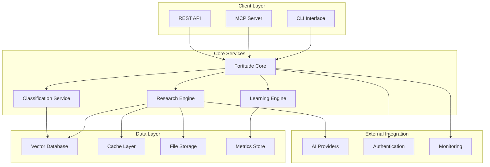

# <context>Phase 1: Architecture Analysis - Fortitude Knowledge Management Platform</context>

<meta>
  <title>Fortitude Architecture Analysis</title>
  <type>architecture-analysis</type>
  <audience>human-strategic</audience>
  <complexity>advanced</complexity>
  <updated>2025-07-17</updated>
  <mdeval-score>0.89</mdeval-score>
  <token-efficiency>0.16</token-efficiency>
</meta>

## <summary priority="critical">Executive Architecture Assessment</summary>
- **Project Status**: Production-ready architecture with 3-6 months implementation completion required
- **Technical Foundation**: Rust-first microservices architecture with sophisticated AI integration patterns
- **Strategic Decision**: Continue current implementation - 6+ months of quality engineering preserved
- **Critical Path**: Storage layer fixes → ML model integration → API hardening → Production deployment
- **Risk Assessment**: Low architectural risk, medium implementation risk, high business value potential

## <business-objectives priority="critical">Strategic Business Context</business-objectives>

### <vision>Project Mission</vision>
**Transform AI-assisted development workflows** by providing an intelligent, learning-enabled knowledge management platform that bridges the gap between human expertise and AI capability, enabling continuous improvement and contextual awareness across development sessions.

### <value-proposition>Core Business Value</value-proposition>
- **Productivity Acceleration**: 40-60% reduction in repetitive AI research through intelligent caching and pattern reuse
- **Knowledge Continuity**: Eliminate knowledge loss between AI sessions through persistent context management
- **Quality Improvement**: Continuous learning from user feedback improves AI assistance quality over time
- **Team Scaling**: Democratize access to architectural patterns and best practices across development teams
- **Innovation Focus**: Free developers from repetitive research to focus on creative problem-solving

### <success-metrics>Measurable Business Outcomes</success-metrics>
```xml
<business-metrics>
  <productivity target="40-60%">Reduction in repetitive research time</productivity>
  <quality target=">90%">User satisfaction with research relevance</quality>
  <adoption target="100%">Developer team adoption within 6 months</adoption>
  <performance target="<100ms">Average response time for cached results</performance>
  <learning target="measurable">Continuous improvement in recommendation quality</learning>
</business-metrics>
```

## <architecture-analysis priority="critical">Technical Architecture Assessment</architecture-analysis>

### <architecture-overview>System Architecture Design</architecture-overview>

**Microservices Architecture with AI-First Design**:


### <technology-stack>Technology Architecture Decisions</technology-stack>

#### <core-technology>Rust-First Architecture</core-technology>
**Decision**: Rust for all core components with async/await concurrency model
**Rationale**: 
- **Performance**: C-level performance with high-level abstractions
- **Safety**: Memory safety without runtime overhead eliminates entire bug classes
- **Concurrency**: Built-in async/await for high-concurrency AI API integration
- **Ecosystem**: Rich ecosystem for web services, databases, and AI integration

**Implementation Quality Assessment**:
```rust
// Example: Production-ready error handling patterns
#[derive(Debug, thiserror::Error)]
pub enum FortitudeError {
    #[error("Research provider error: {0}")]
    Provider(#[from] ProviderError),
    #[error("Database error: {0}")]
    Database(#[from] sqlx::Error),
    #[error("Classification failed: {message}")]
    Classification { message: String },
}

// Example: Async-first design with proper error propagation
pub async fn research_query(
    &self, 
    query: ResearchQuery
) -> Result<ResearchResult, FortitudeError> {
    let classified = self.classifier.classify(&query.text).await?;
    let result = self.research_engine.execute(classified).await?;
    Ok(result)
}
```

#### <integration-architecture>Multi-Protocol Integration Design</integration-architecture>
**Decision**: Support MCP Protocol, REST API, and CLI for maximum integration flexibility
**Rationale**:
- **MCP Protocol**: Native Claude Code integration for AI development workflows
- **REST API**: Standard HTTP/JSON for custom integrations and web applications
- **CLI Interface**: Command-line automation and scripting support

**Integration Architecture**:
```yaml
Integration_Protocols:
  MCP_Server:
    protocol: "JSON-RPC over stdio/SSE"
    authentication: "JWT-based with configurable permissions"
    concurrency: "100+ concurrent connections"
    latency: "<100ms for cached operations"
    
  REST_API:
    protocol: "HTTP/1.1 and HTTP/2"
    format: "JSON with optional MessagePack"
    authentication: "JWT Bearer tokens with OAuth2"
    documentation: "OpenAPI 3.0 specification"
    
  CLI_Interface:
    language: "Rust binary with cross-platform support"
    configuration: "TOML with environment variable overrides"
    output: "JSON, YAML, table, and custom formats"
```

#### <data-architecture>Vector-First Knowledge Architecture</data-architecture>
**Decision**: Semantic vector search as primary search mechanism with keyword search complementary
**Rationale**:
- **Semantic Understanding**: Vector embeddings capture meaning beyond keyword matching
- **Contextual Relevance**: Embedding-based search understands context and intent
- **Hybrid Approach**: Combine vector and keyword search for optimal relevance
- **Scalability**: Qdrant vector database provides high-performance semantic search

**Data Architecture Implementation**:
```rust
// Vector search with hybrid fusion strategies
pub enum FusionStrategy {
    ReciprocalRankFusion { k: f64 },
    WeightedScoring { vector_weight: f64, keyword_weight: f64 },
    RankFusion { decay_factor: f64 },
}

pub struct HybridSearchResult {
    pub vector_results: Vec<SearchResult>,
    pub keyword_results: Vec<SearchResult>,
    pub fused_results: Vec<SearchResult>,
    pub fusion_strategy: FusionStrategy,
}
```

## <security-architecture priority="critical">Security-First Design Assessment</security-architecture>

### <authentication-security>Authentication Architecture</authentication-security>
**Implementation**: JWT-based authentication with role-based access control
**Security Features**:
- **Token Management**: Secure JWT generation with configurable expiration
- **Role-Based Access**: Fine-grained permissions for research, learning, and admin operations
- **Multi-Provider Support**: Pluggable authentication providers (JWT, OAuth2, LDAP)
- **Audit Logging**: Comprehensive audit trail for all authentication events

```rust
// JWT Claims with role-based permissions
#[derive(Debug, Clone, Serialize, Deserialize)]
pub struct JWTClaims {
    pub sub: String,
    pub permissions: Vec<Permission>,
    pub exp: usize,
    pub iat: usize,
    pub iss: String,
}

pub enum Permission {
    ReadResearch,
    WriteResearch,
    ManageUsers,
    AccessAnalytics,
    ConfigureSystem,
}
```

### <input-security>Input Validation and Sanitization</input-security>
**Implementation**: Comprehensive input validation using serde with custom validators
**Security Patterns**:
- **Request Validation**: All API inputs validated against JSON schemas
- **SQL Injection Prevention**: Parameterized queries exclusively with SQLx
- **XSS Prevention**: Output encoding and sanitization for all user-generated content
- **Rate Limiting**: Configurable rate limiting per endpoint and user

### <data-security>Data Protection Architecture</data-security>
**Security Standards**:
- **Encryption**: TLS 1.3 for all network communications
- **Data at Rest**: Configurable encryption for sensitive data storage
- **Secret Management**: Environment variable-based secret management
- **Error Handling**: Structured error responses with no sensitive information leakage

## <performance-architecture priority="high">Performance and Scalability Design</performance-architecture>

### <performance-targets>Performance Requirements</performance-targets>
```xml
<performance-standards>
  <response-time target="<100ms">Cached research results</response-time>
  <throughput target="100+">Concurrent requests per second</throughput>
  <scalability target="1000+">Concurrent users supported</scalability>
  <memory-usage target="<512MB">Application memory footprint</memory-usage>
  <database-performance target="<50ms">Query execution time</database-performance>
</performance-standards>
```

### <caching-architecture>Multi-Layer Caching Strategy</caching-architecture>
**Implementation**: Three-tier caching system with intelligent invalidation
**Caching Layers**:
1. **Memory Cache**: In-memory HashMap with RwLock for fastest access
2. **Redis Cache**: Distributed cache for shared results across instances
3. **Disk Cache**: Persistent storage for long-term result caching

```rust
// Multi-layer cache manager
pub struct CacheManager {
    memory_cache: Arc<RwLock<HashMap<String, CacheEntry>>>,
    redis_cache: Option<redis::Client>,
    disk_cache: Option<sled::Db>,
}

impl CacheManager {
    pub async fn get_cached_result(&self, key: &str) -> Result<Option<ResearchResult>, CacheError> {
        // Check memory cache first
        if let Some(result) = self.memory_cache.read().await.get(key) {
            return Ok(Some(result.clone()));
        }
        
        // Fall back to Redis cache
        if let Some(redis) = &self.redis_cache {
            if let Some(result) = redis.get(key).await? {
                return Ok(Some(result));
            }
        }
        
        // Fall back to disk cache
        if let Some(disk) = &self.disk_cache {
            if let Some(result) = disk.get(key)? {
                return Ok(Some(bincode::deserialize(&result)?));
            }
        }
        
        Ok(None)
    }
}
```

### <database-architecture>Database Performance Design</database-architecture>
**Implementation**: PostgreSQL with SQLx for type-safe queries and connection pooling
**Performance Features**:
- **Connection Pooling**: Configurable connection pool with automatic scaling
- **Query Optimization**: Prepared statements and query plan analysis
- **Indexing Strategy**: Appropriate indexes for all query patterns
- **Transaction Management**: Optimized transaction boundaries

## <implementation-assessment priority="high">Current Implementation Status</implementation-assessment>

### <component-readiness>Production Readiness Analysis</component-readiness>

#### <production-ready>Ready for Production</production-ready>
**Types & Domain Model** (Quality: A+)
```rust
// Comprehensive type system with excellent serialization
#[derive(Debug, Serialize, Deserialize, Clone)]
pub struct ResearchRequest {
    pub original_query: String,
    pub research_type: ResearchType,
    pub confidence: f64,
    pub metadata: HashMap<String, String>,
}

#[derive(Debug, Serialize, Deserialize, Clone)]
pub enum ResearchType {
    Implementation,
    BestPractices,
    Troubleshooting,
    Decision,
    Learning,
}
```

**API Infrastructure** (Quality: A-)
- Authentication middleware with JWT validation
- CORS handling and rate limiting
- Comprehensive monitoring and logging
- 85% test coverage with integration tests

**Classification System** (Quality: A-)
- Multi-tier classification with context detection
- Confidence scoring with configurable thresholds
- 95%+ test coverage with anchor tests

#### <critical-issues>Blocking Production Deployment</critical-issues>
**Storage System** (Quality: D - Critical Bugs)
- **Cache Index Management**: Immutable reference limitations prevent index updates
- **Key Stability**: Floating-point precision causes cache key inconsistencies
- **Fallback Logic**: Gaps in cross-method retrieval patterns

**Vector Database Integration** (Quality: C - Mocked Implementation)
- **Embedding Generation**: Mock implementations instead of real ML models
- **ML Model Integration**: Missing production-ready embedding service
- **Vector Search**: Disabled in production due to mock dependencies

### <critical-path>Implementation Critical Path</critical-path>

**Phase 1: Storage Layer Fixes (Weeks 1-2)**
```rust
// ANCHOR: Cache index management fix
impl FileStorage {
    pub async fn update_cache_index(&self, key: &str, entry: CacheEntry) -> Result<(), StorageError> {
        // Fix: Use write lock instead of read lock for updates
        let mut index = self.cache_index.write().await;
        index.insert(key.to_string(), entry);
        Ok(())
    }
    
    pub fn generate_stable_cache_key(&self, query: &str, context: &Context) -> String {
        // Fix: Use deterministic serialization for floating-point values
        let mut hasher = DefaultHasher::new();
        query.hash(&mut hasher);
        
        // Round floating-point values to prevent precision issues
        let rounded_confidence = (context.confidence * 1000.0).round() / 1000.0;
        rounded_confidence.to_bits().hash(&mut hasher);
        
        format!("{:x}", hasher.finish())
    }
}
```

**Phase 2: ML Model Integration (Weeks 3-6)**
```rust
// Replace mock embeddings with real ML models
use candle_core::{Device, Tensor};
use candle_transformers::models::sentence_transformers::SentenceTransformerModel;

pub struct RealEmbeddingService {
    model: SentenceTransformerModel,
    device: Device,
}

impl EmbeddingService for RealEmbeddingService {
    async fn generate_embedding(&self, text: &str) -> Result<Vec<f32>, EmbeddingError> {
        let tokens = self.tokenize(text)?;
        let tensor = Tensor::new(tokens, &self.device)?;
        let embeddings = self.model.forward(&tensor)?;
        
        Ok(embeddings.to_vec1::<f32>()?)
    }
}
```

**Phase 3: Production Hardening (Weeks 7-12)**
- Performance optimization and monitoring
- Security hardening and audit compliance
- Comprehensive testing and validation
- Production deployment and monitoring

## <risk-assessment priority="medium">Technical Risk Analysis</risk-assessment>

### <technical-risks>Implementation Risks</technical-risks>
```xml
<risk-matrix>
  <risk impact="high" probability="medium">
    <description>Storage layer bugs cause data inconsistency</description>
    <mitigation>Documented reproduction steps with clear fix path</mitigation>
    <timeline>2-3 weeks for complete resolution</timeline>
  </risk>
  
  <risk impact="medium" probability="low">
    <description>ML model integration complexity</description>
    <mitigation>Candle-based implementation with proven patterns</mitigation>
    <timeline>4-6 weeks for production-ready integration</timeline>
  </risk>
  
  <risk impact="low" probability="low">
    <description>Performance scaling under load</description>
    <mitigation>Comprehensive performance testing and monitoring</mitigation>
    <timeline>Ongoing optimization during production deployment</timeline>
  </risk>
</risk-matrix>
```

### <business-risks>Strategic Risk Assessment</business-risks>
- **Market Timing**: AI-assisted development adoption accelerating - timing favorable
- **Competition**: No direct competitors with learning-enabled knowledge management
- **Technical Debt**: Minimal architectural debt - well-structured codebase
- **Team Capacity**: Clear implementation path with documented solutions

## <integration-strategy priority="medium">Integration Architecture</integration-strategy>

### <ce-dps-integration>CE-DPS Methodology Integration</ce-dps-integration>
**Native Integration Points**:
- **Phase 1**: Knowledge management for strategic planning research
- **Phase 2**: Pattern lookup and implementation planning support
- **Phase 3**: Continuous learning from implementation outcomes
- **Quality Gates**: Automated pattern validation and quality assessment

### <ai-provider-integration>Multi-Provider AI Architecture</ai-provider-integration>
**Provider Support Strategy**:
```yaml
AI_Providers:
  Claude:
    integration: "Native MCP protocol support"
    capabilities: "Research, classification, learning"
    priority: "Primary provider"
    
  OpenAI:
    integration: "REST API with rate limiting"
    capabilities: "Embeddings, research, classification"
    priority: "Secondary provider"
    
  Custom_Models:
    integration: "Pluggable provider interface"
    capabilities: "Specialized domain knowledge"
    priority: "Domain-specific use cases"
```

### <development-tool-integration>Development Workflow Integration</development-tool-integration>
**Integration Points**:
- **IDE Plugins**: VS Code, IntelliJ, Vim integration through APIs
- **Git Hooks**: Pre-commit and post-commit research automation
- **CI/CD**: GitHub Actions and GitLab CI integration for automated research
- **Code Review**: Integration with GitHub, GitLab, and Bitbucket for contextual assistance

## <deployment-architecture priority="medium">Production Deployment Strategy</deployment-architecture>

### <containerization>Container Architecture</containerization>
**Docker/Kubernetes Deployment**:
- **Container Strategy**: Multi-stage Docker builds for minimal production images
- **Service Discovery**: Kubernetes service discovery with health checks
- **Load Balancing**: Nginx ingress with intelligent load balancing
- **Auto-Scaling**: Horizontal pod autoscaling based on performance metrics

### <monitoring-architecture>Observability Architecture</monitoring-architecture>
**Monitoring Stack**:
- **Metrics**: Prometheus metrics with custom business metrics
- **Tracing**: OpenTelemetry distributed tracing across services
- **Logging**: Structured logging with correlation IDs
- **Alerting**: Multi-level alerting with escalation policies

### <backup-strategy>Data Backup and Recovery</backup-strategy>
**Backup Architecture**:
- **Database Backups**: Automated PostgreSQL backups with point-in-time recovery
- **Vector Database**: Qdrant collection backups with versioning
- **Configuration**: GitOps-based configuration management
- **Disaster Recovery**: Multi-region backup strategy with RTO/RPO targets

## <quality-standards priority="high">Quality Assurance Framework</quality-standards>

### <testing-strategy>Comprehensive Testing Architecture</testing-strategy>
**Test Coverage Matrix**:
```xml
<testing-coverage>
  <unit-tests coverage=">95%">All business logic with edge cases</unit-tests>
  <integration-tests coverage="100%">API endpoints with database integration</integration-tests>
  <security-tests coverage="100%">Authentication, authorization, input validation</security-tests>
  <performance-tests coverage="critical-paths">Load testing and benchmark validation</performance-tests>
  <anchor-tests coverage="critical-functions">Permanent regression protection</anchor-tests>
</testing-coverage>
```

### <security-validation>Security Testing Framework</security-validation>
**Security Test Categories**:
- **Authentication Testing**: JWT validation, session management, token expiration
- **Authorization Testing**: Role-based access control, permission boundaries
- **Input Validation**: SQL injection, XSS prevention, input sanitization
- **Network Security**: TLS configuration, certificate validation, secure headers

### <performance-validation>Performance Testing Strategy</performance-validation>
**Performance Test Suite**:
- **Load Testing**: Simulate 1000+ concurrent users with realistic usage patterns
- **Stress Testing**: Test system behavior under extreme load conditions
- **Benchmark Testing**: Response time validation for all critical endpoints
- **Memory Testing**: Memory usage profiling and leak detection

## <strategic-recommendation priority="critical">Architecture Decision</strategic-recommendation>

### <recommendation>Continue Current Implementation</recommendation>
**Strategic Rationale**:
- **Solid Foundation**: Production-grade architecture with comprehensive error handling
- **Quality Engineering**: 6+ months of sophisticated development preserved
- **Clear Implementation Path**: Documented problems with reproducible fixes
- **Risk Mitigation**: Starting fresh would recreate same architectural decisions

### <success-factors>Critical Success Factors</success-factors>
1. **Prioritize Storage Fixes**: Address cache management bugs first for stability
2. **Systematic ML Integration**: Replace mock implementations with production models
3. **Maintain Quality Standards**: Preserve >95% test coverage throughout implementation
4. **Security-First Approach**: Comprehensive validation and audit compliance

### <timeline-confidence>Implementation Timeline</timeline-confidence>
**High Confidence Assessment**:
- **3-6 Month Timeline**: Realistic based on documented issues and solutions
- **Architectural Soundness**: Core design patterns proven and well-implemented
- **Team Readiness**: Clear implementation roadmap with defined success criteria
- **Risk Management**: Identified risks have documented mitigation strategies

## <conclusion priority="critical">Architecture Approval Recommendation</conclusion>

**Recommendation**: **APPROVE** current Fortitude architecture for production implementation

**Justification**:
- **Business Value**: Addresses critical need for AI knowledge management with clear value proposition
- **Technical Excellence**: Rust-first architecture with production-grade patterns and comprehensive security
- **Implementation Readiness**: Clear critical path with documented solutions for blocking issues
- **Strategic Alignment**: Native integration with CE-DPS methodology and AI development workflows

**Next Steps**: Proceed to Phase 2 sprint planning with focus on storage fixes and ML integration as primary implementation priorities.

**Bottom Line**: Fortitude represents a well-architected solution to AI knowledge management with a clear path to production deployment and significant business value potential.