```mermaid
graph TD
    A[Storage Layer Fixes - PLANNED] --> B[ML Model Integration]
    B --> C[Vector Search Optimization]
    C --> D[Learning Pipeline]
    
    A --> E[Security Implementation]
    E --> F[Performance Optimization]
    F --> G[Enterprise Security]
    
    R[✅ Core Research Pipeline - COMPLETED] --> B
    R --> E
    R -.-> D
    
    D --> H[Multi-Provider AI]
    C --> I[Proactive Research]
    
    G --> J[Advanced Personalization]
    H --> K[Tool Integration Suite]
    
    F --> L[Horizontal Scaling]
    L --> M[API Platform]
    
    style R fill:#90EE90
    style A fill:#FFE4B5
```

# <context>Phase 1: Feature Roadmap - Fortitude Production Implementation</context>

<meta>
  <title>Fortitude Feature Roadmap</title>
  <type>feature-roadmap</type>
  <audience>human-strategic</audience>
  <complexity>advanced</complexity>
  <updated>2025-07-17</updated>
  <mdeval-score>0.91</mdeval-score>
  <token-efficiency>0.15</token-efficiency>
</meta>

## <summary priority="critical">Strategic Feature Roadmap</summary>
- **Roadmap Scope**: 12-month implementation roadmap from current state to production platform
- **Strategic Approach**: Value-driven feature prioritization with business impact optimization
- **Implementation Philosophy**: Fix-first approach prioritizing stability over new features
- **Success Metrics**: Business value delivery, technical debt reduction, user adoption acceleration
- **Timeline Confidence**: High - based on documented issues with clear resolution paths

### <sprint-completion-status>Current Implementation Status</sprint-completion-status>
- **Sprint 001** (Storage Layer Stabilization): 🟡 **PLANNED** - Setup completed, implementation pending
- **Sprint 002** (Core Research Pipeline Stabilization): ✅ **COMPLETED** - July 29, 2025
  - 431/431 tests passed, >95% coverage, zero security vulnerabilities
  - Files: error_handling.rs (596 lines), resilient_research_engine.rs (474 lines)
  - Delivered: Structured error handling, retry logic, circuit breaker patterns, resilient engine wrapper

## <feature-prioritization priority="critical">Value-Driven Feature Scoring Framework</feature-prioritization>

### <scoring-methodology>Business Value Prioritization Matrix</scoring-methodology>
```xml
<prioritization-framework>
  <business-value weight="0.4">
    <criterion>User impact and adoption potential</criterion>
    <criterion>Revenue generation or cost reduction</criterion>
    <criterion>Competitive advantage creation</criterion>
    <criterion>Strategic alignment with AI development trends</criterion>
  </business-value>
  
  <technical-feasibility weight="0.3">
    <criterion>Implementation complexity and risk</criterion>
    <criterion>Available resources and expertise</criterion>
    <criterion>Technology maturity and support</criterion>
    <criterion>Integration with existing architecture</criterion>
  </technical-feasibility>
  
  <strategic-alignment weight="0.3">
    <criterion>CE-DPS methodology integration</criterion>
    <criterion>Foundation for future features</criterion>
    <criterion>Market timing and urgency</criterion>
    <criterion>Platform ecosystem advancement</criterion>
  </strategic-alignment>
</prioritization-framework>
```

### <feature-categories>Feature Classification System</feature-categories>
- **Critical Path**: Features blocking production deployment (highest priority)
- **Core Platform**: Essential features for MVP functionality
- **Enhancement**: Features improving user experience and adoption
- **Advanced**: Features enabling platform differentiation and competitive advantage

## <roadmap-phases priority="critical">Four-Phase Implementation Strategy</roadmap-phases>

### <phase-1 priority="critical">Phase 1: Foundation Stabilization (Weeks 1-8)</phase-1>

**Theme**: Fix critical issues and establish production-ready foundation
**Business Impact**: Enable basic production deployment with stable core functionality
**Success Criteria**: Storage layer stable, core research pipeline functional, basic security implemented

#### <critical-features>Critical Path Features</critical-features>

**1. Storage Layer Stabilization** (Priority: Critical | Effort: 3 weeks) **[PLANNED - Sprint 001]**
```yaml
Feature: Storage Cache Management Fix
Business_Value: High
  - Eliminates data inconsistency issues blocking production
  - Enables reliable caching for 40-60% performance improvement
  - Foundation for all other features requiring data persistence
  
Technical_Implementation:
  - Fix cache index management with proper write lock handling
  - Implement stable cache key generation with deterministic serialization
  - Add fallback logic for cross-method retrieval patterns
  
Acceptance_Criteria:
  - Cache hit rate >85% under normal load
  - Zero data inconsistency issues in stress testing
  - All existing tests pass with new cache implementation
  
Status: PLANNED (Sprint 001 - Setup completed, implementation pending)
```

**2. Core Research Pipeline Stabilization** (Priority: Critical | Effort: 2 weeks) **[✅ COMPLETED - Sprint 002]**
```yaml
Feature: Research Engine Error Handling
Business_Value: High
  - Prevents service crashes and data loss
  - Enables reliable research query processing
  - Foundation for user trust and adoption
  
Technical_Implementation:
  - ✅ Implement comprehensive error handling with structured types (PipelineError)
  - ✅ Add retry logic with exponential backoff and jitter
  - ✅ Create circuit breaker patterns for external API calls
  - ✅ Resilient research engine wrapper with seamless integration
  
Acceptance_Criteria:
  - ✅ 99.9% uptime capability through circuit breaker protection
  - ✅ Graceful degradation during external API failures
  - ✅ Comprehensive error reporting with correlation IDs and actionable context
  
Status: COMPLETED (Sprint 002 - July 29, 2025)
Quality: 431/431 tests passed, >95% coverage, zero security vulnerabilities
Files: error_handling.rs (596 lines), resilient_research_engine.rs (474 lines)
```

**3. Basic Security Implementation** (Priority: Critical | Effort: 2 weeks)
```yaml
Feature: Production Security Hardening
Business_Value: High
  - Enables secure production deployment
  - Meets basic enterprise security requirements
  - Foundation for user authentication and authorization
  
Technical_Implementation:
  - JWT authentication with secure token management
  - Role-based access control for all endpoints
  - Input validation and sanitization framework
  
Acceptance_Criteria:
  - All API endpoints secured with authentication
  - Comprehensive input validation prevents injection attacks
  - Audit logging for all security-relevant operations
```

**4. Basic Monitoring and Observability** (Priority: High | Effort: 1 week)
```yaml
Feature: Production Monitoring Infrastructure
Business_Value: Medium
  - Enables proactive issue detection and resolution
  - Provides operational visibility for production deployment
  - Foundation for performance optimization and scaling
  
Technical_Implementation:
  - Prometheus metrics collection with custom business metrics
  - Structured logging with correlation IDs
  - Health check endpoints for all services
  
Acceptance_Criteria:
  - Comprehensive metrics collection for all critical operations
  - Real-time alerting for critical issues
  - Performance dashboards for operational visibility
```

### <phase-2 priority="high">Phase 2: ML Integration and Core Functionality (Weeks 9-16)</phase-2>

**Theme**: Enable intelligent semantic search and learning capabilities
**Business Impact**: Unlock core value proposition through AI-powered knowledge management
**Success Criteria**: Vector search functional, learning pipeline operational, user feedback integration

#### <ml-integration-features>ML Integration Features</ml-integration-features>

**1. Real Embedding Service Implementation** (Priority: Critical | Effort: 4 weeks)
```yaml
Feature: Production ML Model Integration
Business_Value: Critical
  - Enables core value proposition of semantic search
  - Unlocks 10x improvement in research relevance
  - Foundation for all AI-powered features
  
Technical_Implementation:
  - Replace mock embedding service with Candle-based implementation
  - Integrate sentence transformer models for text embeddings
  - Add model serving infrastructure with GPU support
  
Acceptance_Criteria:
  - Semantic search produces relevant results for complex queries
  - Embedding generation <200ms for typical queries
  - Model serving scales to 100+ concurrent requests
  
Dependencies:
  - Storage layer fixes from Phase 1
  - Qdrant vector database configuration
  - GPU infrastructure for model serving
```

**2. Vector Search Optimization** (Priority: High | Effort: 2 weeks)
```yaml
Feature: Hybrid Search with Fusion Strategies
Business_Value: High
  - Combines semantic and keyword search for optimal relevance
  - Enables fine-tuning of search results for specific use cases
  - Provides fallback options for search reliability
  
Technical_Implementation:
  - Implement ReciprocalRankFusion for result combination
  - Add configurable fusion strategies and weights
  - Create search relevance scoring and ranking
  
Acceptance_Criteria:
  - Search results demonstrate measurable improvement in relevance
  - Configurable fusion strategies for different query types
  - Search performance <100ms for cached results
```

**3. Learning Pipeline Implementation** (Priority: High | Effort: 3 weeks)
```yaml
Feature: User Feedback Learning System
Business_Value: High
  - Enables continuous improvement of search and research quality
  - Provides user-driven customization and personalization
  - Foundation for competitive advantage through learning
  
Technical_Implementation:
  - Implement feedback collection and processing pipeline
  - Add learning algorithms for search result ranking
  - Create user preference tracking and adaptation
  
Acceptance_Criteria:
  - Measurable improvement in search quality based on feedback
  - User preferences effectively personalize results
  - Learning pipeline processes feedback in real-time
```

#### <core-platform-features>Core Platform Features</core-platform-features>

**4. Advanced Classification System** (Priority: Medium | Effort: 2 weeks)
```yaml
Feature: Context-Aware Query Classification
Business_Value: Medium
  - Improves research targeting and provider selection
  - Enables specialized handling for different query types
  - Foundation for advanced research orchestration
  
Technical_Implementation:
  - Enhance classification with audience and domain context
  - Add confidence scoring and threshold management
  - Implement multi-tier classification pipeline
  
Acceptance_Criteria:
  - Classification accuracy >90% for standard query types
  - Context detection improves research relevance
  - Confidence scoring enables intelligent fallback strategies
```

### <phase-3 priority="medium">Phase 3: Production Hardening and Scale (Weeks 17-24)</phase-3>

**Theme**: Optimize for production scale and enterprise deployment
**Business Impact**: Enable enterprise adoption with performance, security, and operational excellence
**Success Criteria**: System scales to 1000+ users, enterprise security compliant, operational excellence

#### <production-hardening-features>Production Hardening Features</production-hardening-features>

**1. Performance Optimization Suite** (Priority: High | Effort: 3 weeks)
```yaml
Feature: Production Performance Optimization
Business_Value: High
  - Enables scale to 1000+ concurrent users
  - Reduces operational costs through efficiency
  - Improves user experience through responsiveness
  
Technical_Implementation:
  - Implement advanced caching strategies with intelligent invalidation
  - Add connection pooling optimization for database and APIs
  - Create request queuing and load balancing
  
Acceptance_Criteria:
  - System handles 1000+ concurrent users with <200ms response times
  - Memory usage optimized to <512MB per instance
  - Database queries optimized to <50ms execution time
  
Performance_Targets:
  - API response time: <100ms for cached results
  - Throughput: 500+ requests per second
  - Memory efficiency: <512MB per service instance
```

**2. Enterprise Security Implementation** (Priority: High | Effort: 2 weeks)
```yaml
Feature: Enterprise Security and Compliance
Business_Value: High
  - Enables enterprise customer adoption
  - Meets regulatory and compliance requirements
  - Foundation for trusted deployment in sensitive environments
  
Technical_Implementation:
  - Implement OAuth2 integration for enterprise SSO
  - Add encryption at rest for sensitive data
  - Create comprehensive audit logging and compliance reporting
  
Acceptance_Criteria:
  - Integration with enterprise identity providers
  - Compliance with SOC2 and ISO 27001 requirements
  - Comprehensive audit trail for all operations
```

**3. Operational Excellence Infrastructure** (Priority: Medium | Effort: 2 weeks)
```yaml
Feature: Production Operations and Monitoring
Business_Value: Medium
  - Enables reliable production operations
  - Provides operational visibility and control
  - Foundation for proactive issue resolution
  
Technical_Implementation:
  - Implement distributed tracing with OpenTelemetry
  - Add automated alerting with escalation policies
  - Create operational dashboards and runbooks
  
Acceptance_Criteria:
  - 99.9% uptime with comprehensive monitoring
  - Automated alerting for all critical issues
  - Operational dashboards provide actionable insights
```

#### <scale-features>Scalability Features</scale-features>

**4. Horizontal Scaling Implementation** (Priority: Medium | Effort: 3 weeks)
```yaml
Feature: Kubernetes-Native Scaling
Business_Value: Medium
  - Enables automatic scaling based on demand
  - Reduces operational costs through efficient resource usage
  - Foundation for multi-tenant and multi-region deployment
  
Technical_Implementation:
  - Implement Kubernetes deployment with auto-scaling
  - Add service mesh for inter-service communication
  - Create load balancing and traffic routing
  
Acceptance_Criteria:
  - Automatic scaling based on CPU and memory metrics
  - Zero-downtime deployments with rolling updates
  - Service mesh provides observability and security
```

### <phase-4 priority="low">Phase 4: Advanced Features and Differentiation (Weeks 25-52)</phase-4>

**Theme**: Enable advanced AI capabilities and competitive differentiation
**Business Impact**: Establish market leadership through advanced features and capabilities
**Success Criteria**: Advanced AI features operational, competitive advantage established, user adoption accelerated

#### <advanced-ai-features>Advanced AI Features</advanced-ai-features>

**1. Multi-Provider AI Orchestration** (Priority: Medium | Effort: 4 weeks)
```yaml
Feature: Intelligent AI Provider Selection
Business_Value: Medium
  - Optimizes cost and performance through provider diversity
  - Enables specialized AI capabilities for different use cases
  - Foundation for vendor independence and flexibility
  
Technical_Implementation:
  - Implement provider abstraction layer with pluggable architecture
  - Add intelligent provider selection based on query type and performance
  - Create failover and load balancing across providers
  
Acceptance_Criteria:
  - Automatic provider selection optimizes cost and performance
  - Seamless failover prevents service disruption
  - Provider performance metrics drive selection decisions
```

**2. Proactive Research and Gap Detection** (Priority: Medium | Effort: 3 weeks)
```yaml
Feature: Intelligent Knowledge Gap Detection
Business_Value: Medium
  - Proactively identifies and fills knowledge gaps
  - Enables predictive research and recommendation
  - Foundation for autonomous knowledge management
  
Technical_Implementation:
  - Implement file system monitoring for context changes
  - Add gap detection algorithms based on usage patterns
  - Create background research pipeline for proactive knowledge building
  
Acceptance_Criteria:
  - Proactive gap detection identifies 80% of knowledge needs
  - Background research improves knowledge coverage
  - User notification system provides actionable insights
```

**3. Advanced Learning and Personalization** (Priority: Low | Effort: 4 weeks)
```yaml
Feature: Machine Learning-Powered Personalization
Business_Value: Low
  - Provides personalized experience based on user behavior
  - Enables advanced recommendation and suggestion systems
  - Foundation for AI-driven productivity enhancement
  
Technical_Implementation:
  - Implement user behavior analysis and modeling
  - Add recommendation engine based on usage patterns
  - Create personalized search and research experiences
  
Acceptance_Criteria:
  - Personalized recommendations improve user productivity
  - User behavior modeling enables predictive assistance
  - Recommendation accuracy >70% for active users
```

#### <ecosystem-features>Ecosystem Integration Features</ecosystem-features>

**4. Development Tool Integration Suite** (Priority: Medium | Effort: 6 weeks)
```yaml
Feature: Comprehensive Development Tool Integration
Business_Value: Medium
  - Enables seamless integration with developer workflows
  - Reduces friction for user adoption and engagement
  - Foundation for ecosystem leadership and adoption
  
Technical_Implementation:
  - Develop IDE plugins for VS Code, IntelliJ, and Vim
  - Add Git hooks for automated research and assistance
  - Create CI/CD integrations for automated knowledge management
  
Acceptance_Criteria:
  - IDE plugins provide contextual research assistance
  - Git hooks automate knowledge capture and sharing
  - CI/CD integrations support automated documentation
```

**5. API Platform and Extensibility** (Priority: Medium | Effort: 4 weeks)
```yaml
Feature: Comprehensive API Platform
Business_Value: Medium
  - Enables third-party integrations and extensions
  - Provides foundation for partner ecosystem development
  - Creates platform network effects and adoption
  
Technical_Implementation:
  - Implement comprehensive REST API with OpenAPI documentation
  - Add webhook system for real-time integration
  - Create SDK and developer tools for integration
  
Acceptance_Criteria:
  - API platform enables third-party integrations
  - Developer tools reduce integration time by 80%
  - Webhook system provides real-time event notifications
```

## <feature-dependencies priority="high">Implementation Dependencies and Sequencing</feature-dependencies>

### <dependency-mapping>Critical Path Dependencies</dependency-mapping>


### <integration-requirements>Cross-Feature Integration Requirements</integration-requirements>
```yaml
Integration_Dependencies:
  Storage_Foundation:
    required_for: ["ML Integration", "Learning Pipeline", "Performance Optimization"]
    blocking_risk: "High - core functionality depends on stable storage"
    status: "PLANNED (Sprint 001 setup completed)"
    
  Core_Research_Pipeline:
    required_for: ["ML Integration", "Security Framework", "Learning Pipeline"]
    blocking_risk: "Low - foundation complete with comprehensive error handling"
    status: "✅ COMPLETED (Sprint 002 - July 29, 2025)"
    quality_metrics: "431/431 tests passed, >95% coverage, zero vulnerabilities"
    
  ML_Integration:
    required_for: ["Vector Search", "Learning Pipeline", "Advanced Features"]
    blocking_risk: "Critical - core value proposition depends on ML capabilities"
    status: "PENDING (depends on Storage Foundation completion)"
    
  Security_Framework:
    required_for: ["Enterprise Features", "Multi-tenant", "API Platform"]
    blocking_risk: "Medium - enterprise adoption depends on security compliance" 
    status: "PENDING"
    
  Performance_Infrastructure:
    required_for: ["Scaling", "Enterprise Deployment", "Advanced Features"]
    blocking_risk: "Medium - production scale depends on performance optimization"
    status: "PENDING"
```

## <resource-allocation priority="medium">Resource and Timeline Planning</resource-allocation>

### <effort-estimation>Development Effort Analysis</effort-estimation>
```xml
<effort-breakdown>
  <phase-1 duration="8-weeks" effort="high">
    <storage-fixes effort="3-weeks">Critical path - highest priority</storage-fixes>
    <research-pipeline effort="2-weeks">Core functionality stabilization</research-pipeline>
    <security-basic effort="2-weeks">Production readiness requirement</security-basic>
    <monitoring-basic effort="1-week">Operational visibility</monitoring-basic>
  </phase-1>
  
  <phase-2 duration="8-weeks" effort="high">
    <ml-integration effort="4-weeks">Core value proposition enablement</ml-integration>
    <vector-search effort="2-weeks">Search optimization and relevance</vector-search>
    <learning-pipeline effort="3-weeks">Continuous improvement foundation</learning-pipeline>
    <classification-advanced effort="2-weeks">Query processing optimization</classification-advanced>
  </phase-2>
  
  <phase-3 duration="8-weeks" effort="medium">
    <performance-optimization effort="3-weeks">Production scale enablement</performance-optimization>
    <enterprise-security effort="2-weeks">Enterprise adoption requirement</enterprise-security>
    <operational-excellence effort="2-weeks">Production operations</operational-excellence>
    <horizontal-scaling effort="3-weeks">Scalability infrastructure</horizontal-scaling>
  </phase-3>
  
  <phase-4 duration="28-weeks" effort="low">
    <advanced-ai effort="11-weeks">Competitive differentiation</advanced-ai>
    <ecosystem-integration effort="10-weeks">Platform ecosystem development</ecosystem-integration>
    <personalization effort="4-weeks">User experience enhancement</personalization>
    <api-platform effort="4-weeks">Third-party integration enablement</api-platform>
  </phase-4>
</effort-breakdown>
```

### <team-capacity>Team Capacity and Skill Requirements</team-capacity>
```yaml
Team_Requirements:
  Core_Development:
    rust_engineers: 2
    ml_engineers: 1
    devops_engineers: 1
    
  Specialized_Skills:
    vector_databases: "Required for ML integration"
    kubernetes: "Required for scaling implementation"
    security_compliance: "Required for enterprise features"
    
  Timeline_Constraints:
    phase_1: "3-month maximum for production readiness"
    phase_2: "2-month maximum for core value delivery"
    phase_3: "2-month maximum for enterprise readiness"
    phase_4: "6-month maximum for advanced features"
```

## <success-metrics priority="high">Feature Success Validation</success-metrics>

### <business-metrics>Business Impact Measurement</business-metrics>
```xml
<success-validation>
  <user-adoption target="90%">Developer team adoption within 6 months</user-adoption>
  <productivity-impact target="40-60%">Reduction in repetitive research time</productivity-impact>
  <quality-improvement target=">90%">User satisfaction with research relevance</quality-improvement>
  <performance-achievement target="<100ms">Average response time for cached results</performance-achievement>
  <learning-effectiveness target="measurable">Continuous improvement in recommendation quality</learning-effectiveness>
</success-validation>
```

### <technical-metrics>Technical Performance Targets</technical-metrics>
```yaml
Technical_Success_Criteria:
  Stability:
    uptime: ">99.9%"
    error_rate: "<0.1%"
    data_consistency: "100%"
    
  Performance:
    response_time: "<100ms for cached results"
    throughput: "500+ requests per second"
    concurrent_users: "1000+ supported"
    
  Quality:
    test_coverage: ">95%"
    security_compliance: "100%"
    documentation_coverage: ">90%"
    
  Learning:
    search_relevance: "Measurable improvement over time"
    user_satisfaction: ">90%"
    knowledge_coverage: ">95% of common patterns"
```

## <risk-mitigation priority="medium">Implementation Risk Management</risk-mitigation>

### <technical-risks>Technical Risk Assessment</technical-risks>
```xml
<risk-management>
  <risk category="technical" impact="high" probability="medium">
    <description>Storage layer fixes more complex than estimated</description>
    <mitigation>Documented reproduction steps with clear fix path</mitigation>
    <contingency>Parallel implementation of alternative caching strategy</contingency>
  </risk>
  
  <risk category="technical" impact="medium" probability="low">
    <description>ML model integration performance bottlenecks</description>
    <mitigation>Comprehensive performance testing and GPU optimization</mitigation>
    <contingency>Fallback to simpler embedding models with acceptable performance</contingency>
  </risk>
  
  <risk category="business" impact="high" probability="low">
    <description>Market timing changes affecting feature priorities</description>
    <mitigation>Flexible roadmap with quarterly reassessment</mitigation>
    <contingency>Pivot to highest-value features based on market feedback</contingency>
  </risk>
</risk-management>
```

### <mitigation-strategies>Risk Mitigation Strategies</mitigation-strategies>
- **Parallel Development**: Implement critical features in parallel to reduce timeline risk
- **MVP Approach**: Focus on minimum viable features for each phase to enable early feedback
- **Continuous Validation**: Regular stakeholder review and roadmap adjustment based on feedback
- **Technical Debt Management**: Prioritize technical debt resolution to prevent future complexity

## <roadmap-governance priority="low">Roadmap Management and Evolution</roadmap-governance>

### <review-process>Quarterly Roadmap Review Process</review-process>
```yaml
Roadmap_Governance:
  Review_Schedule:
    quarterly: "Strategic roadmap review and adjustment"
    monthly: "Progress assessment and risk evaluation"
    weekly: "Feature delivery and priority adjustment"
    
  Stakeholder_Input:
    users: "Feature request and feedback collection"
    business: "Strategic alignment and value validation"
    technical: "Implementation feasibility and architecture review"
    
  Adjustment_Criteria:
    market_changes: "Competitive landscape and user need evolution"
    technical_discoveries: "Implementation complexity and opportunity identification"
    resource_constraints: "Team capacity and skill availability changes"
```

### <evolution-strategy>Roadmap Evolution Strategy</evolution-strategy>
- **Data-Driven Decisions**: Use user feedback and performance metrics to guide feature prioritization
- **Agile Adaptation**: Maintain flexibility to pivot based on market and technical discoveries
- **Continuous Learning**: Incorporate lessons learned from each phase into future planning
- **Stakeholder Alignment**: Regular communication and alignment with business and technical stakeholders

## <conclusion priority="critical">Strategic Roadmap Recommendation</conclusion>

**Recommendation**: **APPROVE** feature roadmap with Phase 1 as immediate priority

**Strategic Rationale**:
- **Business Value Focus**: Roadmap prioritizes features with highest business impact and user adoption potential
- **Technical Risk Management**: Addresses critical technical debt first to establish stable foundation
- **Market Timing**: Aligns with accelerating AI-assisted development adoption trends
- **Competitive Advantage**: Enables unique learning-enabled knowledge management capabilities

**Implementation Approach**:
1. **Phase 1 Focus**: Immediate implementation of storage fixes and core stability
2. **Value-Driven Execution**: Prioritize features based on business impact and user feedback
3. **Quality First**: Maintain comprehensive testing and security standards throughout
4. **Continuous Validation**: Regular stakeholder review and roadmap adjustment

**Success Prediction**: High confidence in achieving production readiness within 6 months and establishing market leadership through advanced AI capabilities within 12 months.

**Next Steps**: Proceed to Phase 2 sprint planning with Phase 1 features as immediate implementation priority.