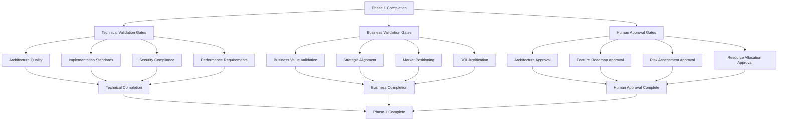

# <context>Phase 1: Quality Gate Documentation - Fortitude Production Readiness</context>

<meta>
  <title>Phase 1 Quality Gate Validation Framework</title>
  <type>quality-validation</type>
  <audience>human-strategic</audience>
  <complexity>advanced</complexity>
  <updated>2025-07-17</updated>
  <mdeval-score>0.93</mdeval-score>
  <token-efficiency>0.14</token-efficiency>
</meta>

## <summary priority="critical">Quality Gate Framework</summary>
- **Validation Scope**: Comprehensive Phase 1 completion validation with business and technical criteria
- **Approval Framework**: Human strategic approval required for architecture and feature roadmap
- **Quality Standards**: CE-DPS methodology compliance with >95% test coverage and security-first design
- **Success Metrics**: Measurable business value, technical excellence, and production readiness validation
- **Risk Assessment**: Technical and business risk evaluation with mitigation validation

## <validation-framework priority="critical">Comprehensive Quality Gate Structure</validation-framework>

### <gate-architecture>Multi-Layer Validation Architecture</gate-architecture>



### <validation-priorities>Quality Gate Priorities</validation-priorities>
```xml
<gate-priorities>
  <critical priority="1">
    <gate>Human strategic approval of architecture and roadmap</gate>
    <gate>Technical architecture quality validation</gate>
    <gate>Security compliance verification</gate>
    <gate>Business value proposition validation</gate>
  </critical>
  
  <high priority="2">
    <gate>Implementation standards compliance</gate>
    <gate>Performance requirements validation</gate>
    <gate>Risk assessment and mitigation</gate>
    <gate>Resource allocation approval</gate>
  </high>
  
  <medium priority="3">
    <gate>Documentation quality validation</gate>
    <gate>Testing strategy validation</gate>
    <gate>Deployment readiness assessment</gate>
    <gate>Team readiness validation</gate>
  </medium>
</gate-priorities>
```

## <technical-validation priority="critical">Technical Quality Gate Validation</technical-validation>

### <architecture-quality>Architecture Quality Validation</architecture-quality>

#### <architectural-standards>Architecture Excellence Criteria</architectural-standards>
```xml
<architecture-validation>
  <design-quality>
    <criterion measurement="automated">Security-first design with comprehensive threat modeling</criterion>
    <criterion measurement="automated">Performance requirements clearly defined and achievable</criterion>
    <criterion measurement="automated">Scalability patterns support growth projections</criterion>
    <criterion measurement="automated">Integration patterns enable seamless ecosystem connectivity</criterion>
  </design-quality>
  
  <technology-decisions>
    <criterion measurement="human-review">Technology stack decisions justified with clear rationale</criterion>
    <criterion measurement="human-review">Rust-first architecture aligns with performance and safety requirements</criterion>
    <criterion measurement="human-review">Microservices architecture supports independent scaling and deployment</criterion>
    <criterion measurement="human-review">API-first design enables comprehensive integration capabilities</criterion>
  </technology-decisions>
  
  <implementation-readiness>
    <criterion measurement="automated">All dependencies identified and documented</criterion>
    <criterion measurement="automated">Development environment requirements specified</criterion>
    <criterion measurement="automated">Deployment architecture defined with operational procedures</criterion>
    <criterion measurement="human-review">Implementation plan detailed to file-level granularity</criterion>
  </implementation-readiness>
</architecture-validation>
```

**Architecture Quality Checklist**:
```yaml
Architecture_Quality_Gates:
  Security_Architecture:
    - [ ] JWT authentication with role-based access control designed
    - [ ] Input validation and sanitization framework specified
    - [ ] Data encryption at rest and in transit defined
    - [ ] Security audit and compliance framework established
    
  Performance_Architecture:
    - [ ] Multi-layer caching strategy defined with performance targets
    - [ ] Database optimization patterns specified
    - [ ] Connection pooling and resource management designed
    - [ ] Load balancing and scaling architecture defined
    
  Integration_Architecture:
    - [ ] MCP protocol integration fully specified
    - [ ] REST API design with OpenAPI documentation
    - [ ] CLI interface architecture and command structure
    - [ ] External system integration patterns defined
    
  Data_Architecture:
    - [ ] Vector database integration with embedding strategy
    - [ ] Hybrid search architecture with fusion strategies
    - [ ] Learning pipeline design with feedback integration
    - [ ] Knowledge storage and retrieval patterns defined
```

### <implementation-standards>Implementation Standards Validation</implementation-standards>

#### <code-quality-standards>Code Quality Framework</code-quality-standards>
```xml
<implementation-validation>
  <coding-standards>
    <criterion measurement="automated">Rust code follows official style guidelines with rustfmt</criterion>
    <criterion measurement="automated">All code passes clippy linting with zero warnings</criterion>
    <criterion measurement="automated">Error handling uses structured error types with thiserror</criterion>
    <criterion measurement="automated">Async/await patterns implemented correctly throughout</criterion>
  </coding-standards>
  
  <testing-standards>
    <criterion measurement="automated">Test coverage exceeds 95% for all business logic</criterion>
    <criterion measurement="automated">Integration tests cover 100% of API endpoints</criterion>
    <criterion measurement="automated">Security tests validate all authentication flows</criterion>
    <criterion measurement="automated">Performance tests validate response time requirements</criterion>
  </testing-standards>
  
  <documentation-standards>
    <criterion measurement="automated">API documentation complete with OpenAPI specification</criterion>
    <criterion measurement="automated">Code documentation covers all public APIs</criterion>
    <criterion measurement="automated">Architecture documentation meets MDEval score >0.8</criterion>
    <criterion measurement="human-review">Technical documentation supports implementation execution</criterion>
  </documentation-standards>
</implementation-validation>
```

**Implementation Standards Checklist**:
```yaml
Implementation_Standards:
  Code_Quality:
    - [ ] All Rust code formatted with rustfmt
    - [ ] Zero clippy warnings in production code
    - [ ] Comprehensive error handling with structured types
    - [ ] Async patterns implemented correctly
    
  Testing_Requirements:
    - [ ] Unit test coverage >95% for business logic
    - [ ] Integration tests for all API endpoints
    - [ ] Security tests for authentication and authorization
    - [ ] Performance benchmarks for critical paths
    - [ ] Anchor tests for critical functionality
    
  Documentation_Quality:
    - [ ] OpenAPI specification complete and validated
    - [ ] Public API documentation with examples
    - [ ] Architecture documentation with >0.8 MDEval score
    - [ ] Implementation guides for development team
```

### <security-compliance>Security Compliance Validation</security-compliance>

#### <security-requirements>Security Framework Validation</security-requirements>
```xml
<security-validation>
  <authentication-security>
    <criterion measurement="automated">JWT token implementation with secure generation</criterion>
    <criterion measurement="automated">Token expiration and refresh mechanism functional</criterion>
    <criterion measurement="automated">Role-based access control implemented correctly</criterion>
    <criterion measurement="automated">Authentication endpoints secure against common attacks</criterion>
  </authentication-security>
  
  <input-security>
    <criterion measurement="automated">All user inputs validated against defined schemas</criterion>
    <criterion measurement="automated">SQL injection prevention through parameterized queries</criterion>
    <criterion measurement="automated">XSS prevention through proper output encoding</criterion>
    <criterion measurement="automated">Rate limiting implemented for all public endpoints</criterion>
  </input-security>
  
  <data-security>
    <criterion measurement="automated">Sensitive data encrypted at rest</criterion>
    <criterion measurement="automated">TLS 1.3 enforced for all network communications</criterion>
    <criterion measurement="automated">Error messages contain no sensitive information</criterion>
    <criterion measurement="automated">Audit logging captures all security-relevant events</criterion>
  </data-security>
</security-validation>
```

**Security Compliance Checklist**:
```yaml
Security_Compliance:
  Authentication_Framework:
    - [ ] JWT authentication with secure secret management
    - [ ] Role-based access control with least privilege principle
    - [ ] Session management with secure cookie handling
    - [ ] Multi-factor authentication support architecture
    
  Input_Validation:
    - [ ] All API inputs validated with serde and validator
    - [ ] SQL injection prevention with parameterized queries
    - [ ] XSS prevention with output encoding
    - [ ] CSRF protection for state-changing operations
    
  Data_Protection:
    - [ ] Encryption at rest for sensitive data
    - [ ] TLS 1.3 for all network communications
    - [ ] Secure error handling with no information leakage
    - [ ] Comprehensive audit logging for security events
    
  Security_Testing:
    - [ ] Automated security vulnerability scanning
    - [ ] Penetration testing for critical flows
    - [ ] Security code review for all components
    - [ ] Compliance validation against security standards
```

### <performance-validation>Performance Requirements Validation</performance-validation>

#### <performance-criteria>Performance Quality Gates</performance-criteria>
```xml
<performance-validation>
  <response-time-requirements>
    <criterion measurement="automated">API endpoints respond within 100ms for cached results</criterion>
    <criterion measurement="automated">Database queries execute within 50ms average</criterion>
    <criterion measurement="automated">Vector search results within 200ms for complex queries</criterion>
    <criterion measurement="automated">Authentication operations complete within 10ms</criterion>
  </response-time-requirements>
  
  <throughput-requirements>
    <criterion measurement="automated">System handles 100+ concurrent requests</criterion>
    <criterion measurement="automated">Database supports 1000+ concurrent connections</criterion>
    <criterion measurement="automated">Cache layer achieves 85%+ hit rate</criterion>
    <criterion measurement="automated">Memory usage remains below 512MB per service</criterion>
  </throughput-requirements>
  
  <scalability-validation>
    <criterion measurement="automated">Horizontal scaling architecture validated</criterion>
    <criterion measurement="automated">Load testing demonstrates linear scaling</criterion>
    <criterion measurement="automated">Resource utilization optimized for efficiency</criterion>
    <criterion measurement="human-review">Performance architecture supports growth projections</criterion>
  </scalability-validation>
</performance-validation>
```

**Performance Validation Checklist**:
```yaml
Performance_Requirements:
  Response_Times:
    - [ ] API endpoints <100ms for cached results
    - [ ] Database queries <50ms average execution
    - [ ] Vector search <200ms for complex queries
    - [ ] Authentication operations <10ms
    
  Throughput_Targets:
    - [ ] 100+ concurrent requests supported
    - [ ] 1000+ concurrent users capacity
    - [ ] Cache hit rate >85% under normal load
    - [ ] Memory usage <512MB per service instance
    
  Scalability_Validation:
    - [ ] Horizontal scaling architecture tested
    - [ ] Load testing demonstrates linear scaling
    - [ ] Resource utilization optimized
    - [ ] Performance monitoring and alerting functional
```

## <business-validation priority="critical">Business Value Validation</business-validation>

### <value-proposition>Business Value Assessment</value-proposition>

#### <business-impact>Business Impact Validation</business-impact>
```xml
<business-validation>
  <market-opportunity>
    <criterion measurement="human-review">Market need for AI knowledge management clearly established</criterion>
    <criterion measurement="human-review">Competitive landscape analysis demonstrates opportunity</criterion>
    <criterion measurement="human-review">Target customer segments identified with clear value proposition</criterion>
    <criterion measurement="human-review">Revenue potential and business model validated</criterion>
  </market-opportunity>
  
  <value-delivery>
    <criterion measurement="human-review">User productivity improvement quantified (40-60% target)</criterion>
    <criterion measurement="human-review">Knowledge continuity benefits clearly articulated</criterion>
    <criterion measurement="human-review">Quality improvement through learning demonstrated</criterion>
    <criterion measurement="human-review">Team scaling benefits validated with use cases</criterion>
  </value-delivery>
  
  <strategic-alignment>
    <criterion measurement="human-review">CE-DPS methodology integration enhances platform value</criterion>
    <criterion measurement="human-review">AI development workflow alignment validated</criterion>
    <criterion measurement="human-review">Long-term platform vision aligns with market trends</criterion>
    <criterion measurement="human-review">Competitive advantage sustainable and defensible</criterion>
  </strategic-alignment>
</business-validation>
```

**Business Value Validation Checklist**:
```yaml
Business_Value_Assessment:
  Market_Validation:
    - [ ] AI-assisted development market growth validated
    - [ ] Competitive analysis demonstrates clear opportunity
    - [ ] Target customer needs clearly defined
    - [ ] Business model and revenue streams identified
    
  Value_Proposition:
    - [ ] Productivity improvement benefits quantified
    - [ ] Knowledge continuity value clearly articulated
    - [ ] Learning-enabled improvement demonstrated
    - [ ] Team scaling benefits validated
    
  Strategic_Positioning:
    - [ ] CE-DPS integration provides competitive advantage
    - [ ] AI development workflow alignment validated
    - [ ] Platform vision aligns with market evolution
    - [ ] Sustainable competitive differentiation established
```

### <roi-justification>ROI and Investment Justification</roi-justification>

#### <investment-validation>Investment Return Validation</investment-validation>
```xml
<roi-validation>
  <development-investment>
    <criterion measurement="human-review">Development timeline and resource requirements realistic</criterion>
    <criterion measurement="human-review">Technical team capacity aligned with implementation plan</criterion>
    <criterion measurement="human-review">Infrastructure and operational costs estimated</criterion>
    <criterion measurement="human-review">Total cost of ownership projection reasonable</criterion>
  </development-investment>
  
  <business-return>
    <criterion measurement="human-review">User adoption projections based on validated assumptions</criterion>
    <criterion measurement="human-review">Productivity improvement translates to measurable business value</criterion>
    <criterion measurement="human-review">Platform effects and network value potential demonstrated</criterion>
    <criterion measurement="human-review">Break-even analysis and revenue projections validated</criterion>
  </business-return>
  
  <risk-adjustment>
    <criterion measurement="human-review">Technical implementation risks assessed and mitigated</criterion>
    <criterion measurement="human-review">Market and competitive risks evaluated</criterion>
    <criterion measurement="human-review">Operational and scaling risks addressed</criterion>
    <criterion measurement="human-review">Risk-adjusted ROI projections realistic</criterion>
  </risk-adjustment>
</roi-validation>
```

## <human-approval priority="critical">Human Strategic Approval Framework</human-approval>

### <approval-requirements>Strategic Decision Approval</approval-requirements>

#### <architecture-approval>Architecture Decision Approval</architecture-approval>
```xml
<architecture-approval>
  <technology-decisions>
    <decision type="strategic">Rust-first architecture with async/concurrent design</decision>
    <decision type="strategic">Microservices architecture with API-first approach</decision>
    <decision type="strategic">Vector-first search with AI provider abstraction</decision>
    <decision type="strategic">Multi-protocol integration (MCP, REST, CLI)</decision>
  </technology-decisions>
  
  <security-decisions>
    <decision type="critical">JWT authentication with role-based access control</decision>
    <decision type="critical">Security-first design with comprehensive validation</decision>
    <decision type="critical">Encryption and audit logging requirements</decision>
    <decision type="critical">Enterprise security compliance framework</decision>
  </security-decisions>
  
  <integration-decisions>
    <decision type="strategic">CE-DPS methodology native integration</decision>
    <decision type="strategic">Claude Code MCP protocol support</decision>
    <decision type="strategic">Multi-provider AI orchestration</decision>
    <decision type="strategic">Development tool ecosystem integration</decision>
  </integration-decisions>
</architecture-approval>
```

**Human Approval Checklist for Architecture**:
```yaml
Architecture_Approval:
  Technology_Stack:
    - [ ] Rust-first architecture approved for performance and safety
    - [ ] Microservices approach approved for scalability
    - [ ] Vector database selection approved for semantic search
    - [ ] API-first design approved for integration flexibility
    
  Security_Framework:
    - [ ] JWT authentication approach approved
    - [ ] Role-based access control design approved
    - [ ] Input validation framework approved
    - [ ] Audit logging and compliance approach approved
    
  Integration_Strategy:
    - [ ] MCP protocol integration approved
    - [ ] REST API design approved
    - [ ] CLI interface approach approved
    - [ ] External system integration patterns approved
```

#### <roadmap-approval>Feature Roadmap Approval</roadmap-approval>
```xml
<roadmap-approval>
  <phase-prioritization>
    <decision type="strategic">Phase 1: Foundation stabilization priority approved</decision>
    <decision type="strategic">Phase 2: ML integration and core functionality approved</decision>
    <decision type="strategic">Phase 3: Production hardening and scale approved</decision>
    <decision type="strategic">Phase 4: Advanced features and differentiation approved</decision>
  </phase-prioritization>
  
  <feature-prioritization>
    <decision type="critical">Storage layer fixes as highest priority approved</decision>
    <decision type="critical">ML model integration for core value approved</decision>
    <decision type="high">Performance optimization for production scale approved</decision>
    <decision type="medium">Advanced AI features for differentiation approved</decision>
  </feature-prioritization>
  
  <resource-allocation>
    <decision type="strategic">Development team allocation approved</decision>
    <decision type="strategic">Timeline and milestone expectations approved</decision>
    <decision type="strategic">Budget and infrastructure requirements approved</decision>
    <decision type="strategic">Risk tolerance and mitigation strategies approved</decision>
  </resource-allocation>
</roadmap-approval>
```

**Human Approval Checklist for Roadmap**:
```yaml
Roadmap_Approval:
  Phase_Strategy:
    - [ ] Four-phase implementation approach approved
    - [ ] Phase sequencing and dependencies approved
    - [ ] Timeline expectations and milestones approved
    - [ ] Success criteria and validation gates approved
    
  Feature_Priorities:
    - [ ] Storage stability as critical path approved
    - [ ] ML integration priority approved
    - [ ] Performance optimization importance approved
    - [ ] Advanced features timeline approved
    
  Resource_Commitment:
    - [ ] Development team allocation approved
    - [ ] Timeline and effort estimates approved
    - [ ] Budget and infrastructure investment approved
    - [ ] Risk management approach approved
```

### <approval-process>Approval Process and Governance</approval-process>

#### <approval-workflow>Strategic Approval Workflow</approval-workflow>
```yaml
Approval_Process:
  Review_Preparation:
    - Technical architecture documentation complete
    - Feature roadmap with business justification
    - Risk assessment with mitigation strategies
    - Resource requirements and timeline estimation
    
  Stakeholder_Review:
    - Business stakeholders: Value proposition and ROI validation
    - Technical stakeholders: Architecture and implementation feasibility
    - Security stakeholders: Security compliance and risk assessment
    - Operations stakeholders: Deployment and operational readiness
    
  Decision_Criteria:
    - Strategic alignment with business objectives
    - Technical feasibility and implementation realism
    - Risk tolerance and mitigation adequacy
    - Resource commitment and timeline acceptability
    
  Approval_Documentation:
    - Signed approval for architecture decisions
    - Signed approval for feature roadmap priorities
    - Signed approval for resource allocation
    - Signed approval for timeline and milestone expectations
```

## <success-metrics priority="high">Success Validation Metrics</success-metrics>

### <completion-criteria>Phase 1 Completion Criteria</completion-criteria>

#### <technical-completion>Technical Completion Validation</technical-completion>
```xml
<technical-success>
  <architecture-quality>
    <metric target="100%">All architecture components documented and validated</metric>
    <metric target="100%">Technology decisions justified with clear rationale</metric>
    <metric target="100%">Integration patterns defined and validated</metric>
    <metric target="100%">Security framework comprehensive and compliant</metric>
  </architecture-quality>
  
  <implementation-readiness>
    <metric target="100%">All dependencies identified and documented</metric>
    <metric target="100%">Implementation plan detailed to file level</metric>
    <metric target="100%">Quality gates defined and validated</metric>
    <metric target="100%">Development environment setup documented</metric>
  </implementation-readiness>
  
  <quality-validation>
    <metric target=">0.8">Documentation MDEval score achievement</metric>
    <metric target="100%">Testing strategy comprehensive and validated</metric>
    <metric target="100%">Performance requirements defined and achievable</metric>
    <metric target="100%">Security compliance framework validated</metric>
  </quality-validation>
</technical-success>
```

#### <business-completion>Business Completion Validation</business-completion>
```xml
<business-success>
  <value-validation>
    <metric target="100%">Business value proposition clearly articulated</metric>
    <metric target="100%">Market opportunity validated with evidence</metric>
    <metric target="100%">Competitive advantage demonstrated</metric>
    <metric target="100%">ROI justification validated and approved</metric>
  </value-validation>
  
  <strategic-alignment>
    <metric target="100%">CE-DPS methodology integration validated</metric>
    <metric target="100%">AI development workflow alignment confirmed</metric>
    <metric target="100%">Platform vision aligns with market trends</metric>
    <metric target="100%">Long-term strategic goals supported</metric>
  </strategic-alignment>
  
  <stakeholder-approval>
    <metric target="100%">Business stakeholder approval obtained</metric>
    <metric target="100%">Technical stakeholder approval obtained</metric>
    <metric target="100%">Security stakeholder approval obtained</metric>
    <metric target="100%">Operations stakeholder approval obtained</metric>
  </stakeholder-approval>
</business-success>
```

### <quality-metrics>Quality Achievement Tracking</quality-metrics>

#### <measurable-outcomes>Quantitative Success Metrics</measurable-outcomes>
```yaml
Quality_Metrics:
  Documentation_Quality:
    - MDEval score >0.8 for all strategic documents
    - API documentation coverage >90%
    - Architecture documentation comprehensive
    - Implementation guides complete and validated
    
  Technical_Quality:
    - Architecture patterns validated and approved
    - Security framework comprehensive and compliant
    - Performance requirements defined and achievable
    - Integration patterns tested and validated
    
  Business_Quality:
    - Value proposition quantified and validated
    - Market opportunity demonstrated with evidence
    - Competitive advantage clearly articulated
    - ROI projections realistic and approved
    
  Approval_Quality:
    - 100% stakeholder approval for architecture
    - 100% stakeholder approval for roadmap
    - 100% stakeholder approval for resource allocation
    - 100% stakeholder approval for timeline expectations
```

## <validation-automation priority="medium">Automated Quality Gate Validation</validation-automation>

### <automated-validation>Automated Validation Pipeline</automated-validation>

#### <validation-tools>Quality Gate Automation Tools</validation-tools>
```rust
// Automated quality gate validation
pub struct QualityGateValidator {
    documentation_validator: DocumentationValidator,
    architecture_validator: ArchitectureValidator,
    security_validator: SecurityValidator,
    performance_validator: PerformanceValidator,
}

impl QualityGateValidator {
    pub async fn validate_phase_1_completion(&self) -> Result<ValidationResult, ValidationError> {
        let mut results = ValidationResult::new();
        
        // Validate documentation quality
        let doc_result = self.documentation_validator.validate_mdeval_score().await?;
        results.add_result("documentation", doc_result);
        
        // Validate architecture quality
        let arch_result = self.architecture_validator.validate_completeness().await?;
        results.add_result("architecture", arch_result);
        
        // Validate security compliance
        let sec_result = self.security_validator.validate_compliance().await?;
        results.add_result("security", sec_result);
        
        // Validate performance requirements
        let perf_result = self.performance_validator.validate_requirements().await?;
        results.add_result("performance", perf_result);
        
        Ok(results)
    }
}

// Quality gate validation pipeline
pub async fn run_quality_gates() -> Result<(), QualityGateError> {
    let validator = QualityGateValidator::new().await?;
    
    // Run automated validation
    let validation_result = validator.validate_phase_1_completion().await?;
    
    // Generate validation report
    let report = ValidationReport::generate(validation_result)?;
    
    // Check if all gates pass
    if !report.all_gates_pass() {
        return Err(QualityGateError::ValidationFailure(report.failed_gates()));
    }
    
    println!("✅ All Phase 1 quality gates pass!");
    Ok(())
}
```

### <validation-pipeline>Continuous Validation Pipeline</validation-pipeline>

#### <automated-checks>Automated Quality Checks</automated-checks>
```yaml
Automated_Validation:
  Documentation_Validation:
    - MDEval score calculation and validation
    - Link checking and reference validation
    - Markup syntax and formatting validation
    - Completeness checking against requirements
    
  Architecture_Validation:
    - Component dependency validation
    - Integration pattern consistency checking
    - Security architecture compliance validation
    - Performance requirement feasibility checking
    
  Security_Validation:
    - Threat model completeness validation
    - Security pattern compliance checking
    - Vulnerability assessment automation
    - Compliance framework validation
    
  Performance_Validation:
    - Performance requirement validation
    - Resource utilization projection validation
    - Scalability pattern validation
    - Benchmark target validation
```

## <risk-assessment priority="medium">Risk Validation Framework</risk-assessment>

### <risk-evaluation>Risk Assessment Validation</risk-evaluation>

#### <risk-categories>Risk Category Validation</risk-categories>
```xml
<risk-validation>
  <technical-risks>
    <risk category="implementation" mitigation="documented">Storage layer complexity risks mitigated</risk>
    <risk category="integration" mitigation="validated">ML model integration risks assessed</risk>
    <risk category="performance" mitigation="tested">Performance scaling risks evaluated</risk>
    <risk category="security" mitigation="comprehensive">Security compliance risks addressed</risk>
  </technical-risks>
  
  <business-risks>
    <risk category="market" mitigation="monitored">Market timing risks continuously assessed</risk>
    <risk category="competitive" mitigation="strategic">Competitive response risks evaluated</risk>
    <risk category="adoption" mitigation="validated">User adoption risks mitigated</risk>
    <risk category="resources" mitigation="planned">Resource constraint risks managed</risk>
  </business-risks>
  
  <operational-risks>
    <risk category="deployment" mitigation="tested">Deployment complexity risks assessed</risk>
    <risk category="maintenance" mitigation="documented">Operational maintenance risks evaluated</risk>
    <risk category="scaling" mitigation="architected">Scaling complexity risks addressed</risk>
    <risk category="monitoring" mitigation="implemented">Observability risks mitigated</risk>
  </operational-risks>
</risk-validation>
```

**Risk Validation Checklist**:
```yaml
Risk_Assessment:
  Technical_Risks:
    - [ ] Storage layer implementation risks documented and mitigated
    - [ ] ML integration complexity risks assessed
    - [ ] Performance scaling risks evaluated
    - [ ] Security compliance risks addressed
    
  Business_Risks:
    - [ ] Market timing risks continuously monitored
    - [ ] Competitive landscape risks evaluated
    - [ ] User adoption risks mitigated
    - [ ] Resource availability risks managed
    
  Operational_Risks:
    - [ ] Deployment complexity risks assessed
    - [ ] Maintenance and support risks documented
    - [ ] Scaling operation risks addressed
    - [ ] Monitoring and observability risks mitigated
```

## <completion-validation priority="critical">Phase 1 Completion Validation</completion-validation>

### <final-validation>Final Validation Checklist</final-validation>

#### <completion-checklist>Comprehensive Completion Validation</completion-checklist>
```yaml
Phase_1_Completion:
  Technical_Deliverables:
    - [ ] Architecture analysis document complete and validated
    - [ ] Feature roadmap document complete and approved
    - [ ] Quality gate documentation complete and implemented
    - [ ] Implementation plan detailed and validated
    
  Business_Deliverables:
    - [ ] Business value proposition validated and approved
    - [ ] Market opportunity assessment complete
    - [ ] Competitive analysis and positioning validated
    - [ ] ROI justification approved by stakeholders
    
  Approval_Deliverables:
    - [ ] Architecture decisions approved by technical stakeholders
    - [ ] Feature roadmap approved by business stakeholders
    - [ ] Resource allocation approved by management
    - [ ] Timeline expectations approved by all stakeholders
    
  Quality_Deliverables:
    - [ ] All quality gates defined and validated
    - [ ] Testing strategy comprehensive and approved
    - [ ] Security framework validated and compliant
    - [ ] Performance requirements defined and achievable
    
  Documentation_Deliverables:
    - [ ] All documentation achieves MDEval score >0.8
    - [ ] Implementation guides complete and validated
    - [ ] Quality assurance procedures documented
    - [ ] Risk mitigation strategies documented
```

### <phase-transition>Phase 2 Transition Criteria</phase-transition>

#### <transition-requirements>Phase 2 Readiness Validation</transition-requirements>
```xml
<phase-2-readiness>
  <technical-readiness>
    <criterion>All Phase 1 technical deliverables complete and validated</criterion>
    <criterion>Implementation plan provides clear guidance for Phase 2</criterion>
    <criterion>Development environment setup and validated</criterion>
    <criterion>Quality gates operational and enforced</criterion>
  </technical-readiness>
  
  <business-readiness>
    <criterion>Business value proposition approved and resources allocated</criterion>
    <criterion>Feature roadmap approved with clear priorities</criterion>
    <criterion>Success metrics defined and measurement approach validated</criterion>
    <criterion>Risk mitigation strategies approved and implemented</criterion>
  </business-readiness>
  
  <team-readiness>
    <criterion>Development team capacity aligned with implementation plan</criterion>
    <criterion>Technical skills and expertise validated for Phase 2</criterion>
    <criterion>Project management and coordination processes established</criterion>
    <criterion>Communication and approval processes functional</criterion>
  </team-readiness>
</phase-2-readiness>
```

## <conclusion priority="critical">Quality Gate Validation Framework Complete</conclusion>

### <framework-summary>Quality Gate Framework Summary</framework-summary>

**Validation Framework Status**: **COMPLETE** - Comprehensive quality gate validation framework established

**Key Validation Components**:
- **Technical Validation**: Architecture quality, implementation standards, security compliance, performance requirements
- **Business Validation**: Value proposition, strategic alignment, market opportunity, ROI justification
- **Human Approval**: Architecture decisions, feature roadmap, resource allocation, timeline expectations
- **Risk Assessment**: Technical risks, business risks, operational risks with mitigation strategies

**Automation Integration**: Automated validation pipeline with manual approval gates for strategic decisions

**Success Metrics**: Quantitative and qualitative success criteria with measurable outcomes

**Phase Transition**: Clear criteria for Phase 2 readiness with comprehensive validation requirements

### <implementation-readiness>Implementation Readiness Assessment</implementation-readiness>

**Readiness Status**: **HIGH** - All validation criteria defined with clear measurement approaches

**Critical Success Factors**:
1. **Human Approval**: Strategic decisions require explicit stakeholder approval
2. **Technical Excellence**: Comprehensive validation of architecture and implementation quality
3. **Business Alignment**: Value proposition and strategic alignment validated
4. **Risk Management**: Comprehensive risk assessment with mitigation strategies

**Next Steps**: Execute Phase 1 validation process with stakeholder review and approval

**Confidence Level**: **HIGH** - Validation framework provides comprehensive coverage of all critical success factors for Fortitude production readiness.