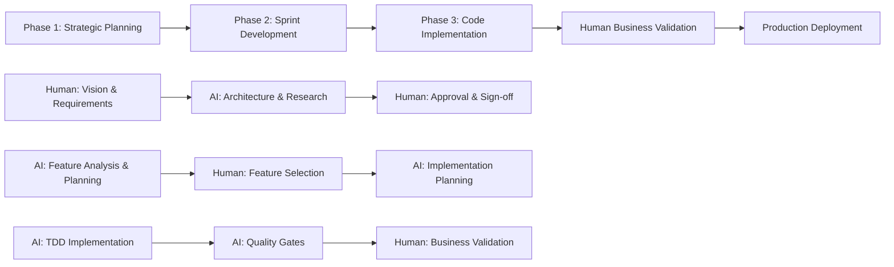

# CE-DPS Methodology Guide

A comprehensive guide to the Context Engineered Development Process Suite's three-phase development methodology.

## Core Philosophy

CE-DPS operates on the principle of **AI implements, humans provide strategic direction**. This creates a powerful collaboration where AI handles tactical implementation while humans focus on strategic decisions and business validation.

## The Three-Phase Approach

### Overview



**Phase Transition Criteria**:
- Phase 1 → 2: Human approval of architecture and roadmap
- Phase 2 → 3: Human approval of sprint scope and implementation plan
- Phase 3 → Production: Human validation of business value and quality gates

## Phase 1: Strategic Planning (Human-Led)

### Objectives
- **Duration**: 3-5 business days for typical projects
- **Success Criteria**: Human-approved architecture and feature roadmap
- **Quality Gates**: Complete research, validated approach, realistic timeline

### Human Responsibilities
1. Define business requirements + success metrics
2. Set strategic constraints + technical requirements
3. Review/approve AI architecture proposals
4. Validate feature roadmap + timeline

### AI Responsibilities
1. Query Fortitude for architectural patterns + domain-specific approaches
2. Research security patterns and scalability approaches from knowledge base
3. Design system architecture using proven patterns
4. Create detailed feature roadmap + effort estimates
5. Identify risks + mitigation strategies

### Workflow
```bash
/phase1:setup    # Initialize Phase 1 environment and template
# Human: Fill out business requirements template
/phase1:analyze  # AI performs comprehensive architectural analysis
# Human: Review and approve AI analysis
/phase1:validate # Validate completion and human approvals
```

### Key Deliverables
- Business requirements document
- System architecture design
- Technology evaluation and selection
- Feature roadmap with priorities
- Risk assessment and mitigation plan
- Human approval sign-off

## Phase 2: Sprint Development (AI-Led, Human Approval)

### Objectives
- **Duration**: 1-2 business days per sprint
- **Success Criteria**: Human-approved sprint scope with file-level implementation plan
- **Quality Gates**: Complete dependency research, realistic estimates, comprehensive testing approach

### AI Responsibilities
1. Query Fortitude for similar feature implementation patterns
2. Research security and performance patterns for selected features
3. Analyze features for implementation complexity using proven approaches
4. Create file-level implementation plans based on knowledge base patterns
5. Estimate effort + identify dependencies

### Human Responsibilities
1. Select features based on business priorities
2. Review/approve implementation approach
3. Validate timeline + resource allocation
4. Authorize sprint execution

### Workflow
```bash
/phase2:setup    # Initialize Phase 2 environment and feature selection
# Human: Select 2-4 features for sprint implementation
/phase2:plan     # AI creates detailed implementation plans
# Human: Review and approve implementation approach
/phase2:validate # Validate Phase 2 completion and implementation approach
```

### Quality Gates
- File-level implementation detail with pattern references
- All dependencies identified/researched using Fortitude knowledge base
- Security + performance considerations from proven patterns
- Comprehensive testing approach based on similar implementations

### Key Deliverables
- Selected feature set for sprint
- File-level implementation plans
- Technical approach documentation
- Effort estimates and timeline
- Dependency analysis
- Risk assessment for implementation

## Phase 3: Code Implementation (AI-Led, Human Validation)

### Objectives
- **Duration**: Variable based on sprint scope (typically 1-2 weeks)
- **Success Criteria**: Human validation of business value with all quality gates passed
- **Quality Gates**: >95% test coverage, security scan passes, performance targets met

### AI Responsibilities
1. Implement code using TDD with patterns from Fortitude knowledge base
2. Apply proven security and performance patterns during implementation
3. Create comprehensive test coverage (unit/integration/security)
4. Enforce quality gates + standards
5. Generate complete technical documentation

### Human Responsibilities
1. Validate features vs business requirements
2. Confirm user experience expectations
3. Approve for production deployment
4. Provide continuous improvement feedback

### Workflow
```bash
/phase3:setup     # Initialize Phase 3 environment with quality gates
/phase3:implement # AI implementation with test-driven development
# Human: Validate features against business requirements
/phase3:validate  # Validate Phase 3 completion and production readiness
```

### Quality Standards
- >95% test coverage for business logic
- Security scan passes (no critical vulnerabilities)
- Performance meets requirements (<200ms API response times)
- Documentation complete + current
- All quality gates pass

### Key Deliverables
- Production-ready code implementation
- Comprehensive test suite
- Technical documentation
- Security validation reports
- Performance benchmarks
- Human business value validation

## Role Clarity

### Human Strategic Authority
- Project vision and business objectives
- Architecture approval and design decisions
- Feature prioritization and scope approval
- Business value validation and strategic alignment

### AI Implementation Authority
- Code implementation and technical execution
- Comprehensive testing and quality assurance
- Technical documentation and knowledge management
- Pattern application and continuous learning

## Quality Standards Framework

### Security First
- Input validation and sanitization
- Authentication and authorization patterns
- SQL injection and XSS prevention
- Security vulnerability scanning

### Comprehensive Testing
- Test-driven development approach
- >95% test coverage requirement
- Unit, integration, and security testing
- Performance and load testing

### Documentation Excellence
- API documentation with examples
- Code comments explaining business logic
- Deployment and configuration guides
- Troubleshooting and error resolution guides

## Success Metrics

### Technical Metrics
- Test coverage >95%
- Security scan passes with no critical issues
- Performance meets defined requirements (<200ms API response)
- Documentation completeness >90%

### Business Metrics
- Features deliver expected business value
- User satisfaction scores meet targets
- Timeline and budget adherence
- Strategic goals advancement

### Collaboration Metrics
- Human oversight time focused on strategic decisions
- AI implementation efficiency and quality
- Escalation patterns and resolution effectiveness
- Knowledge capture and reuse through Fortitude

## Continuous Improvement

### Learning Integration
- Capture successful implementation patterns
- Document effective human-AI collaboration
- Refine quality gates based on outcomes
- Optimize velocity while maintaining quality

### Pattern Evolution
- Update implementation templates from experience
- Refine testing approaches for better coverage
- Enhance security patterns for threat landscape
- Improve documentation patterns for clarity

## Getting Started

1. **Read the methodology** - Understand the three phases and role clarity
2. **Check [Quick Reference](QUICK-REFERENCE.md)** - Learn the commands
3. **Try [SKYNET Mode](SKYNET-MODE.md)** - Experience autonomous development
4. **Master [Collaboration](COLLABORATION.md)** - Optimize human-AI teamwork

## Best Practices

### For Humans
1. **Be Specific**: Provide clear business requirements and success criteria
2. **Trust but Verify**: Let AI implement while validating business value
3. **Focus on Strategy**: Concentrate on business decisions, not technical details
4. **Provide Feedback**: Give specific, actionable feedback for continuous improvement

### For AI Assistants
1. **Security First**: Always implement comprehensive security patterns
2. **Test Everything**: Achieve >95% test coverage with meaningful tests
3. **Document Thoroughly**: Create comprehensive technical documentation
4. **Escalate Appropriately**: Seek human guidance for strategic decisions