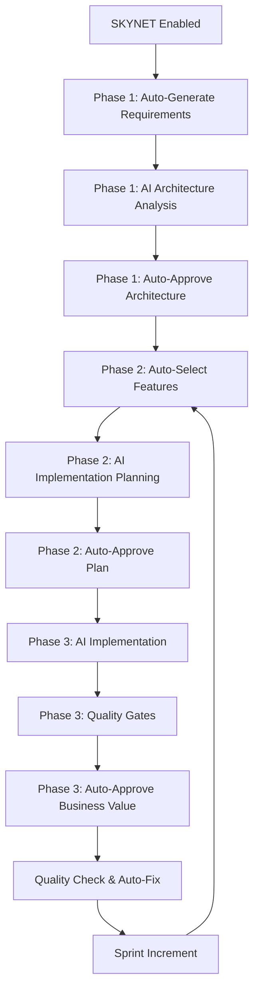

# SKYNET Autonomous Mode Guide

A comprehensive guide to CE-DPS's autonomous development mode that enables fully automated development cycles without human approval checkpoints.

## Overview

SKYNET mode transforms CE-DPS from a collaborative human-AI development process into a fully autonomous development system. When enabled, AI takes complete control of business decisions while maintaining all technical quality standards.

### Key Principles

- **Autonomous Operation**: No human approval checkpoints for business decisions
- **Quality Maintained**: All technical quality gates remain fully enforced
- **Continuous Development**: Automatic progression through sprints indefinitely  
- **Full Transparency**: All AI decisions documented and auditable

## Enabling SKYNET Mode

### Basic Activation
```bash
# Enable autonomous mode
/skynet:enable

# Check current status
/skynet:status

# Return to human oversight
/skynet:disable
```

### Quick Activation
```bash
# Rapid activation for experienced users
/skynet:quick-enable
```

### Recovery from Interruptions
```bash
# Resume interrupted autonomous loops
/skynet:resume
```

## Mode Comparison

| Aspect | Human Oversight Mode | SKYNET Autonomous Mode |
|--------|---------------------|------------------------|
| Business Requirements | Human defines | AI auto-generates from context |
| Architecture Approval | Human reviews & approves | AI decides based on best practices |
| Feature Selection | Human prioritizes | AI selects by complexity/dependencies |
| Implementation Approach | Human validates | AI chooses optimal patterns |
| Business Value Validation | Human confirms | AI auto-approves with justification |
| Sprint Progression | Manual command execution | Automatic continuous loops |
| Technical Quality Gates | Fully enforced | Fully enforced |
| Documentation | AI generates, human reviews | AI generates and auto-approves |

## Autonomous Workflow

### Continuous Development Loop



### Phase-Specific Behavior

#### Phase 1 (Strategic Planning)
**Autonomous Actions**:
- Auto-populate business requirements with AI-assisted development focus
- Generate problem statements about accelerating development with quality
- Define target users (development teams, product managers, QA teams)
- Set success metrics (>50% faster delivery, >95% test coverage, zero critical vulnerabilities)
- Create technical requirements (API <200ms, 10k+ users, security-first)
- Mark all documents as "Manifested by SKYNET"

#### Phase 2 (Sprint Planning)  
**Autonomous Actions**:
- Auto-select 2-4 features based on complexity analysis and dependency mapping
- Generate implementation plans using proven patterns from knowledge base
- Create effort estimates based on historical data
- Auto-approve implementation approach if quality standards met

#### Phase 3 (Implementation)
**Autonomous Actions**:
- Implement code using test-driven development
- Apply security and performance patterns automatically
- Generate comprehensive documentation
- Auto-approve business value with logical justification
- Trigger automatic progression to next sprint

## Quality Assurance in Autonomous Mode

### Technical Standards Maintained
- **Test Coverage**: >95% requirement enforced
- **Security**: Comprehensive vulnerability scanning
- **Performance**: <200ms API response time targets
- **Code Quality**: Linting, formatting, complexity checks
- **Documentation**: >90% API coverage requirement

### Quality Gates Process
```bash
# Automatic quality validation in SKYNET mode
/quality-check
# - Runs complete CI/CD test suite
# - Auto-fixes formatting and linting issues
# - Validates security patterns implementation
# - Ensures performance benchmarks met
# - Only proceeds if ALL quality gates pass
```

### Failure Handling
- **Quality Gate Failures**: Autonomous mode pauses, human intervention required
- **Technical Issues**: Auto-compact detection, recovery recommendations provided
- **System Interruptions**: Resume capability maintains context and progress

## Auto-Compact Detection and Recovery

### What is Auto-Compact?
Auto-compact occurs when SKYNET autonomous loops are interrupted (system shutdown, network issues, etc.), leaving the development process in an incomplete state.

### Detection
```bash
# Check for auto-compact interruptions
/project-status
# Will display: "🔴 AUTO-COMPACT DETECTED: SKYNET loop was interrupted"

/skynet:status
# Shows detailed interruption information and recovery options
```

### Recovery Options
```bash
# Resume from last known position
/skynet:resume

# Check detailed loop state
/skynet:status

# Disable autonomous mode if needed
/skynet:disable
```

## Advanced Features

### Sprint Management
- **Automatic Increment**: Successful sprints automatically increment sprint numbers
- **State Tracking**: Complete loop state preserved across interruptions
- **Progress Monitoring**: Detailed tracking of autonomous development progress

### Knowledge Integration
- **Pattern Application**: Automatic use of proven patterns from Fortitude knowledge base
- **Learning Capture**: Successful autonomous patterns captured for future use
- **Context Preservation**: Full context maintained across sprint boundaries

### Documentation Standards
- **SKYNET Headers**: All AI-modified documents marked with "Manifested by SKYNET"
- **Decision Audit Trail**: Complete record of autonomous decisions made
- **Quality Reports**: Detailed quality metrics for each autonomous sprint

## Monitoring and Control

### Status Monitoring
```bash
# Comprehensive status display
/skynet:status
# Shows: Current mode, loop state, sprint progress, quality metrics

# Project progress in autonomous mode
/project-status  
# Displays: Current sprint, completion status, next autonomous actions
```

### Human Intervention Points
- **Quality Gate Failures**: Automatic pause, human intervention required
- **Technical Issues**: Recovery guidance provided
- **Manual Override**: Can disable autonomous mode at any time

### Safety Features
- **Quality Enforcement**: Technical standards never compromised in autonomous mode
- **Audit Trail**: Complete transparency of all autonomous decisions
- **Recovery Capability**: Robust handling of interruptions and failures
- **Manual Override**: Human can regain control at any time

## Best Practices

### When to Use SKYNET Mode
- **Rapid Prototyping**: Quick iteration on proof-of-concepts
- **Continuous Development**: Ongoing feature development with established patterns
- **Learning and Exploration**: Understanding AI implementation capabilities
- **Productivity Boost**: Accelerated development cycles

### When to Use Human Oversight
- **Critical Business Decisions**: Strategic architectural choices
- **High-Risk Projects**: Projects with significant business impact
- **Learning Phase**: Understanding CE-DPS methodology
- **Custom Requirements**: Unique business constraints or requirements

### Optimization Tips
1. **Quality First**: Ensure quality gates are properly configured before enabling
2. **Monitor Progress**: Regular status checks during autonomous operation
3. **Learn from Patterns**: Review autonomous decisions for learning opportunities
4. **Gradual Adoption**: Start with less critical projects to build confidence

## Troubleshooting

### Common Issues
- **Auto-Compact Interruptions**: Use `/skynet:resume` to recover
- **Quality Gate Failures**: Review quality reports, fix issues, resume
- **Loop State Corruption**: Disable and re-enable SKYNET mode
- **Performance Issues**: Check system resources, optimize quality gates

### Getting Help
- Use `/help` for comprehensive command reference
- Check `/skynet:status` for detailed mode information
- Review `docs/quality-reports/` for quality metrics
- Consult [Collaboration Guide](COLLABORATION.md) for hybrid approaches

## Integration with Other Guides

- **[Quick Reference](QUICK-REFERENCE.md)** - SKYNET command syntax and examples
- **[Methodology](METHODOLOGY.md)** - Understanding the phases SKYNET automates
- **[Collaboration](COLLABORATION.md)** - Hybrid human-AI approaches and when to use them