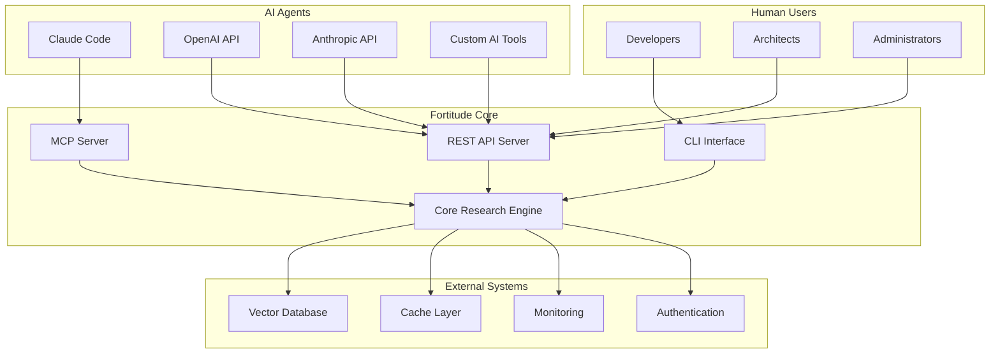

# Fortitude Technical Integration Model

## Executive Summary

This document defines the technical integration model for the Fortitude knowledge management platform, specifying how it interacts with other code systems, LLM agents, and human users. It serves as the blueprint for building replacement systems or extending Fortitude's integration capabilities.

## Integration Architecture Overview

### Core Integration Philosophy

Fortitude operates as a **knowledge broker** that sits between AI agents, human users, and external systems. It provides multiple integration points designed for different use cases and technical constraints.



## Primary Integration Points

### 1. MCP (Model Context Protocol) Server

**Purpose:** Native integration with Claude Code and other MCP-enabled AI development tools.

**Technical Specifications:**
- **Protocol:** MCP (Model Context Protocol) v1.0
- **Transport:** JSON-RPC over stdio/SSE
- **Authentication:** JWT-based with configurable permissions
- **Concurrency:** 100+ concurrent connections
- **Latency:** <100ms for cached operations

**Integration Contract:**
```typescript
interface MCPTool {
  name: string;
  description: string;
  inputSchema: JSONSchema;
}

interface MCPResource {
  uri: string;
  name: string;
  description: string;
  mimeType: string;
}

// Core MCP tools provided by Fortitude
const FORTITUDE_MCP_TOOLS: MCPTool[] = [
  {
    name: "research_query",
    description: "Execute intelligent research query with learning integration",
    inputSchema: {
      type: "object",
      properties: {
        query: { type: "string" },
        research_type: { enum: ["decision", "implementation", "troubleshooting", "learning", "validation"] },
        context: { type: "object" },
        audience: { enum: ["developer", "architect", "manager", "mixed"] }
      },
      required: ["query"]
    }
  },
  {
    name: "submit_feedback",
    description: "Submit feedback on research results for learning improvement",
    inputSchema: {
      type: "object",
      properties: {
        research_id: { type: "string" },
        quality_rating: { type: "number", minimum: 1, maximum: 5 },
        feedback_text: { type: "string" },
        improvement_suggestions: { type: "array", items: { type: "string" } }
      },
      required: ["research_id", "quality_rating"]
    }
  }
];
```

**Configuration Example:**
```json
{
  "mcpServers": {
    "fortitude": {
      "command": "cargo",
      "args": ["run", "--bin", "fortitude-mcp-server", "--", "--config", "config/ce-dps.toml"],
      "cwd": "/path/to/fortitude",
      "env": {
        "FORTITUDE_JWT_SECRET": "your-jwt-secret",
        "FORTITUDE_LOG_LEVEL": "info"
      }
    }
  }
}
```

**Required Integration Hooks for Replacement Systems:**
1. **Tool Registration**: Dynamic tool registration with schema validation
2. **Resource Discovery**: Ability to expose knowledge resources as MCP resources
3. **Authentication**: JWT-based authentication with role-based permissions
4. **Streaming Support**: Support for streaming responses for long-running operations
5. **Error Handling**: Standardized error responses with actionable context

### 2. REST API Server

**Purpose:** Comprehensive HTTP API for custom integrations, web applications, and external systems.

**Technical Specifications:**
- **Protocol:** HTTP/1.1 and HTTP/2
- **Format:** JSON with optional MessagePack support
- **Authentication:** JWT Bearer tokens with OAuth2 support
- **Rate Limiting:** Configurable rate limiting per endpoint
- **Documentation:** OpenAPI 3.0 specification

**Core API Endpoints:**
```rust
// Research Operations
POST   /api/v1/research           // Execute research query
GET    /api/v1/research/{id}      // Get research result by ID
GET    /api/v1/research/history   // Get research history with filtering
POST   /api/v1/research/feedback  // Submit feedback on research result

// Learning Operations
GET    /api/v1/learning/metrics   // Get learning performance metrics
POST   /api/v1/learning/feedback  // Submit learning feedback
GET    /api/v1/learning/patterns  // Get discovered usage patterns

// System Operations
GET    /api/v1/health             // Health check endpoint
GET    /api/v1/metrics            // Prometheus metrics endpoint
GET    /api/v1/config             // Get system configuration
POST   /api/v1/config             // Update system configuration (admin only)

// User Management
POST   /api/v1/auth/login         // User authentication
POST   /api/v1/auth/refresh       // Refresh JWT token
GET    /api/v1/users/profile      // Get user profile
PUT    /api/v1/users/profile      // Update user profile
```

**Authentication Flow:**
```json
{
  "auth": {
    "type": "JWT",
    "header": "Authorization: Bearer {token}",
    "expiration": "24h",
    "refresh_supported": true,
    "permissions": [
      "read:research",
      "write:research", 
      "read:learning",
      "write:learning",
      "admin:config"
    ]
  }
}
```

**Required Integration Hooks for Replacement Systems:**
1. **Authentication Provider**: Pluggable authentication providers (JWT, OAuth2, LDAP)
2. **Rate Limiting**: Configurable rate limiting with custom policies
3. **Response Caching**: Intelligent caching with TTL and invalidation
4. **Audit Logging**: Comprehensive audit logging for all operations
5. **Error Handling**: Consistent error responses with correlation IDs

### 3. CLI Interface

**Purpose:** Command-line access for automation, scripting, and developer workflows.

**Technical Specifications:**
- **Language:** Rust binary with cross-platform support
- **Configuration:** TOML configuration files with environment variable overrides
- **Output Formats:** JSON, YAML, table, and custom formats
- **Scripting:** Machine-readable output for shell scripting

**CLI Command Structure:**
```bash
# Research commands
fortitude research query "authentication patterns" --type implementation
fortitude research history --filter "last-week" --format json
fortitude research feedback --id "res_123" --rating 5

# Learning commands
fortitude learning metrics --date-range "2024-01-01:2024-12-31"
fortitude learning patterns --category "implementation"

# System commands
fortitude system health
fortitude system config get
fortitude system config set cache.ttl=3600

# User commands
fortitude auth login
fortitude auth status
fortitude profile show
```

**Configuration System:**
```toml
# ~/.config/fortitude/config.toml
[server]
url = "http://localhost:8080"
timeout = 30

[auth]
method = "jwt"
token_file = "~/.config/fortitude/token"

[output]
format = "table"
color = true
pager = true

[research]
default_type = "implementation"
default_audience = "developer"
```

**Required Integration Hooks for Replacement Systems:**
1. **Configuration Management**: Hierarchical configuration with overrides
2. **Authentication**: Multiple authentication methods (JWT, API keys, OAuth)
3. **Output Formatting**: Pluggable output formatters
4. **Error Handling**: Human-readable error messages with suggestions
5. **Shell Integration**: Command completion and shell integration

## AI Agent Integration Patterns

### 1. Proactive Research Agent

**Pattern:** AI agents that automatically trigger research based on context changes.

**Implementation:**
```rust
// Example: File system watcher integration
pub struct ProactiveResearchAgent {
    file_watcher: notify::RecommendedWatcher,
    research_client: FortitudeClient,
    context_analyzer: ContextAnalyzer,
}

impl ProactiveResearchAgent {
    pub async fn handle_file_change(&mut self, path: PathBuf) -> Result<(), Error> {
        let context = self.context_analyzer.analyze_file(&path).await?;
        
        if context.indicates_knowledge_gap() {
            let research_query = context.generate_research_query();
            let result = self.research_client.research_query(research_query).await?;
            
            // Optionally notify user or take action
            self.notify_user_of_research(result).await?;
        }
        
        Ok(())
    }
}
```

**Integration Requirements:**
- **Context Analysis**: Ability to analyze code/file changes for knowledge gaps
- **Automatic Triggering**: Event-driven research execution
- **Background Processing**: Non-blocking research execution
- **User Notification**: Configurable notification mechanisms

### 2. Learning-Enabled Code Assistant

**Pattern:** AI assistants that learn from user interactions and improve over time.

**Implementation:**
```rust
// Example: Learning-enabled code completion
pub struct LearningCodeAssistant {
    fortitude_client: FortitudeClient,
    learning_tracker: LearningTracker,
    user_preferences: UserPreferences,
}

impl LearningCodeAssistant {
    pub async fn get_code_suggestion(
        &mut self,
        context: CodeContext,
        cursor_position: Position,
    ) -> Result<CodeSuggestion, Error> {
        // Query Fortitude for relevant patterns
        let research_query = self.build_research_query(&context, cursor_position);
        let research_result = self.fortitude_client.research_query(research_query).await?;
        
        // Generate suggestion based on research
        let suggestion = self.generate_suggestion(research_result, &context);
        
        // Track suggestion for learning
        self.learning_tracker.track_suggestion(&suggestion);
        
        Ok(suggestion)
    }
    
    pub async fn handle_user_feedback(
        &mut self,
        suggestion_id: String,
        feedback: UserFeedback,
    ) -> Result<(), Error> {
        // Submit feedback to Fortitude
        self.fortitude_client.submit_feedback(suggestion_id, feedback).await?;
        
        // Update local learning model
        self.learning_tracker.update_from_feedback(feedback);
        
        Ok(())
    }
}
```

**Integration Requirements:**
- **Context Extraction**: Extract relevant context from code/project state
- **Pattern Matching**: Match current context to historical patterns
- **Feedback Loop**: Capture and process user feedback
- **Personalization**: Adapt to individual user preferences

### 3. Multi-Agent Collaboration

**Pattern:** Multiple AI agents collaborating through shared knowledge.

**Implementation:**
```rust
// Example: Multi-agent research collaboration
pub struct AgentCollaborationManager {
    agents: HashMap<String, Box<dyn AIAgent>>,
    knowledge_broker: FortitudeClient,
    coordination_service: CoordinationService,
}

impl AgentCollaborationManager {
    pub async fn coordinate_research(
        &mut self,
        research_request: ResearchRequest,
    ) -> Result<CollaborativeResearchResult, Error> {
        // Decompose research into specialized tasks
        let subtasks = self.decompose_research(&research_request);
        
        // Assign tasks to specialized agents
        let mut agent_tasks = Vec::new();
        for subtask in subtasks {
            let agent = self.select_agent_for_task(&subtask);
            agent_tasks.push(self.execute_agent_task(agent, subtask));
        }
        
        // Execute tasks concurrently
        let results = futures::future::join_all(agent_tasks).await;
        
        // Consolidate results through Fortitude
        let consolidated_result = self.consolidate_results(results).await?;
        
        // Update shared knowledge
        self.knowledge_broker.update_knowledge(consolidated_result.clone()).await?;
        
        Ok(consolidated_result)
    }
}
```

**Integration Requirements:**
- **Task Decomposition**: Break complex research into specialized tasks
- **Agent Coordination**: Coordinate multiple agents working on related tasks
- **Knowledge Sharing**: Share discoveries between agents
- **Result Synthesis**: Combine multiple agent results into coherent output

## Human User Integration Patterns

### 1. Interactive Development Workflow

**Pattern:** Seamless integration into developer workflows with contextual assistance.

**Workflow Integration Points:**
```bash
# Pre-commit hooks
git add .
fortitude research query "security review checklist" --context "$(git diff --cached)"

# CI/CD integration
fortitude research query "deployment patterns for microservices" --context "$(cat deployment.yaml)"

# Code review assistance
fortitude research query "review guidelines for async rust code" --context "$(cat src/lib.rs)"
```

**Required Integration Hooks:**
1. **Git Integration**: Hooks for commit, push, and merge operations
2. **IDE Integration**: Plugins for popular IDEs (VS Code, IntelliJ, Vim)
3. **CI/CD Integration**: Actions/plugins for CI/CD pipelines
4. **Code Review**: Integration with code review tools (GitHub, GitLab, Bitbucket)

### 2. Learning-Driven Adaptation

**Pattern:** System adapts to team and individual preferences through explicit and implicit feedback.

**Learning Integration:**
```rust
// Example: Adaptive preference learning
pub struct AdaptiveUserInterface {
    user_preferences: UserPreferences,
    learning_engine: LearningEngine,
    fortitude_client: FortitudeClient,
}

impl AdaptiveUserInterface {
    pub async fn present_research_results(
        &mut self,
        results: Vec<ResearchResult>,
        user_id: String,
    ) -> Result<PresentationResult, Error> {
        // Adapt presentation based on user preferences
        let presentation_style = self.user_preferences.get_presentation_style(&user_id);
        let filtered_results = self.filter_results_for_user(results, &user_id);
        
        // Present results
        let presentation = self.format_results(filtered_results, presentation_style);
        
        // Track presentation for learning
        self.learning_engine.track_presentation(&presentation, &user_id);
        
        Ok(presentation)
    }
}
```

**Integration Requirements:**
- **Preference Tracking**: Capture user preferences implicitly and explicitly
- **Adaptive UI**: Adjust interface based on user behavior patterns
- **Feedback Collection**: Multiple feedback collection mechanisms
- **Personalization**: Customize experience for individual users

### 3. Collaborative Knowledge Building

**Pattern:** Teams collaboratively build and maintain knowledge through Fortitude.

**Collaboration Features:**
```rust
// Example: Team knowledge sharing
pub struct TeamKnowledgeManager {
    team_repository: TeamRepository,
    knowledge_validator: KnowledgeValidator,
    collaboration_engine: CollaborationEngine,
}

impl TeamKnowledgeManager {
    pub async fn contribute_knowledge(
        &mut self,
        contributor: UserId,
        knowledge_item: KnowledgeItem,
    ) -> Result<ContributionResult, Error> {
        // Validate contribution
        let validation_result = self.knowledge_validator.validate(&knowledge_item).await?;
        
        if validation_result.is_valid() {
            // Store in team repository
            self.team_repository.store(knowledge_item.clone()).await?;
            
            // Notify team members
            self.collaboration_engine.notify_team_of_contribution(
                contributor,
                knowledge_item
            ).await?;
        }
        
        Ok(ContributionResult::from(validation_result))
    }
}
```

**Integration Requirements:**
- **Team Management**: User groups and permission management
- **Knowledge Validation**: Peer review and validation workflows
- **Notification System**: Team notifications for knowledge updates
- **Conflict Resolution**: Handling conflicting knowledge contributions

## External System Integration

### 1. Vector Database Integration

**Current Implementation:** Qdrant vector database for semantic search.

**Integration Contract:**
```rust
#[async_trait]
pub trait VectorDatabase {
    async fn store_embeddings(
        &self,
        collection: &str,
        embeddings: Vec<EmbeddingRecord>,
    ) -> Result<(), VectorDbError>;
    
    async fn search_similar(
        &self,
        collection: &str,
        query_vector: Vec<f32>,
        limit: usize,
    ) -> Result<Vec<SearchResult>, VectorDbError>;
    
    async fn create_collection(
        &self,
        name: &str,
        config: CollectionConfig,
    ) -> Result<(), VectorDbError>;
}
```

**Required Integration Hooks for Replacement Systems:**
1. **Collection Management**: Create and manage vector collections
2. **Embedding Storage**: Store and index high-dimensional vectors
3. **Similarity Search**: Efficient similarity search with filtering
4. **Backup/Restore**: Data backup and restoration capabilities
5. **Monitoring**: Performance and health monitoring

### 2. Caching Layer Integration

**Current Implementation:** Multi-layer caching with Redis and in-memory cache.

**Integration Contract:**
```rust
#[async_trait]
pub trait CacheLayer {
    async fn get<T: DeserializeOwned>(&self, key: &str) -> Result<Option<T>, CacheError>;
    async fn set<T: Serialize>(&self, key: &str, value: &T, ttl: Duration) -> Result<(), CacheError>;
    async fn invalidate(&self, pattern: &str) -> Result<(), CacheError>;
    async fn health_check(&self) -> Result<CacheHealth, CacheError>;
}
```

**Required Integration Hooks for Replacement Systems:**
1. **Multi-Layer Caching**: Memory, Redis, and disk caching layers
2. **TTL Management**: Configurable time-to-live for cache entries
3. **Cache Invalidation**: Pattern-based cache invalidation
4. **Performance Monitoring**: Cache hit rates and performance metrics
5. **Distributed Caching**: Support for distributed cache clusters

### 3. Authentication and Authorization

**Current Implementation:** JWT-based authentication with role-based access control.

**Integration Contract:**
```rust
#[async_trait]
pub trait AuthProvider {
    async fn authenticate(
        &self,
        credentials: AuthCredentials,
    ) -> Result<AuthResult, AuthError>;
    
    async fn authorize(
        &self,
        user_id: &str,
        resource: &str,
        action: &str,
    ) -> Result<bool, AuthError>;
    
    async fn refresh_token(
        &self,
        refresh_token: &str,
    ) -> Result<TokenPair, AuthError>;
}
```

**Required Integration Hooks for Replacement Systems:**
1. **Multi-Provider Support**: Support for multiple authentication providers
2. **Role-Based Access Control**: Fine-grained permission management
3. **Token Management**: JWT token generation and validation
4. **Session Management**: User session lifecycle management
5. **Audit Logging**: Authentication and authorization audit trails

## Monitoring and Observability Integration

### 1. Metrics Collection

**Current Implementation:** Prometheus metrics with custom business metrics.

**Integration Contract:**
```rust
pub trait MetricsCollector {
    fn increment_counter(&self, name: &str, labels: &HashMap<String, String>);
    fn record_histogram(&self, name: &str, value: f64, labels: &HashMap<String, String>);
    fn set_gauge(&self, name: &str, value: f64, labels: &HashMap<String, String>);
    fn start_timer(&self, name: &str) -> Timer;
}
```

**Key Metrics:**
- **Performance Metrics**: Response times, throughput, error rates
- **Business Metrics**: Research quality, user satisfaction, learning effectiveness
- **System Metrics**: Resource usage, health status, capacity utilization
- **Security Metrics**: Authentication failures, access patterns, security events

### 2. Distributed Tracing

**Current Implementation:** OpenTelemetry-based distributed tracing.

**Integration Contract:**
```rust
pub trait TracingProvider {
    fn start_span(&self, name: &str, parent: Option<SpanContext>) -> Span;
    fn add_event(&self, span: &Span, name: &str, attributes: &HashMap<String, String>);
    fn set_status(&self, span: &Span, status: SpanStatus);
    fn end_span(&self, span: Span);
}
```

### 3. Health Monitoring

**Current Implementation:** Comprehensive health checks with automated alerting.

**Health Check Categories:**
- **Database Health**: Connection status, query performance, storage capacity
- **Cache Health**: Hit rates, connection status, memory usage
- **API Health**: Response times, error rates, throughput
- **Integration Health**: External service availability, authentication status

## Deployment and Configuration Integration

### 1. Container Orchestration

**Current Implementation:** Docker containers with Kubernetes deployment support.

**Required Integration Hooks:**
1. **Container Registry**: Support for multiple container registries
2. **Service Discovery**: Automatic service discovery and registration
3. **Load Balancing**: Intelligent load balancing with health checks
4. **Auto-Scaling**: Automatic scaling based on performance metrics
5. **Rolling Updates**: Zero-downtime deployment strategies

### 2. Configuration Management

**Current Implementation:** TOML configuration with environment variable overrides.

**Configuration Hierarchy:**
```toml
# Default configuration
[server]
host = "0.0.0.0"
port = 8080

[database]
url = "postgresql://localhost/fortitude"
max_connections = 10

[cache]
redis_url = "redis://localhost:6379"
ttl = 3600

[auth]
jwt_secret = "${JWT_SECRET}"
token_expiry = "24h"
```

**Required Integration Hooks:**
1. **Environment Override**: Environment variable configuration override
2. **Secret Management**: Integration with secret management systems
3. **Configuration Validation**: Schema validation for configuration files
4. **Hot Reload**: Runtime configuration updates without restart
5. **Multi-Environment**: Support for multiple environment configurations

## Migration and Replacement Strategy

### For Organizations Replacing Fortitude

**Migration Checklist:**
1. **Data Migration**: Export research results, learning data, and user preferences
2. **API Compatibility**: Maintain API compatibility during transition
3. **Authentication Migration**: Transfer user accounts and permissions
4. **Integration Updates**: Update all integration points to new system
5. **Monitoring Migration**: Transfer metrics and alerting configurations

**Replacement System Requirements:**
1. **Core Functionality**: Research, learning, and knowledge management capabilities
2. **Integration Points**: All integration patterns documented in this model
3. **Performance Standards**: Meet or exceed current performance benchmarks
4. **Security Standards**: Maintain current security and compliance standards
5. **Migration Tools**: Provide automated migration tools for seamless transition

### For Extending Fortitude

**Extension Points:**
1. **Custom Providers**: Add new AI providers or specialized research engines
2. **Integration Protocols**: Add new integration protocols or APIs
3. **Custom Metrics**: Add domain-specific metrics and monitoring
4. **Workflow Integration**: Add new workflow integration patterns
5. **UI Extensions**: Add custom user interfaces or dashboards

## Conclusion

This technical integration model provides a comprehensive blueprint for how Fortitude integrates with the broader development ecosystem. It defines the contracts, patterns, and requirements that enable seamless integration with AI agents, human users, and external systems.

Organizations looking to replace Fortitude should implement all integration points defined in this model to ensure compatibility with existing workflows and tools. Organizations looking to extend Fortitude can use the extension points to add custom functionality while maintaining system coherence.

The model emphasizes flexibility, performance, and maintainability, ensuring that Fortitude can adapt to evolving development practices while maintaining its core value proposition of intelligent, learning-enabled knowledge management.