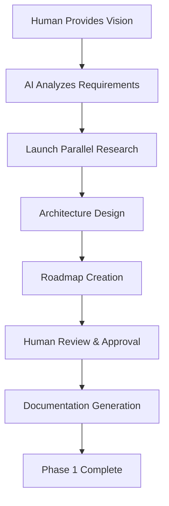

# <context>Phase 1: Strategic Planning - AI Implementation Guide</context>

## <summary priority="critical">AI Implementation Authority</summary>

**Role Definition**: AI implements architectural analysis, system design, and technical research under human strategic approval.

**Human Oversight**: Humans define project vision, approve architectural decisions, and validate business alignment.

**Duration**: 30-60 minutes with parallel research subagents

**Documentation Standards**: Follow [LLM Documentation Guidelines](llm-documentation-guidelines.md) for all AI-generated documentation

## <method>AI Planning Process</method>

### <step priority="high">1. Project Vision Analysis</step>

**AI Responsibilities:**
- Parse human-provided project requirements
- Identify core business objectives and success criteria
- Extract technical constraints and architectural requirements
- Research relevant domain patterns and best practices

**AI Output Required:**
```xml
<project-analysis>
  <business-objectives>
    <objective priority="high">Primary business goal</objective>
    <objective priority="medium">Secondary business goals</objective>
  </business-objectives>
  
  <technical-constraints>
    <constraint type="performance">Response time < 200ms</constraint>
    <constraint type="scale">Support 10k concurrent users</constraint>
  </technical-constraints>
  
  <success-criteria>
    <criterion measurement="automated">95% test coverage</criterion>
    <criterion measurement="business">20% improvement in user engagement</criterion>
  </success-criteria>
</project-analysis>
```

### <step priority="high">2. Architecture Research and Design</step>

**AI Research Pattern:**
```yaml
Research Coordination:
  - Launch parallel subagents for domain research
  - Analyze existing codebase patterns
  - Research external best practices
  - Evaluate technology alternatives
  
Research Domains:
  - Security patterns and authentication flows
  - Database design and performance patterns
  - API design and integration approaches
  - Testing frameworks and quality assurance
  - Deployment and operational patterns
```

**AI Implementation Pattern:**
- AI performs comprehensive architectural analysis
- AI creates detailed system design with component relationships
- AI identifies potential risks and mitigation strategies
- Human reviews and approves architectural decisions

### <step priority="high">3. Feature Roadmap Creation</step>

**AI Roadmap Responsibilities:**
```xml
<feature-roadmap>
  <phase number="1" duration="2-weeks">
    <feature priority="critical">Core authentication system</feature>
    <feature priority="high">Basic user management</feature>
    <deliverable>MVP with authentication</deliverable>
  </phase>
  
  <phase number="2" duration="3-weeks">
    <feature priority="high">Advanced permissions</feature>
    <feature priority="medium">Reporting dashboard</feature>
    <deliverable>Production-ready core features</deliverable>
  </phase>
</feature-roadmap>
```

**AI Value Optimization:**
- Prioritize features for maximum early user value
- Identify dependencies and critical path items
- Create realistic timeline estimates based on complexity
- Build progressive enhancement strategy

## <implementation>AI Implementation Workflow</implementation>

### <workflow>Phase 1 Execution Pattern</workflow>



### <quality-gates>AI Quality Standards</quality-gates>

**Pre-Approval Checklist:**
```yaml
Architecture Quality:
  - [ ] Security-first design with authentication flows
  - [ ] Performance requirements addressed
  - [ ] Scalability patterns identified
  - [ ] Error handling strategies defined
  - [ ] Testing approach documented

Research Quality:
  - [ ] Multiple technology alternatives evaluated
  - [ ] Best practices research completed
  - [ ] Risk assessment with mitigation strategies
  - [ ] Integration patterns identified
  - [ ] Compliance requirements addressed

Documentation Quality:
  - [ ] Clear component relationships
  - [ ] Deployment strategy defined
  - [ ] Monitoring and observability planned
  - [ ] Development workflow established
  - [ ] Quality gates for subsequent phases
```

### <escalation>Human Intervention Points</escalation>

**Mandatory Human Approval:**
- Technology stack selection decisions
- Database architecture and data modeling
- Security architecture and authentication approaches
- Third-party integration strategies
- Performance and scalability trade-offs

**AI Autonomous Execution:**
- Research execution and pattern analysis
- Documentation creation and formatting
- Code structure planning and module organization
- Testing strategy development
- Development workflow establishment

## <constraints>Critical Requirements</constraints>

### <ai-requirements>AI Implementation Standards</ai-requirements>

**Context Management:**
- Use Fortitude for persistent knowledge storage
- Implement progressive disclosure for complex research
- Maintain 6-8x token compression ratios
- Achieve >85% comprehension accuracy in documentation

**Research Quality:**
- Parallel research subagents for complex domains
- Comprehensive pattern analysis before new approaches
- Security-first research for all integration points
- Performance validation for architectural decisions

**Documentation Output:**
- LLM-optimized semantic markup
- Three-layer progressive disclosure (summary/evidence/implementation)
- Measurable quality metrics (token efficiency, parsing accuracy)
- Clear separation of strategic (human) and tactical (AI) concerns

### <validation>Success Validation</validation>

**Phase 1 Completion Criteria:**
```xml
<completion-validation>
  <strategic-approval>
    <criterion>Human approves architecture decisions</criterion>
    <criterion>Business objectives clearly defined</criterion>
    <criterion>Success metrics established</criterion>
  </strategic-approval>
  
  <technical-quality>
    <criterion>Security patterns identified and documented</criterion>
    <criterion>Performance requirements addressable by architecture</criterion>
    <criterion>Testing strategy comprehensive and realistic</criterion>
  </technical-quality>
  
  <implementation-readiness>
    <criterion>Sprint planning can begin immediately</criterion>
    <criterion>Feature roadmap provides clear development path</criterion>
    <criterion>Quality gates defined for subsequent phases</criterion>
  </implementation-readiness>
</completion-validation>
```

## <integration>Fortitude Knowledge Integration</integration>

**Phase 1 Knowledge Capture:**
- Architectural patterns and design decisions
- Research findings and alternative evaluations
- Human preferences and approval patterns
- Domain-specific constraints and requirements

**Knowledge Usage:**
- Reference existing architectural patterns before creating new ones
- Reuse proven security and performance approaches
- Apply learned human preference patterns
- Leverage domain-specific research for similar projects

**Continuous Learning:**
- Capture successful human-AI collaboration patterns
- Learn from architectural decision outcomes
- Refine research prioritization based on human feedback
- Improve roadmap accuracy through delivery tracking