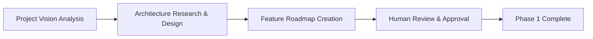
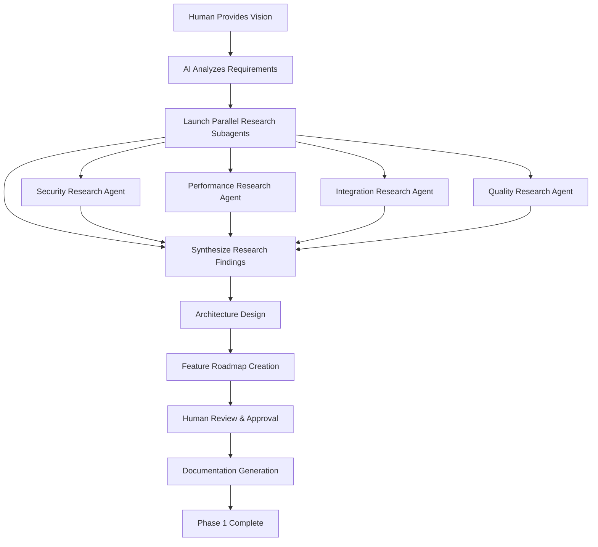

# <context>Phase 1: Strategic Planning - AI Implementation Guide</context>

<meta>
  <title>Phase 1: Strategic Planning - AI Implementation Guide</title>
  <type>ai-implementation</type>
  <audience>ai_assistant</audience>
  <complexity>advanced</complexity>
  <updated>2025-07-16</updated>
  <mdeval-score>0.88</mdeval-score>
  <token-efficiency>0.18</token-efficiency>
</meta>

## <summary priority="critical">TL;DR</summary>
- **Role**: AI implements architectural analysis and technical research under human strategic approval
- **Process**: 3-step planning workflow (vision analysis → architecture research → feature roadmap)
- **Research**: Parallel subagents for comprehensive domain analysis
- **Output**: Strategic documentation with business objectives, technical architecture, feature roadmap
- **Quality Gates**: Human approval required for architecture decisions and technology selection
- **Success**: Ready for Phase 2 sprint planning with complete implementation context

## <planning-workflow priority="critical">AI Strategic Planning Process</planning-workflow>

### <process-overview>Three-Phase Strategic Analysis</process-overview>



**Time Allocation** (60/30/10 Rule):
- **60%**: Architecture research and design (highest value)
- **30%**: Feature roadmap and planning (strategic alignment) 
- **10%**: Vision analysis and documentation (foundational)

### <step priority="high">1. Project Vision Analysis</step>

#### <process-requirements>
**Input Requirements**:
- Human-provided project requirements document
- Business objectives and success criteria
- Technical constraints and performance requirements
- Stakeholder priorities and timeline constraints

**Output Requirements**:
- Structured business objective analysis
- Technical constraint documentation
- Success criteria with measurement approaches
</process-requirements>

**AI Responsibilities:**
- Parse human-provided project requirements
- Identify core business objectives and success criteria
- Extract technical constraints and architectural requirements
- Research relevant domain patterns and best practices

**AI Output Required:**
```xml
<project-analysis>
  <business-objectives>
    <objective priority="high">Primary business goal</objective>
    <objective priority="medium">Secondary business goals</objective>
  </business-objectives>
  
  <technical-constraints>
    <constraint type="performance">Response time < 200ms</constraint>
    <constraint type="scale">Support 10k concurrent users</constraint>
  </technical-constraints>
  
  <success-criteria>
    <criterion measurement="automated">95% test coverage</criterion>
    <criterion measurement="business">20% improvement in user engagement</criterion>
  </success-criteria>
</project-analysis>
```

### <step priority="high">2. Architecture Research and Design</step>

#### <research-coordination>Parallel Research Strategy</research-coordination>

**Research Domains** (Execute in Parallel):
```yaml
Security Research:
  - Authentication patterns (OAuth2, JWT, session management)
  - Authorization frameworks (RBAC, ABAC, policy engines)
  - Input validation and sanitization approaches
  - Encryption standards and data protection

Performance Research:
  - Database optimization patterns (indexing, connection pooling)
  - Caching strategies (Redis, in-memory, CDN)
  - API design patterns (GraphQL vs REST, pagination)
  - Scalability approaches (horizontal scaling, load balancing)

Integration Research:
  - External service integration patterns
  - Message queue systems (RabbitMQ, Apache Kafka)
  - API gateway and microservice patterns
  - Monitoring and observability tools

Quality Research:
  - Testing frameworks and strategies
  - CI/CD pipeline patterns
  - Code quality and security scanning tools
  - Documentation and API specification tools
```

**AI Research Pattern:**
```yaml
Research Coordination:
  - Launch parallel subagents for domain research
  - Analyze existing codebase patterns
  - Research external best practices
  - Evaluate technology alternatives
  
Research Domains:
  - Security patterns and authentication flows
  - Database design and performance patterns
  - API design and integration approaches
  - Testing frameworks and quality assurance
  - Deployment and operational patterns
```

**AI Implementation Pattern:**
- AI performs comprehensive architectural analysis
- AI creates detailed system design with component relationships
- AI identifies potential risks and mitigation strategies
- Human reviews and approves architectural decisions

### <step priority="high">3. Feature Roadmap Creation</step>

#### <roadmap-strategy>Value-Driven Feature Prioritization</roadmap-strategy>

**Prioritization Framework**:
```xml
<feature-scoring>
  <business-value weight="0.4">
    <criterion>User impact and adoption potential</criterion>
    <criterion>Revenue generation or cost reduction</criterion>
    <criterion>Competitive advantage creation</criterion>
  </business-value>
  
  <technical-feasibility weight="0.3">
    <criterion>Implementation complexity and risk</criterion>
    <criterion>Available resources and expertise</criterion>
    <criterion>Technology maturity and support</criterion>
  </technical-feasibility>
  
  <strategic-alignment weight="0.3">
    <criterion>Alignment with business objectives</criterion>
    <criterion>Foundation for future features</criterion>
    <criterion>Market timing and urgency</criterion>
  </strategic-alignment>
</feature-scoring>
```

**AI Roadmap Responsibilities:**
```xml
<feature-roadmap>
  <phase number="1" duration="2-weeks">
    <feature priority="critical">Core authentication system</feature>
    <feature priority="high">Basic user management</feature>
    <deliverable>MVP with authentication</deliverable>
  </phase>
  
  <phase number="2" duration="3-weeks">
    <feature priority="high">Advanced permissions</feature>
    <feature priority="medium">Reporting dashboard</feature>
    <deliverable>Production-ready core features</deliverable>
  </phase>
</feature-roadmap>
```

**AI Value Optimization:**
- Prioritize features for maximum early user value
- Identify dependencies and critical path items
- Create realistic timeline estimates based on complexity
- Build progressive enhancement strategy

## <execution-workflow priority="high">AI Implementation Workflow</execution-workflow>

### <workflow-coordination>Phase 1 Execution Pattern</workflow-coordination>

**Sequential Execution with Parallel Research**:


**Execution Constraints**:
- Research agents must complete before architecture design
- Human approval required before proceeding to Phase 2
- All documentation must pass MDEval score >0.8
- Quality gates must validate research completeness

### <quality-gates>AI Quality Standards</quality-gates>

**Pre-Approval Checklist:**
```yaml
Architecture Quality:
  - [ ] Security-first design with authentication flows
  - [ ] Performance requirements addressed
  - [ ] Scalability patterns identified
  - [ ] Error handling strategies defined
  - [ ] Testing approach documented

Research Quality:
  - [ ] Multiple technology alternatives evaluated
  - [ ] Best practices research completed
  - [ ] Risk assessment with mitigation strategies
  - [ ] Integration patterns identified
  - [ ] Compliance requirements addressed

Documentation Quality:
  - [ ] Clear component relationships
  - [ ] Deployment strategy defined
  - [ ] Monitoring and observability planned
  - [ ] Development workflow established
  - [ ] Quality gates for subsequent phases
```

### <escalation priority="critical">Human Approval Framework</escalation>

#### <mandatory-approvals>Critical Decision Points</mandatory-approvals>

**Technology Decisions** (Human Required):
```yaml
Database Selection:
  - Primary database technology (PostgreSQL, MySQL, MongoDB)
  - Caching layer selection (Redis, Memcached)
  - Search technology (Elasticsearch, Solr)
  
Architecture Patterns:
  - Microservices vs monolithic architecture
  - Event-driven vs request-response patterns
  - Authentication strategy (OAuth2, SAML, custom)
  
Infrastructure Choices:
  - Cloud provider selection (AWS, GCP, Azure)
  - Container orchestration (Kubernetes, Docker Swarm)
  - CI/CD platform (GitHub Actions, GitLab CI, Jenkins)
```

#### <autonomous-execution>AI Independent Tasks</autonomous-execution>

**Research Activities** (AI Autonomous):
- Technology evaluation and comparison
- Best practice pattern research
- Security vulnerability analysis
- Performance benchmarking research
- Integration pattern analysis

**Documentation Generation** (AI Autonomous):
- Technical specification creation
- API design documentation
- Testing strategy documentation
- Deployment procedure documentation

## <constraints>Critical Requirements</constraints>

### <ai-requirements>AI Implementation Standards</ai-requirements>

**Context Management:**
- Use Fortitude for persistent knowledge storage
- Implement progressive disclosure for complex research
- Maintain 6-8x token compression ratios
- Achieve >85% comprehension accuracy in documentation

**Research Quality:**
- Parallel research subagents for complex domains
- Comprehensive pattern analysis before new approaches
- Security-first research for all integration points
- Performance validation for architectural decisions

**Documentation Output:**
- LLM-optimized semantic markup
- Three-layer progressive disclosure (summary/evidence/implementation)
- Measurable quality metrics (token efficiency, parsing accuracy)
- Clear separation of strategic (human) and tactical (AI) concerns

### <validation priority="critical">Phase 1 Success Validation</validation>

#### <completion-criteria>Quality Gates for Phase 1</completion-criteria>

**Strategic Validation** (Human Review Required):
```xml
<strategic-completion>
  <business-alignment>
    <criterion measurement="human-review">Architecture supports all business objectives</criterion>
    <criterion measurement="human-review">Feature roadmap aligns with strategic priorities</criterion>
    <criterion measurement="human-review">Success metrics are measurable and realistic</criterion>
  </business-alignment>
  
  <risk-assessment>
    <criterion measurement="human-review">Technical risks identified with mitigation strategies</criterion>
    <criterion measurement="human-review">Timeline estimates realistic and achievable</criterion>
    <criterion measurement="human-review">Resource requirements clearly defined</criterion>
  </risk-assessment>
</strategic-completion>
```

**Technical Validation** (Automated + Human Review):
```xml
<technical-completion>
  <architecture-quality>
    <criterion measurement="automated">Security patterns address all identified threats</criterion>
    <criterion measurement="automated">Performance requirements achievable with proposed architecture</criterion>
    <criterion measurement="automated">Scalability patterns support growth projections</criterion>
  </architecture-quality>
  
  <implementation-readiness>
    <criterion measurement="automated">All dependencies identified and documented</criterion>
    <criterion measurement="automated">Development environment requirements specified</criterion>
    <criterion measurement="human-review">Sprint planning materials complete and actionable</criterion>
  </implementation-readiness>
</technical-completion>
```

#### <success-metrics>Measurable Outcomes</success-metrics>

| Metric | Target | Measurement |
|--------|--------|-------------|
| Documentation MDEval Score | >0.8 | Automated |
| Research Completeness | 100% domains covered | Automated |
| Human Approval Rate | 100% for critical decisions | Manual |
| Time to Phase 2 Readiness | <5 business days | Tracked |

## <knowledge-integration priority="medium">Fortitude Knowledge Management</knowledge-integration>

### <knowledge-capture>Strategic Learning Patterns</knowledge-capture>

**Research Pattern Capture**:
```yaml
Architectural Decisions:
  - Technology selection criteria and outcomes
  - Performance pattern effectiveness
  - Security implementation success rates
  - Integration complexity assessments

Human Preference Learning:
  - Approval decision patterns
  - Technology preference indicators
  - Risk tolerance patterns
  - Timeline estimation accuracy

Domain Expertise:
  - Industry-specific compliance requirements
  - Sector-specific security patterns
  - Business model alignment patterns
  - Stakeholder communication preferences
```

### <knowledge-application>Pattern Reuse Strategy</knowledge-application>

**Before Implementation**:
1. **Query Fortitude**: Research existing patterns for similar domains
2. **Pattern Analysis**: Evaluate success rates and lessons learned
3. **Adaptation Strategy**: Customize proven patterns for current context
4. **Gap Identification**: Identify areas requiring new research

**During Implementation**:
1. **Real-time Validation**: Compare current decisions with historical patterns
2. **Risk Assessment**: Apply learned risk patterns to current architecture
3. **Quality Prediction**: Use historical quality outcomes to optimize current approach

### <continuous-learning>Strategic Knowledge Evolution</continuous-learning>

**Learning Feedback Loops**:
```xml
<learning-cycles>
  <short-term cycle="weekly">
    <capture>Human feedback patterns during Phase 1</capture>
    <apply>Adjust research prioritization for current project</apply>
  </short-term>
  
  <medium-term cycle="project">
    <capture>Architecture decision outcomes and effectiveness</capture>
    <apply>Refine architectural pattern library</apply>
  </medium-term>
  
  <long-term cycle="quarterly">
    <capture>Cross-project patterns and success factors</capture>
    <apply>Optimize strategic planning methodology</apply>
  </long-term>
</learning-cycles>
```