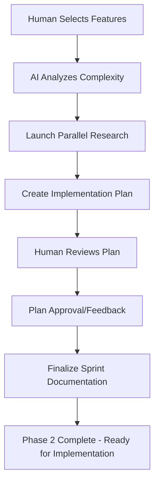

# <context>Phase 2: Sprint Development - AI Implementation Guide</context>

## <summary priority="critical">AI Sprint Implementation Authority</summary>

**Role Definition**: AI creates detailed implementation plans, manages complexity assessment, and executes comprehensive research under human feature selection and approval.

**Human Oversight**: Humans select features, approve sprint scope, and validate implementation approaches.

**Research Approach**: Parallel research for comprehensive knowledge gap analysis

**Documentation Standards**: Sprint documentation must follow [LLM Documentation Guidelines](llm-documentation-guidelines.md) with emphasis on token efficiency

## <method>AI Sprint Planning Process</method>

### <step priority="high">1. Feature Selection Analysis</step>

**AI Analysis Responsibilities:**
- Parse human-selected features from roadmap
- Identify technical dependencies and prerequisites
- Assess implementation complexity and resource requirements
- Create detailed task breakdown with time estimates

**AI Output Required:**
```xml
<sprint-analysis>
  <selected-features>
    <feature id="auth-system" complexity="8/10">
      <description>JWT-based authentication with role management</description>
      <dependencies>Database schema, password hashing, session management</dependencies>
      <complexity-assessment>High complexity - authentication flows and security requirements</complexity-assessment>
      <risk-factors>Token security, session persistence, role validation</risk-factors>
    </feature>
  </selected-features>
  
  <implementation-plan>
    <task priority="critical" estimated-hours="4">Database authentication schema</task>
    <task priority="high" estimated-hours="6">JWT token management service</task>
    <task priority="high" estimated-hours="4">Role-based authorization middleware</task>
    <task priority="medium" estimated-hours="3">Authentication API endpoints</task>
  </implementation-plan>
</sprint-analysis>
```

### <step priority="high">2. Knowledge Gap Research</step>

**AI Research Coordination:**
```yaml
Research Strategy:
  - Query Fortitude for existing implementation patterns
  - Launch parallel subagents for technology-specific research
  - Validate approaches against security and performance requirements
  - Create comprehensive implementation context
  
Research Domains (Parallel Execution):
  - Authentication libraries and frameworks
  - Database schema design patterns
  - Security best practices and vulnerability prevention
  - Testing approaches for authentication systems
  - Performance optimization patterns
```

**AI Research Quality Gates:**
```xml
<research-validation>
  <completeness-check>
    <criterion>Security implications fully researched</criterion>
    <criterion>Performance impact assessed</criterion>
    <criterion>Testing approach comprehensive</criterion>
    <criterion>Error handling patterns identified</criterion>
  </completeness-check>
  
  <pattern-validation>
    <criterion>Existing codebase patterns analyzed</criterion>
    <criterion>Industry best practices researched</criterion>
    <criterion>Alternative approaches evaluated</criterion>
    <criterion>Integration patterns with existing code confirmed</criterion>
  </pattern-validation>
</research-validation>
```

### <step priority="high">3. Implementation Plan Creation</step>

**AI Planning Output:**
```xml
<detailed-implementation-plan>
  <file-structure>
    <new-file path="src/auth/mod.rs">Authentication module entry point</new-file>
    <new-file path="src/auth/jwt.rs">JWT token management</new-file>
    <new-file path="src/auth/middleware.rs">Authorization middleware</new-file>
    <modified-file path="src/main.rs">Authentication route integration</modified-file>
    <new-file path="tests/auth_integration.rs">Authentication integration tests</new-file>
  </file-structure>
  
  <implementation-sequence>
    <step order="1">Create database schema migration</step>
    <step order="2">Implement JWT service with security patterns</step>
    <step order="3">Create authorization middleware</step>
    <step order="4">Add API endpoints with validation</step>
    <step order="5">Write comprehensive tests</step>
    <step order="6">Add error handling and logging</step>
  </implementation-sequence>
  
  <quality-requirements>
    <requirement type="testing">Unit tests for all authentication functions</requirement>
    <requirement type="integration">End-to-end authentication flow tests</requirement>
    <requirement type="security">Security vulnerability testing</requirement>
    <requirement type="performance">Authentication performance benchmarks</requirement>
  </quality-requirements>
</detailed-implementation-plan>
```

## <implementation>AI Sprint Workflow</implementation>

### <workflow>Phase 2 Execution Pattern</workflow>



### <research-coordination>Parallel Research Management</research-coordination>

**Subagent Task Template:**
```yaml
Subagent: Authentication Security Research
Context: CE-DPS AI-as-implementer philosophy
Task: Research JWT authentication security patterns for Rust
Sources: 
  - Industry security standards (OWASP, NIST)
  - Rust authentication crates documentation
  - Security vulnerability databases
Constraints: 
  - Focus on production-ready patterns
  - Include error handling approaches
  - Address session management security
Integration: Security requirements for authentication implementation plan
Format: Security checklist with implementation patterns
Validation: Comprehensive security coverage for authentication
```

**Research Completion Integration:**
- Synthesize findings from all parallel research subagents
- Validate consistency across research domains
- Identify conflicts and resolution strategies
- Create unified implementation context

### <complexity-assessment>AI Complexity Analysis</complexity-assessment>

**Complexity Scoring Framework:**
```xml
<complexity-factors>
  <technical-complexity score="1-10">
    <factor weight="0.3">Algorithm complexity and performance requirements</factor>
    <factor weight="0.2">Integration complexity with existing systems</factor>
    <factor weight="0.2">Security requirements and vulnerability surface</factor>
    <factor weight="0.3">Testing complexity and validation requirements</factor>
  </technical-complexity>
  
  <knowledge-complexity score="1-10">
    <factor weight="0.4">Availability of implementation patterns</factor>
    <factor weight="0.3">Team familiarity with technology stack</factor>
    <factor weight="0.3">External dependency complexity</factor>
  </knowledge-complexity>
  
  <risk-complexity score="1-10">
    <factor weight="0.4">Business impact of implementation failure</factor>
    <factor weight="0.3">Technical risk and rollback complexity</factor>
    <factor weight="0.3">Timeline risk and dependency impact</factor>
  </risk-complexity>
</complexity-factors>
```

## <quality-gates>Sprint Quality Standards</quality-gates>

### <ai-quality-requirements>AI Sprint Quality</ai-quality-requirements>

**Implementation Plan Quality:**
```yaml
Plan Completeness:
  - [ ] All files and modifications identified
  - [ ] Implementation sequence logically ordered
  - [ ] Dependencies and prerequisites clear
  - [ ] Testing approach comprehensive
  - [ ] Error handling patterns specified

Research Quality:
  - [ ] Security implications fully researched
  - [ ] Performance patterns identified
  - [ ] Alternative approaches evaluated
  - [ ] Integration patterns validated
  - [ ] Best practices incorporated

Documentation Quality:
  - [ ] Implementation context complete
  - [ ] Quality requirements measurable
  - [ ] Risk factors identified with mitigation
  - [ ] Time estimates realistic and justified
  - [ ] Human approval points clearly marked
```

### <escalation>Human Approval Requirements</escalation>

**Mandatory Human Approval:**
- Final feature selection and sprint scope
- Technology choices for new dependencies
- Database schema changes or migrations
- Security architecture modifications
- API design and public interface changes

**AI Autonomous Execution:**
- Research execution and synthesis
- Implementation plan creation
- Task breakdown and time estimation
- Quality requirement specification
- Documentation generation

## <constraints>Sprint Constraints</constraints>

### <ai-implementation-standards>AI Standards for Sprint Planning</ai-implementation-standards>

**Context Management:**
- Utilize Fortitude for pattern lookup before new research
- Maintain research context across parallel subagents
- Ensure consistent integration of research findings
- Document knowledge gaps for future learning

**Research Efficiency:**
- Parallel execution for independent research domains
- Sequential synthesis of related research findings
- Pattern reuse from previous successful implementations
- Proactive security and performance research

**Planning Quality:**
- Detailed file-level implementation planning
- Comprehensive testing strategy integration
- Clear quality gates and validation criteria
- Realistic time estimation based on complexity analysis

### <validation>Sprint Completion Validation</validation>

**Phase 2 Success Criteria:**
```xml
<sprint-completion-validation>
  <human-approval>
    <criterion>Feature selection approved by human oversight</criterion>
    <criterion>Implementation approach validated</criterion>
    <criterion>Sprint scope realistic and achievable</criterion>
  </human-approval>
  
  <technical-readiness>
    <criterion>Implementation plan detailed to file level</criterion>
    <criterion>All dependencies identified and researched</criterion>
    <criterion>Quality requirements comprehensive</criterion>
    <criterion>Testing approach validates all requirements</criterion>
  </technical-readiness>
  
  <knowledge-completeness>
    <criterion>Security patterns researched and documented</criterion>
    <criterion>Performance implications assessed</criterion>
    <criterion>Error handling approaches specified</criterion>
    <criterion>Integration patterns validated</criterion>
  </knowledge-completeness>
</sprint-completion-validation>
```

## <integration>Fortitude Integration for Sprint Planning</integration>

**Sprint Knowledge Capture:**
- Implementation planning patterns and successful approaches
- Complexity assessment accuracy and time estimation patterns
- Research prioritization and efficiency patterns
- Human approval patterns and preference learning

**Sprint Knowledge Usage:**
- Reference existing implementation patterns before new research
- Apply complexity assessment patterns from similar features
- Reuse proven research approaches for technology domains
- Leverage human preference patterns for feature prioritization

**Continuous Learning:**
- Refine complexity scoring based on actual implementation time
- Improve research prioritization from implementation outcomes
- Learn human approval patterns for better plan creation
- Optimize parallel research coordination for efficiency