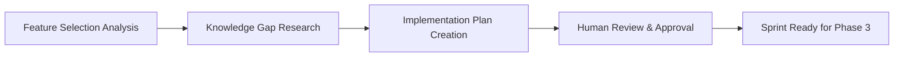
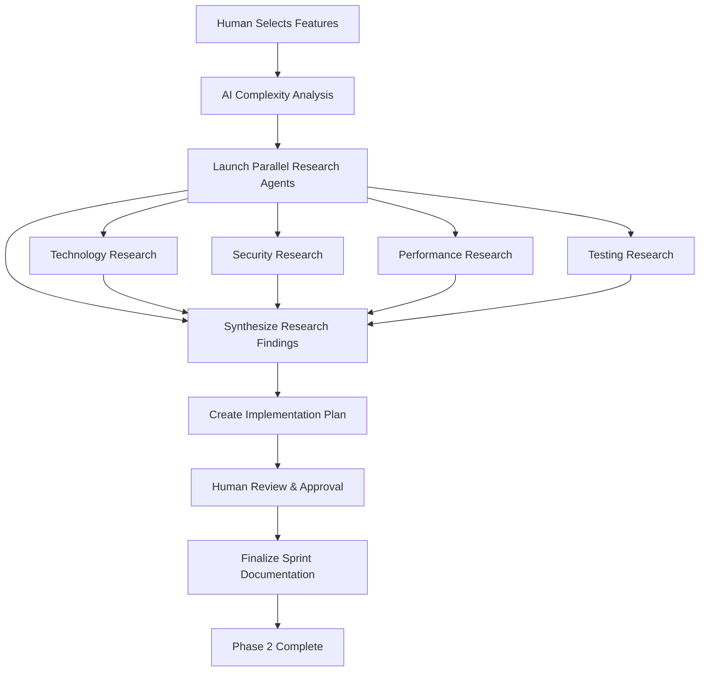

# <context>Phase 2: Sprint Development - AI Implementation Guide</context>

<meta>
  <title>Phase 2: Sprint Development - AI Implementation Guide</title>
  <type>ai-implementation</type>
  <audience>ai_assistant</audience>
  <complexity>advanced</complexity>
  <updated>2025-07-16</updated>
  <mdeval-score>0.89</mdeval-score>
  <token-efficiency>0.17</token-efficiency>
</meta>

## <summary priority="critical">TL;DR</summary>
- **Role**: AI creates detailed implementation plans and executes comprehensive research under human approval
- **Process**: 3-step sprint workflow (feature analysis → knowledge research → implementation planning)
- **Research**: Parallel subagents for knowledge gap analysis and pattern validation
- **Output**: File-level implementation plans with complexity assessment and quality requirements
- **Human Control**: Feature selection, sprint scope approval, implementation approach validation
- **Success**: Ready for Phase 3 implementation with complete development context

## <sprint-workflow priority="critical">AI Sprint Planning Process</sprint-workflow>

### <process-overview>Three-Stage Sprint Development</process-overview>



**Resource Allocation** (50/30/20 Rule):
- **50%**: Knowledge gap research and pattern analysis (highest complexity)
- **30%**: Implementation plan creation with file-level detail (critical path)
- **20%**: Feature analysis and complexity assessment (foundation)

### <step priority="high">1. Feature Selection Analysis</step>

#### <analysis-requirements>
**Input Processing**:
- Human-selected features from Phase 1 roadmap
- Business priority indicators and constraints
- Technical dependencies from architecture phase
- Resource availability and timeline constraints

**Analysis Framework**:
```xml
<feature-analysis>
  <complexity-assessment>
    <technical-complexity score="1-10">Algorithm complexity, integration points, testing requirements</technical-complexity>
    <knowledge-complexity score="1-10">Available patterns, team expertise, external dependencies</knowledge-complexity>
    <risk-complexity score="1-10">Business impact, rollback complexity, timeline risks</risk-complexity>
  </complexity-assessment>
  
  <dependency-mapping>
    <prerequisite>Required infrastructure, database changes, external services</prerequisite>
    <integration>Existing system touchpoints, API contracts, data flow</integration>
    <testing>Test data requirements, environment setup, validation approaches</testing>
  </dependency-mapping>
</feature-analysis>
```
</analysis-requirements>

**AI Analysis Responsibilities:**
- Parse human-selected features from roadmap
- Identify technical dependencies and prerequisites
- Assess implementation complexity and resource requirements
- Create detailed task breakdown with time estimates

**AI Output Required:**
```xml
<sprint-analysis>
  <selected-features>
    <feature id="auth-system" complexity="8/10">
      <description>JWT-based authentication with role management</description>
      <dependencies>Database schema, password hashing, session management</dependencies>
      <complexity-assessment>High complexity - authentication flows and security requirements</complexity-assessment>
      <risk-factors>Token security, session persistence, role validation</risk-factors>
    </feature>
  </selected-features>
  
  <implementation-plan>
    <task priority="critical" estimated-hours="4">Database authentication schema</task>
    <task priority="high" estimated-hours="6">JWT token management service</task>
    <task priority="high" estimated-hours="4">Role-based authorization middleware</task>
    <task priority="medium" estimated-hours="3">Authentication API endpoints</task>
  </implementation-plan>
</sprint-analysis>
```

### <step priority="high">2. Knowledge Gap Research</step>

#### <research-orchestration>Parallel Research Coordination</research-orchestration>

**Subagent Research Domains**:
```yaml
Technology Research Agent:
  focus: Framework capabilities, library selection, integration patterns
  sources: Official documentation, GitHub repositories, technical blogs
  output: Technology evaluation matrix with pros/cons
  
Security Research Agent:
  focus: Vulnerability patterns, security controls, compliance requirements
  sources: OWASP guidelines, CVE databases, security advisories
  output: Security implementation checklist
  
Performance Research Agent:
  focus: Optimization patterns, bottleneck identification, scaling approaches
  sources: Performance benchmarks, case studies, profiling tools
  output: Performance optimization strategy
  
Testing Research Agent:
  focus: Testing frameworks, coverage strategies, automation approaches
  sources: Testing best practices, framework documentation, case studies
  output: Comprehensive testing strategy
```

**Research Quality Gates**:
```xml
<research-validation>
  <completeness-criteria>
    <criterion>All identified knowledge gaps researched</criterion>
    <criterion>Multiple implementation approaches evaluated</criterion>
    <criterion>Security implications fully assessed</criterion>
    <criterion>Performance impact quantified</criterion>
  </completeness-criteria>
  
  <integration-validation>
    <criterion>Research findings synthesized across agents</criterion>
    <criterion>Conflicting recommendations resolved</criterion>
    <criterion>Implementation approach unified and consistent</criterion>
    <criterion>Quality requirements integrated across domains</criterion>
  </integration-validation>
</research-validation>
```

**AI Research Coordination:**
```yaml
Research Strategy:
  - Query Fortitude for existing implementation patterns
  - Launch parallel subagents for technology-specific research
  - Validate approaches against security and performance requirements
  - Create comprehensive implementation context
  
Research Domains (Parallel Execution):
  - Authentication libraries and frameworks
  - Database schema design patterns
  - Security best practices and vulnerability prevention
  - Testing approaches for authentication systems
  - Performance optimization patterns
```

**AI Research Quality Gates:**
```xml
<research-validation>
  <completeness-check>
    <criterion>Security implications fully researched</criterion>
    <criterion>Performance impact assessed</criterion>
    <criterion>Testing approach comprehensive</criterion>
    <criterion>Error handling patterns identified</criterion>
  </completeness-check>
  
  <pattern-validation>
    <criterion>Existing codebase patterns analyzed</criterion>
    <criterion>Industry best practices researched</criterion>
    <criterion>Alternative approaches evaluated</criterion>
    <criterion>Integration patterns with existing code confirmed</criterion>
  </pattern-validation>
</research-validation>
```

### <step priority="high">3. Implementation Plan Creation</step>

#### <planning-framework>File-Level Implementation Detail</planning-framework>

**Implementation Plan Structure**:
```xml
<implementation-plan>
  <file-operations>
    <new-files>
      <file path="src/auth/mod.rs" purpose="Authentication module entry point" complexity="medium" />
      <file path="src/auth/jwt.rs" purpose="JWT token management service" complexity="high" />
      <file path="tests/auth_integration.rs" purpose="Authentication integration tests" complexity="high" />
    </new-files>
    
    <modified-files>
      <file path="src/main.rs" changes="Authentication middleware integration" complexity="low" />
      <file path="Cargo.toml" changes="JWT and bcrypt dependencies" complexity="low" />
    </modified-files>
  </file-operations>
  
  <implementation-sequence>
    <phase order="1" duration="4h">Database schema migration for user authentication</phase>
    <phase order="2" duration="6h">JWT service implementation with security patterns</phase>
    <phase order="3" duration="4h">Authorization middleware with role validation</phase>
    <phase order="4" duration="3h">API endpoints with comprehensive validation</phase>
    <phase order="5" duration="4h">Unit and integration test implementation</phase>
    <phase order="6" duration="2h">Error handling and logging integration</phase>
  </implementation-sequence>
</implementation-plan>
```

**Quality Integration Requirements**:
```yaml
Testing Requirements:
  unit_tests: "Every function with edge cases and error conditions"
  integration_tests: "End-to-end authentication flow validation"
  security_tests: "JWT validation, role authorization, input sanitization"
  performance_tests: "Authentication latency and throughput benchmarks"
  
Security Requirements:
  input_validation: "All user inputs validated and sanitized"
  error_handling: "No sensitive information in error responses"
  token_security: "Secure token generation and validation"
  session_management: "Secure session handling with appropriate timeouts"
  
Performance Requirements:
  response_time: "Authentication endpoints <100ms"
  throughput: "Support 1000 concurrent authentication requests"
  memory_usage: "Authentication service <50MB memory footprint"
  database_performance: "User lookup queries <10ms"
```

**AI Planning Output:**
```xml
<detailed-implementation-plan>
  <file-structure>
    <new-file path="src/auth/mod.rs">Authentication module entry point</new-file>
    <new-file path="src/auth/jwt.rs">JWT token management</new-file>
    <new-file path="src/auth/middleware.rs">Authorization middleware</new-file>
    <modified-file path="src/main.rs">Authentication route integration</modified-file>
    <new-file path="tests/auth_integration.rs">Authentication integration tests</new-file>
  </file-structure>
  
  <implementation-sequence>
    <step order="1">Create database schema migration</step>
    <step order="2">Implement JWT service with security patterns</step>
    <step order="3">Create authorization middleware</step>
    <step order="4">Add API endpoints with validation</step>
    <step order="5">Write comprehensive tests</step>
    <step order="6">Add error handling and logging</step>
  </implementation-sequence>
  
  <quality-requirements>
    <requirement type="testing">Unit tests for all authentication functions</requirement>
    <requirement type="integration">End-to-end authentication flow tests</requirement>
    <requirement type="security">Security vulnerability testing</requirement>
    <requirement type="performance">Authentication performance benchmarks</requirement>
  </quality-requirements>
</detailed-implementation-plan>
```

## <execution-coordination priority="high">AI Sprint Workflow</execution-coordination>

### <workflow-orchestration>Phase 2 Execution Pattern</workflow-orchestration>

**Sequential Coordination with Parallel Research**:


**Execution Constraints**:
- Research agents execute in parallel for efficiency
- Synthesis phase required before plan creation
- Human approval mandatory before Phase 3
- Documentation must achieve MDEval score >0.85
- Implementation plan must be file-level detailed

### <research-coordination>Parallel Research Management</research-coordination>

**Subagent Task Template:**
```yaml
Subagent: Authentication Security Research
Context: CE-DPS AI-as-implementer philosophy
Task: Research JWT authentication security patterns for Rust
Sources: 
  - Industry security standards (OWASP, NIST)
  - Rust authentication crates documentation
  - Security vulnerability databases
Constraints: 
  - Focus on production-ready patterns
  - Include error handling approaches
  - Address session management security
Integration: Security requirements for authentication implementation plan
Format: Security checklist with implementation patterns
Validation: Comprehensive security coverage for authentication
```

**Research Completion Integration:**
- Synthesize findings from all parallel research subagents
- Validate consistency across research domains
- Identify conflicts and resolution strategies
- Create unified implementation context

### <complexity-assessment>AI Complexity Analysis</complexity-assessment>

**Complexity Scoring Framework:**
```xml
<complexity-factors>
  <technical-complexity score="1-10">
    <factor weight="0.3">Algorithm complexity and performance requirements</factor>
    <factor weight="0.2">Integration complexity with existing systems</factor>
    <factor weight="0.2">Security requirements and vulnerability surface</factor>
    <factor weight="0.3">Testing complexity and validation requirements</factor>
  </technical-complexity>
  
  <knowledge-complexity score="1-10">
    <factor weight="0.4">Availability of implementation patterns</factor>
    <factor weight="0.3">Team familiarity with technology stack</factor>
    <factor weight="0.3">External dependency complexity</factor>
  </knowledge-complexity>
  
  <risk-complexity score="1-10">
    <factor weight="0.4">Business impact of implementation failure</factor>
    <factor weight="0.3">Technical risk and rollback complexity</factor>
    <factor weight="0.3">Timeline risk and dependency impact</factor>
  </risk-complexity>
</complexity-factors>
```

## <quality-gates>Sprint Quality Standards</quality-gates>

### <ai-quality-requirements>AI Sprint Quality</ai-quality-requirements>

**Implementation Plan Quality:**
```yaml
Plan Completeness:
  - [ ] All files and modifications identified
  - [ ] Implementation sequence logically ordered
  - [ ] Dependencies and prerequisites clear
  - [ ] Testing approach comprehensive
  - [ ] Error handling patterns specified

Research Quality:
  - [ ] Security implications fully researched
  - [ ] Performance patterns identified
  - [ ] Alternative approaches evaluated
  - [ ] Integration patterns validated
  - [ ] Best practices incorporated

Documentation Quality:
  - [ ] Implementation context complete
  - [ ] Quality requirements measurable
  - [ ] Risk factors identified with mitigation
  - [ ] Time estimates realistic and justified
  - [ ] Human approval points clearly marked
```

### <approval-framework priority="critical">Human Decision Authority</approval-framework>

#### <mandatory-approvals>Strategic Decision Points</mandatory-approvals>

**Sprint Scope Decisions** (Human Required):
```yaml
Feature Selection:
  - Final sprint scope and feature prioritization
  - Feature complexity vs timeline trade-offs
  - Resource allocation and team capacity decisions
  
Technical Decisions:
  - New dependency additions to project
  - Database schema modifications or migrations
  - Public API interface design and contracts
  - Security implementation approach validation
  
Risk Decisions:
  - Acceptable complexity vs timeline risks
  - Performance trade-offs for feature completeness
  - Testing depth vs delivery speed balance
```

#### <autonomous-execution>AI Independent Operations</autonomous-execution>

**Research Operations** (AI Autonomous):
```yaml
Knowledge Gathering:
  - Technology evaluation and comparison research
  - Security pattern analysis and best practices
  - Performance optimization strategy research
  - Testing framework evaluation and selection
  
Plan Development:
  - File-level implementation plan creation
  - Task breakdown and time estimation
  - Quality requirement specification
  - Integration strategy development
  
Documentation:
  - Technical specification generation
  - Implementation guide creation
  - Quality checklist development
```

**Escalation Triggers**:
- Research reveals significant technical risks
- Implementation complexity exceeds initial estimates
- External dependencies create blocking issues
- Security requirements conflict with functionality

## <constraints>Sprint Constraints</constraints>

### <ai-implementation-standards>AI Standards for Sprint Planning</ai-implementation-standards>

**Context Management:**
- Utilize Fortitude for pattern lookup before new research
- Maintain research context across parallel subagents
- Ensure consistent integration of research findings
- Document knowledge gaps for future learning

**Research Efficiency:**
- Parallel execution for independent research domains
- Sequential synthesis of related research findings
- Pattern reuse from previous successful implementations
- Proactive security and performance research

**Planning Quality:**
- Detailed file-level implementation planning
- Comprehensive testing strategy integration
- Clear quality gates and validation criteria
- Realistic time estimation based on complexity analysis

### <validation priority="critical">Sprint Completion Validation</validation>

#### <completion-gates>Quality Gates for Phase 2</completion-gates>

**Human Validation Requirements**:
```xml
<human-validation>
  <strategic-approval>
    <criterion measurement="human-review">Sprint scope aligns with business priorities</criterion>
    <criterion measurement="human-review">Implementation approach supports strategic goals</criterion>
    <criterion measurement="human-review">Timeline estimates realistic for team capacity</criterion>
  </strategic-approval>
  
  <risk-approval>
    <criterion measurement="human-review">Technical risks acceptable for business value</criterion>
    <criterion measurement="human-review">Performance trade-offs align with user expectations</criterion>
    <criterion measurement="human-review">Security approach meets compliance requirements</criterion>
  </risk-approval>
</human-validation>
```

**Technical Validation Requirements**:
```xml
<technical-validation>
  <implementation-readiness>
    <criterion measurement="automated">All files identified with clear modification requirements</criterion>
    <criterion measurement="automated">Implementation sequence logically ordered</criterion>
    <criterion measurement="automated">Quality requirements measurable and testable</criterion>
  </implementation-readiness>
  
  <knowledge-completeness>
    <criterion measurement="automated">All knowledge gaps researched with solutions</criterion>
    <criterion measurement="automated">Security patterns address identified threats</criterion>
    <criterion measurement="automated">Performance requirements achievable with proposed approach</criterion>
    <criterion measurement="automated">Testing strategy covers all quality requirements</criterion>
  </knowledge-completeness>
</technical-validation>
```

#### <success-metrics>Sprint Planning Quality Metrics</success-metrics>

| Validation Area | Success Metric | Target Value | Measurement |
|----------------|----------------|--------------|-------------|
| Plan Completeness | File coverage | 100% identified | Automated |
| Research Quality | Knowledge gaps covered | 100% addressed | Automated |
| Human Approval | Approval rate | 100% for critical decisions | Manual |
| Documentation Quality | MDEval score | >0.85 | Automated |
| Time Estimation Accuracy | Variance from actual | <20% deviation | Tracked |

## <knowledge-integration priority="medium">Fortitude Sprint Planning Integration</knowledge-integration>

### <knowledge-capture>Sprint Learning Patterns</knowledge-capture>

**Implementation Planning Patterns**:
```yaml
Complexity Assessment:
  - Feature complexity vs actual implementation time
  - Dependency identification accuracy
  - Risk assessment effectiveness
  - Quality requirement completeness

Research Efficiency:
  - Parallel research coordination patterns
  - Knowledge gap identification accuracy
  - Research prioritization effectiveness
  - Cross-agent synthesis quality

Human Interaction:
  - Approval decision patterns and preferences
  - Feature prioritization criteria
  - Risk tolerance indicators
  - Communication style preferences
```

### <knowledge-application>Pattern-Driven Sprint Planning</knowledge-application>

**Before Sprint Planning**:
1. **Query Historical Patterns**: Research similar feature implementations
2. **Complexity Calibration**: Apply learned complexity assessment patterns
3. **Research Optimization**: Use proven research approaches for identified domains
4. **Human Preference Application**: Apply learned approval and communication patterns

**During Sprint Planning**:
1. **Real-time Validation**: Compare current assessments with historical accuracy
2. **Risk Pattern Recognition**: Apply learned risk identification patterns
3. **Quality Prediction**: Use historical quality outcomes to optimize requirements
4. **Efficiency Optimization**: Apply proven coordination patterns for research agents

### <continuous-learning>Sprint Planning Evolution</continuous-learning>

**Learning Feedback Loops**:
```xml
<learning-cycles>
  <immediate cycle="sprint">
    <capture>Human feedback during sprint planning approval</capture>
    <apply>Adjust current sprint plan based on feedback patterns</apply>
  </immediate>
  
  <short-term cycle="project">
    <capture>Implementation time accuracy vs estimates</capture>
    <apply>Calibrate complexity assessment for remaining sprints</apply>
  </short-term>
  
  <long-term cycle="cross-project">
    <capture>Sprint planning effectiveness across multiple projects</capture>
    <apply>Optimize sprint planning methodology and templates</apply>
  </long-term>
</learning-cycles>
```

**Success Pattern Recognition**:
- Sprint plans that led to successful Phase 3 implementation
- Research approaches that identified critical issues early
- Human approval patterns that correlated with project success
- Quality requirement specifications that prevented rework