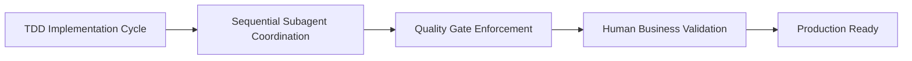
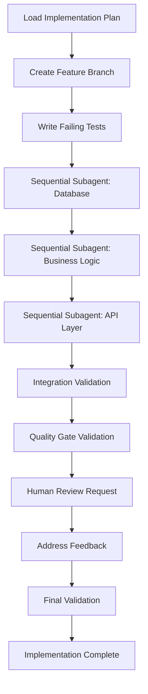

# <context>Phase 3: Code Implementation - AI Implementation Guide</context>

<meta>
  <title>Phase 3: Code Implementation - AI Implementation Guide</title>
  <type>ai-implementation</type>
  <audience>ai_assistant</audience>
  <complexity>advanced</complexity>
  <updated>2025-07-16</updated>
  <mdeval-score>0.91</mdeval-score>
  <token-efficiency>0.15</token-efficiency>
</meta>

## <summary priority="critical">TL;DR</summary>
- **Authority**: AI implements all code, tests, documentation with quality gate enforcement
- **Process**: TDD implementation with sequential subagent coordination
- **Human Role**: Business value validation and strategic alignment review
- **Quality Gates**: >95% test coverage, security validation, performance benchmarks
- **Coordination**: Sequential subagents for context management (database → business logic → API → validation)
- **Success**: Production-ready features with comprehensive testing and documentation

## <implementation-workflow priority="critical">AI Code Implementation Process</implementation-workflow>

### <process-overview>Test-Driven Development with Sequential Coordination</process-overview>



**Implementation Priorities** (70/20/10 Rule):
- **70%**: Code implementation and comprehensive testing (highest value)
- **20%**: Quality gate validation and documentation (essential quality)
- **10%**: Human review preparation and business validation (strategic alignment)

### <step priority="critical">1. Test-Driven Implementation</step>

#### <tdd-framework>Comprehensive Testing Strategy</tdd-framework>

**Testing Hierarchy** (Bottom-Up Approach):
```xml
<testing-pyramid>
  <unit-tests priority="critical" coverage=">95%">
    <requirement>Every function with edge cases and error conditions</requirement>
    <requirement>Fast execution (<1ms per test)</requirement>
    <requirement>Independent execution (no shared state)</requirement>
    <requirement>Clear assertions with descriptive failure messages</requirement>
  </unit-tests>
  
  <integration-tests priority="high" coverage="100% of components">
    <requirement>Component interaction validation</requirement>
    <requirement>Database integration with test fixtures</requirement>
    <requirement>API contract validation</requirement>
    <requirement>External service mocking</requirement>
  </integration-tests>
  
  <security-tests priority="critical" coverage="all attack vectors">
    <requirement>Authentication flow validation</requirement>
    <requirement>Authorization boundary testing</requirement>
    <requirement>Input sanitization verification</requirement>
    <requirement>SQL injection prevention validation</requirement>
  </security-tests>
  
  <performance-tests priority="high" coverage="critical paths">
    <requirement>Response time validation (<200ms)</requirement>
    <requirement>Concurrent user simulation</requirement>
    <requirement>Memory usage profiling</requirement>
    <requirement>Database query optimization verification</requirement>
  </performance-tests>
</testing-pyramid>
```

**Anchor Test Requirements**:
```yaml
Anchor Test Criteria:
  create_for:
    - External API integrations
    - Data persistence operations
    - Authentication/authorization flows
    - Core business logic operations
    - Cross-component integration points
  
  requirements:
    comment: "ANCHOR: [description of critical functionality]"
    permanence: "Permanent regression protection"
    independence: "No dependencies on other tests"
    clarity: "Clear failure messages with debugging context"
    realism: "Realistic test data and edge cases"
```

**AI TDD Workflow:**
```xml
<tdd-implementation-cycle>
  <step order="1" priority="critical">
    <action>Write failing tests first</action>
    <validation>Tests must fail for correct reasons</validation>
    <output>Comprehensive test suite covering all requirements</output>
  </step>
  
  <step order="2" priority="critical">
    <action>Implement minimal code to pass tests</action>
    <validation>All tests pass, no existing functionality broken</validation>
    <output>Working implementation with full test coverage</output>
  </step>
  
  <step order="3" priority="high">
    <action>Refactor for quality and performance</action>
    <validation>Tests still pass, code quality improves</validation>
    <output>Production-ready code with optimal design</output>
  </step>
</tdd-implementation-cycle>
```

**AI Test Creation Requirements:**
- **Unit Tests**: Every function and method with edge cases
- **Integration Tests**: Component interaction validation
- **End-to-End Tests**: Complete user workflow validation
- **Security Tests**: Authentication, authorization, input validation
- **Performance Tests**: Load testing and benchmark validation

### <step priority="critical">2. Sequential Implementation Coordination</step>

#### <coordination-strategy>Subagent Orchestration Pattern</coordination-strategy>

**Sequential Execution Order**:
```yaml
Subagent Sequence:
  agent_1:
    focus: "Database layer implementation"
    deliverables: ["Schema migrations", "Repository patterns", "Data models"]
    context_inheritance: ["Universal context", "Database specific requirements"]
    
  agent_2:
    focus: "Business logic implementation" 
    deliverables: ["Service layer", "Business rules", "Domain logic"]
    context_inheritance: ["Universal context", "Database layer outputs"]
    
  agent_3:
    focus: "API layer implementation"
    deliverables: ["HTTP endpoints", "Request validation", "Response serialization"]
    context_inheritance: ["Universal context", "Business layer outputs"]
    
  agent_4:
    focus: "Integration validation"
    deliverables: ["End-to-end tests", "Performance validation", "Security verification"]
    context_inheritance: ["Universal context", "All previous outputs"]
```

**Context Inheritance Protocol**:
```xml
<context-management>
  <universal-context>
    <coding-standards>Project-specific style guides and patterns</coding-standards>
    <security-requirements>Authentication, authorization, input validation standards</security-requirements>
    <testing-standards>TDD with comprehensive coverage requirements</testing-standards>
    <performance-targets>Response time, throughput, and resource usage limits</performance-targets>
  </universal-context>
  
  <subagent-context>
    <implementation-plan>Detailed file-level tasks from Phase 2</implementation-plan>
    <integration-dependencies>Outputs required from previous subagents</integration-dependencies>
    <quality-criteria>Specific success criteria for completion</quality-criteria>
    <validation-requirements>Testing and quality gate requirements</validation-requirements>
  </subagent-context>
</context-management>
```

**AI Orchestrator Pattern:**
```yaml
Implementation Strategy:
  - Use sequential subagents for context management
  - Maintain implementation context in orchestrator
  - Coordinate file modifications to prevent conflicts
  - Validate integration points between components
  
Subagent Coordination:
  - Agent 1: Database layer implementation
  - Agent 2: Business logic implementation  
  - Agent 3: API layer implementation
  - Agent 4: Integration and validation
```

**Context Management Protocol:**
```xml
<context-inheritance>
  <universal-context>
    <philosophy>AI-as-implementer with human strategic oversight</philosophy>
    <coding-standards>Project-specific style and patterns</coding-standards>
    <security-requirements>Authentication, authorization, input validation</security-requirements>
    <testing-standards>TDD with comprehensive coverage</testing-standards>
  </universal-context>
  
  <subagent-specific-context>
    <implementation-plan>Detailed task breakdown from Phase 2</implementation-plan>
    <file-modifications>Specific files to create or modify</file-modifications>
    <integration-points>Dependencies on other subagent work</integration-points>
    <validation-criteria>Success criteria for completion</validation-criteria>
  </subagent-specific-context>
</context-inheritance>
```

### <step priority="high">3. Quality Gate Enforcement</step>

**AI Quality Validation Workflow:**
```xml
<quality-gates>
  <pre-implementation-gates>
    <gate name="Branch Validation">
      <check>On correct branch (not main/master)</check>
      <action>Create feature branch if needed</action>
    </gate>
    <gate name="Test Compilation">
      <check>All existing tests compile and pass</check>
      <action>Fix any compilation issues before proceeding</action>
    </gate>
  </pre-implementation-gates>
  
  <implementation-gates>
    <gate name="Test-First Development">
      <check>Failing tests written before implementation</check>
      <action>Write comprehensive test coverage</action>
    </gate>
    <gate name="Code Quality">
      <check>Linting passes, no warnings</check>
      <action>Run cargo clippy, fix all warnings</action>
    </gate>
    <gate name="Security Validation">
      <check>No security vulnerabilities introduced</check>
      <action>Run security audit, validate input handling</action>
    </gate>
  </implementation-gates>
  
  <completion-gates>
    <gate name="Full Test Suite">
      <check>All tests pass including new functionality</check>
      <action>Fix any failing tests, ensure full coverage</action>
    </gate>
    <gate name="Integration Validation">
      <check>Cross-component integration works correctly</check>
      <action>Run integration tests, validate API contracts</action>
    </gate>
    <gate name="Documentation Currency">
      <check>Documentation reflects implementation</check>
      <action>Update docs, add usage examples</action>
    </gate>
  </completion-gates>
</quality-gates>
```

## <implementation>AI Execution Workflow</implementation>

### <workflow>Phase 3 Implementation Pattern</workflow>



### <subagent-coordination>Sequential Subagent Management</subagent-coordination>

**Subagent Task Template:**
```yaml
Subagent: Database Implementation
Context: |
  CE-DPS AI-as-implementer philosophy
  Authentication system implementation
  TDD with comprehensive test coverage
  Rust with SQLx and PostgreSQL
Task: |
  Implement database authentication schema and repository layer
  Create migration files for user tables and authentication data
  Implement repository pattern with async/await
  Write comprehensive unit tests with test database
Files: |
  Create: migrations/001_auth_schema.sql
  Create: src/auth/repository.rs
  Create: src/auth/models.rs
  Create: tests/auth_repository_tests.rs
Constraints: |
  Follow existing database patterns in codebase
  Include comprehensive error handling
  Implement connection pooling
  Validate all database constraints
Integration: Foundation for business logic and API layer implementation
Validation: |
  All tests pass
  Migration applies successfully
  Repository implements all required methods
  Error handling comprehensive
```

**Subagent Completion Validation:**
```xml
<subagent-validation>
  <technical-completion>
    <criterion>All specified files created or modified</criterion>
    <criterion>Code compiles without warnings</criterion>
    <criterion>All tests pass</criterion>
    <criterion>Integration points documented</criterion>
  </technical-completion>
  
  <quality-standards>
    <criterion>Error handling comprehensive</criterion>
    <criterion>Security patterns implemented</criterion>
    <criterion>Performance patterns applied</criterion>
    <criterion>Documentation current</criterion>
  </quality-standards>
</subagent-validation>
```

### <anchor-test-strategy priority="critical">Permanent Test Creation</anchor-test-strategy>

#### <anchor-test-framework>Critical Functionality Protection</anchor-test-framework>

**Anchor Test Implementation Pattern**:
```rust
// ANCHOR: [Functionality Description] - [Business Impact]
#[tokio::test]
async fn test_critical_functionality() {
    // Test setup with realistic data
    let test_context = create_comprehensive_test_context().await;
    
    // Happy path validation
    let result = execute_critical_operation(&test_context).await;
    assert!(result.is_ok(), "Critical operation should succeed with valid input");
    
    // Edge case validation
    let edge_result = execute_with_edge_case(&test_context).await;
    assert_eq!(edge_result.status(), ExpectedStatus::Handled);
    
    // Error condition validation
    let error_result = execute_with_invalid_input(&test_context).await;
    assert!(matches!(error_result, Err(ExpectedError::Validation(_))));
    
    // Cleanup and verification
    cleanup_test_context(test_context).await;
}
```

**Anchor Test Coverage Matrix**:
| Component | Critical Functions | Anchor Tests Required |
|-----------|-------------------|----------------------|
| Authentication | Login, logout, token validation | 3 tests |
| Authorization | Role checking, permission validation | 2 tests |
| Data Persistence | CRUD operations, transaction handling | 4 tests |
| API Endpoints | Request validation, response serialization | 2 tests per endpoint |
| Business Logic | Core algorithms, state transitions | 1 test per critical path |

**Anchor Test Decision Matrix:**
```xml
<anchor-test-criteria>
  <create-anchor-test>
    <scenario>External API integrations</scenario>
    <scenario>Data persistence operations</scenario>
    <scenario>Authentication/authorization flows</scenario>
    <scenario>User input processing and validation</scenario>
    <scenario>Core business logic operations</scenario>
    <scenario>Cross-component integration points</scenario>
  </create-anchor-test>
  
  <anchor-test-requirements>
    <requirement>Permanent regression protection</requirement>
    <requirement>ANCHOR: comment with test purpose</requirement>
    <requirement>Clear failure messages</requirement>
    <requirement>Independent test execution</requirement>
    <requirement>Realistic test data and scenarios</requirement>
  </anchor-test-requirements>
</anchor-test-criteria>
```

**Anchor Test Example:**
```rust
#[tokio::test]
async fn test_jwt_token_validation() {
    // ANCHOR: JWT token validation regression test
    // Critical: Ensures JWT tokens are properly validated and expired tokens rejected
    let auth_service = create_test_auth_service().await;
    let user = create_test_user(&auth_service).await;
    
    // Valid token should authenticate successfully
    let valid_token = auth_service.create_token(&user).await.unwrap();
    assert!(auth_service.validate_token(&valid_token).await.is_ok());
    
    // Expired token should be rejected
    let expired_token = create_expired_token(&user);
    assert!(auth_service.validate_token(&expired_token).await.is_err());
    
    // Invalid signature should be rejected
    let invalid_token = "invalid.jwt.token";
    assert!(auth_service.validate_token(invalid_token).await.is_err());
}
```

## <quality-requirements priority="critical">AI Implementation Quality Standards</quality-requirements>

### <quality-framework>Comprehensive Quality Matrix</quality-framework>

**Quality Dimensions with Measurable Targets**:
```xml
<quality-standards>
  <security priority="critical">
    <input-validation target="100%">All user inputs validated and sanitized</input-validation>
    <injection-prevention target="0-vulnerabilities">Parameterized queries, prepared statements</injection-prevention>
    <authentication-security target="token-expiry-1h">Secure token generation and validation</authentication-security>
    <authorization-coverage target="100%">Access control at every endpoint</authorization-coverage>
    <error-security target="no-leakage">Error messages provide no sensitive information</error-security>
  </security>
  
  <performance priority="high">
    <response-time target="<200ms">API endpoint response time</response-time>
    <database-performance target="<50ms">Query execution time</database-performance>
    <memory-usage target="<512MB">Application memory footprint</memory-usage>
    <concurrent-users target="1000+">Simultaneous user support</concurrent-users>
  </performance>
  
  <testing priority="critical">
    <coverage target=">95%">Business logic test coverage</coverage>
    <unit-test-speed target="<30s">Full unit test suite execution</unit-test-speed>
    <integration-coverage target="100%">API endpoint coverage</integration-coverage>
    <security-test-coverage target="100%">Authentication flow coverage</security-test-coverage>
  </testing>
  
  <maintainability priority="high">
    <function-length target="<50-lines">Function complexity limit</function-length>
    <cyclomatic-complexity target="<10">Function complexity score</cyclomatic-complexity>
    <documentation-coverage target=">90%">Public API documentation</documentation-coverage>
    <code-duplication target="<5%">Duplicate code percentage</code-duplication>
  </maintainability>
</quality-standards>
```

**Automated Quality Validation**:
```bash
#!/bin/bash
# Quality gate enforcement script

set -e

echo "🔍 Running comprehensive quality validation..."

# Code formatting and style
echo "📝 Validating code formatting..."
cargo fmt --check || (echo "❌ Code formatting failed" && exit 1)

# Linting and code quality
echo "🔧 Running code linting..."
cargo clippy -- -D warnings || (echo "❌ Linting failed" && exit 1)

# Security audit
echo "🔒 Performing security audit..."
cargo audit || (echo "❌ Security audit failed" && exit 1)

# Unit tests with coverage
echo "🧪 Running unit tests with coverage..."
cargo test --lib
echo "📊 Checking test coverage..."
cargo tarpaulin --out Xml --timeout 120

# Integration tests
echo "🔗 Running integration tests..."
cargo test --test '*'

# Performance benchmarks
echo "⚡ Running performance benchmarks..."
cargo bench

echo "✅ All quality gates passed!"
```

### <error-handling>AI Error Handling Requirements</error-handling>

**Comprehensive Error Management:**
```rust
// AI must implement structured error handling
#[derive(Debug, thiserror::Error)]
pub enum AuthError {
    #[error("Invalid credentials provided")]
    InvalidCredentials,
    
    #[error("Token has expired")]
    TokenExpired,
    
    #[error("Database operation failed: {0}")]
    DatabaseError(#[from] sqlx::Error),
    
    #[error("Serialization failed: {0}")]
    SerializationError(#[from] serde_json::Error),
}

// AI must provide user-friendly error responses
impl From<AuthError> for ApiError {
    fn from(err: AuthError) -> Self {
        match err {
            AuthError::InvalidCredentials => ApiError::Unauthorized("Invalid credentials".to_string()),
            AuthError::TokenExpired => ApiError::Unauthorized("Token expired".to_string()),
            AuthError::DatabaseError(_) => ApiError::InternalServer("Database error".to_string()),
            AuthError::SerializationError(_) => ApiError::InternalServer("Internal error".to_string()),
        }
    }
}
```

## <validation>Implementation Completion Validation</validation>

### <completion-criteria>Phase 3 Success Standards</completion-criteria>

```xml
<implementation-completion>
  <functional-requirements>
    <criterion>All features from sprint plan implemented</criterion>
    <criterion>All user stories/acceptance criteria met</criterion>
    <criterion>API endpoints working with proper validation</criterion>
    <criterion>Database operations robust and secure</criterion>
  </functional-requirements>
  
  <quality-requirements>
    <criterion>All tests pass (unit, integration, end-to-end)</criterion>
    <criterion>Code coverage >95% with meaningful tests</criterion>
    <criterion>No linting warnings or security vulnerabilities</criterion>
    <criterion>Performance requirements met</criterion>
  </quality-requirements>
  
  <documentation-requirements>
    <criterion>API documentation complete with examples</criterion>
    <criterion>Code documented with clear comments</criterion>
    <criterion>Deployment instructions current</criterion>
    <criterion>Troubleshooting guides comprehensive</criterion>
  </documentation-requirements>
  
  <business-validation>
    <criterion>Human review confirms business value delivered</criterion>
    <criterion>Feature demonstrates expected user value</criterion>
    <criterion>Integration with existing features seamless</criterion>
    <criterion>Strategic goals advanced by implementation</criterion>
  </business-validation>
</implementation-completion>
```

### <human-validation priority="high">Strategic Business Review Framework</human-validation>

#### <review-focus>Human Review Priorities</review-focus>

**Business Value Validation**:
```yaml
Value Assessment:
  user_impact:
    criteria: "Does implementation solve intended user problems?"
    measurement: "User journey validation and feedback"
    success_threshold: "90% of intended user scenarios supported"
    
  business_alignment:
    criteria: "Does feature advance strategic business objectives?"
    measurement: "Objective mapping and KPI impact assessment"
    success_threshold: "Clear contribution to business metrics"
    
  competitive_advantage:
    criteria: "Does implementation provide market differentiation?"
    measurement: "Feature comparison and uniqueness analysis"
    success_threshold: "Demonstrable competitive benefit"
```

**User Experience Validation**:
```yaml
UX Assessment:
  usability:
    criteria: "Is the implementation intuitive and user-friendly?"
    measurement: "User workflow testing and feedback"
    success_threshold: "<5 clicks for primary user tasks"
    
  integration_quality:
    criteria: "Does feature integrate seamlessly with existing system?"
    measurement: "Cross-feature workflow testing"
    success_threshold: "No workflow disruption or confusion"
    
  performance_perception:
    criteria: "Does implementation feel responsive and reliable?"
    measurement: "User-perceived performance testing"
    success_threshold: "<2 second perceived response time"
```

#### <review-support>AI-Generated Review Materials</review-support>

**Demo Environment Preparation**:
```xml
<demo-setup>
  <environment-config>
    <database>Populated with realistic test data</database>
    <features>All implemented functionality accessible</features>
    <monitoring>Performance and error tracking enabled</monitoring>
  </environment-config>
  
  <user-scenarios>
    <scenario name="Happy Path">Complete user workflow from start to finish</scenario>
    <scenario name="Edge Cases">Boundary conditions and error handling</scenario>
    <scenario name="Integration">Cross-feature interaction demonstration</scenario>
  </user-scenarios>
  
  <business-metrics>
    <metric name="Performance">Response time measurements and trends</metric>
    <metric name="Usage">Feature adoption and user engagement</metric>
    <metric name="Quality">Error rates and user satisfaction</metric>
  </business-metrics>
</demo-setup>
```

**Review Documentation Package**:
- **Feature Overview**: Business value proposition and user benefits
- **Implementation Summary**: Technical approach and quality metrics
- **User Journey Guide**: Step-by-step feature usage scenarios
- **Performance Report**: Response times, throughput, and resource usage
- **Quality Assurance**: Test coverage, security validation, error handling
- **Rollback Plan**: Procedures for feature rollback if issues identified

## <knowledge-integration priority="medium">Fortitude Implementation Learning</knowledge-integration>

### <knowledge-capture>Implementation Pattern Learning</knowledge-capture>

**Code Pattern Capture**:
```yaml
Implementation Patterns:
  successful_architectures:
    - Component organization and separation of concerns
    - Error handling and recovery patterns
    - Security implementation approaches
    - Performance optimization techniques
    
  testing_strategies:
    - Effective test organization and structure
    - Mock and fixture patterns that improve reliability
    - Integration testing approaches that catch issues early
    - Performance testing patterns that identify bottlenecks
    
  quality_approaches:
    - Code review patterns that improve quality
    - Refactoring strategies that enhance maintainability
    - Documentation approaches that support understanding
    - Deployment patterns that reduce risk
```

**Human Feedback Learning**:
```yaml
Business Validation Patterns:
  approval_indicators:
    - Feature characteristics that correlate with human approval
    - Implementation approaches that demonstrate business value
    - Quality metrics that predict user satisfaction
    - Communication patterns that facilitate effective review
    
  improvement_requests:
    - Common feedback themes and improvement areas
    - User experience issues and resolution patterns
    - Performance concerns and optimization approaches
    - Integration issues and solution patterns
```

### <knowledge-application>Pattern-Driven Implementation</knowledge-application>

**Pre-Implementation Pattern Application**:
```xml
<pattern-usage>
  <code-generation>
    <step>Query Fortitude for similar implementation patterns</step>
    <step>Adapt proven patterns to current requirements</step>
    <step>Apply security and error handling templates</step>
    <step>Integrate testing patterns for comprehensive coverage</step>
  </code-generation>
  
  <quality-optimization>
    <step>Apply proven quality gate configurations</step>
    <step>Use effective testing strategies from knowledge base</step>
    <step>Implement performance optimization patterns</step>
    <step>Apply documentation templates that support review</step>
  </quality-optimization>
</pattern-usage>
```

**Real-time Learning Integration**:
- **Success Pattern Recognition**: Identify and apply patterns from successful implementations
- **Risk Mitigation**: Use learned patterns to avoid known implementation pitfalls
- **Quality Prediction**: Apply patterns that correlate with high-quality outcomes
- **Human Alignment**: Use feedback patterns to optimize review preparation

### <continuous-improvement>Implementation Learning Evolution</continuous-improvement>

**Learning Feedback Loops**:
```xml
<learning-cycles>
  <implementation cycle="feature">
    <capture>Code patterns, testing approaches, quality outcomes</capture>
    <apply>Pattern refinement for remaining features in current project</apply>
  </implementation>
  
  <project cycle="completion">
    <capture>Overall implementation effectiveness and human feedback</capture>
    <apply>Implementation methodology optimization for future projects</apply>
  </project>
  
  <cross-project cycle="quarterly">
    <capture>Implementation patterns across multiple projects and domains</capture>
    <apply>Universal pattern library enhancement and methodology evolution</apply>
  </cross-project>
</learning-cycles>
```