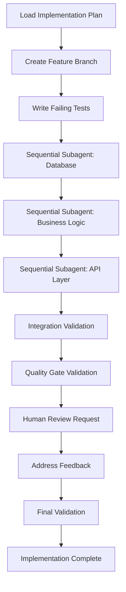

# <context>Phase 3: Code Implementation - AI Implementation Guide</context>

## <summary priority="critical">AI Code Implementation Authority</summary>

**Role Definition**: AI implements all code, creates comprehensive tests, generates documentation, and enforces quality gates under human oversight for business value validation.

**Human Oversight**: Humans review completed features against business requirements and validate strategic alignment.

**Duration**: 60-180 minutes with sequential subagent coordination for context management

**Documentation Standards**: All generated documentation must follow [LLM Documentation Guidelines](llm-documentation-guidelines.md) for optimal AI comprehension

## <method>AI Implementation Process</method>

### <step priority="critical">1. Test-Driven Implementation</step>

**AI TDD Workflow:**
```xml
<tdd-implementation-cycle>
  <step order="1" priority="critical">
    <action>Write failing tests first</action>
    <validation>Tests must fail for correct reasons</validation>
    <output>Comprehensive test suite covering all requirements</output>
  </step>
  
  <step order="2" priority="critical">
    <action>Implement minimal code to pass tests</action>
    <validation>All tests pass, no existing functionality broken</validation>
    <output>Working implementation with full test coverage</output>
  </step>
  
  <step order="3" priority="high">
    <action>Refactor for quality and performance</action>
    <validation>Tests still pass, code quality improves</validation>
    <output>Production-ready code with optimal design</output>
  </step>
</tdd-implementation-cycle>
```

**AI Test Creation Requirements:**
- **Unit Tests**: Every function and method with edge cases
- **Integration Tests**: Component interaction validation
- **End-to-End Tests**: Complete user workflow validation
- **Security Tests**: Authentication, authorization, input validation
- **Performance Tests**: Load testing and benchmark validation

### <step priority="critical">2. Sequential Implementation Coordination</step>

**AI Orchestrator Pattern:**
```yaml
Implementation Strategy:
  - Use sequential subagents for context management
  - Maintain implementation context in orchestrator
  - Coordinate file modifications to prevent conflicts
  - Validate integration points between components
  
Subagent Coordination:
  - Agent 1: Database layer implementation
  - Agent 2: Business logic implementation  
  - Agent 3: API layer implementation
  - Agent 4: Integration and validation
```

**Context Management Protocol:**
```xml
<context-inheritance>
  <universal-context>
    <philosophy>AI-as-implementer with human strategic oversight</philosophy>
    <coding-standards>Project-specific style and patterns</coding-standards>
    <security-requirements>Authentication, authorization, input validation</security-requirements>
    <testing-standards>TDD with comprehensive coverage</testing-standards>
  </universal-context>
  
  <subagent-specific-context>
    <implementation-plan>Detailed task breakdown from Phase 2</implementation-plan>
    <file-modifications>Specific files to create or modify</file-modifications>
    <integration-points>Dependencies on other subagent work</integration-points>
    <validation-criteria>Success criteria for completion</validation-criteria>
  </subagent-specific-context>
</context-inheritance>
```

### <step priority="high">3. Quality Gate Enforcement</step>

**AI Quality Validation Workflow:**
```xml
<quality-gates>
  <pre-implementation-gates>
    <gate name="Branch Validation">
      <check>On correct branch (not main/master)</check>
      <action>Create feature branch if needed</action>
    </gate>
    <gate name="Test Compilation">
      <check>All existing tests compile and pass</check>
      <action>Fix any compilation issues before proceeding</action>
    </gate>
  </pre-implementation-gates>
  
  <implementation-gates>
    <gate name="Test-First Development">
      <check>Failing tests written before implementation</check>
      <action>Write comprehensive test coverage</action>
    </gate>
    <gate name="Code Quality">
      <check>Linting passes, no warnings</check>
      <action>Run cargo clippy, fix all warnings</action>
    </gate>
    <gate name="Security Validation">
      <check>No security vulnerabilities introduced</check>
      <action>Run security audit, validate input handling</action>
    </gate>
  </implementation-gates>
  
  <completion-gates>
    <gate name="Full Test Suite">
      <check>All tests pass including new functionality</check>
      <action>Fix any failing tests, ensure full coverage</action>
    </gate>
    <gate name="Integration Validation">
      <check>Cross-component integration works correctly</check>
      <action>Run integration tests, validate API contracts</action>
    </gate>
    <gate name="Documentation Currency">
      <check>Documentation reflects implementation</check>
      <action>Update docs, add usage examples</action>
    </gate>
  </completion-gates>
</quality-gates>
```

## <implementation>AI Execution Workflow</implementation>

### <workflow>Phase 3 Implementation Pattern</workflow>



### <subagent-coordination>Sequential Subagent Management</subagent-coordination>

**Subagent Task Template:**
```yaml
Subagent: Database Implementation
Context: |
  CE-DPS AI-as-implementer philosophy
  Authentication system implementation
  TDD with comprehensive test coverage
  Rust with SQLx and PostgreSQL
Task: |
  Implement database authentication schema and repository layer
  Create migration files for user tables and authentication data
  Implement repository pattern with async/await
  Write comprehensive unit tests with test database
Files: |
  Create: migrations/001_auth_schema.sql
  Create: src/auth/repository.rs
  Create: src/auth/models.rs
  Create: tests/auth_repository_tests.rs
Constraints: |
  Follow existing database patterns in codebase
  Include comprehensive error handling
  Implement connection pooling
  Validate all database constraints
Integration: Foundation for business logic and API layer implementation
Validation: |
  All tests pass
  Migration applies successfully
  Repository implements all required methods
  Error handling comprehensive
```

**Subagent Completion Validation:**
```xml
<subagent-validation>
  <technical-completion>
    <criterion>All specified files created or modified</criterion>
    <criterion>Code compiles without warnings</criterion>
    <criterion>All tests pass</criterion>
    <criterion>Integration points documented</criterion>
  </technical-completion>
  
  <quality-standards>
    <criterion>Error handling comprehensive</criterion>
    <criterion>Security patterns implemented</criterion>
    <criterion>Performance patterns applied</criterion>
    <criterion>Documentation current</criterion>
  </quality-standards>
</subagent-validation>
```

### <anchor-test-strategy>Permanent Test Creation</anchor-test-strategy>

**Anchor Test Decision Matrix:**
```xml
<anchor-test-criteria>
  <create-anchor-test>
    <scenario>External API integrations</scenario>
    <scenario>Data persistence operations</scenario>
    <scenario>Authentication/authorization flows</scenario>
    <scenario>User input processing and validation</scenario>
    <scenario>Core business logic operations</scenario>
    <scenario>Cross-component integration points</scenario>
  </create-anchor-test>
  
  <anchor-test-requirements>
    <requirement>Permanent regression protection</requirement>
    <requirement>ANCHOR: comment with test purpose</requirement>
    <requirement>Clear failure messages</requirement>
    <requirement>Independent test execution</requirement>
    <requirement>Realistic test data and scenarios</requirement>
  </anchor-test-requirements>
</anchor-test-criteria>
```

**Anchor Test Example:**
```rust
#[tokio::test]
async fn test_jwt_token_validation() {
    // ANCHOR: JWT token validation regression test
    // Critical: Ensures JWT tokens are properly validated and expired tokens rejected
    let auth_service = create_test_auth_service().await;
    let user = create_test_user(&auth_service).await;
    
    // Valid token should authenticate successfully
    let valid_token = auth_service.create_token(&user).await.unwrap();
    assert!(auth_service.validate_token(&valid_token).await.is_ok());
    
    // Expired token should be rejected
    let expired_token = create_expired_token(&user);
    assert!(auth_service.validate_token(&expired_token).await.is_err());
    
    // Invalid signature should be rejected
    let invalid_token = "invalid.jwt.token";
    assert!(auth_service.validate_token(invalid_token).await.is_err());
}
```

## <quality-standards>AI Implementation Quality Requirements</quality-standards>

### <code-quality>Implementation Standards</code-quality>

**Code Quality Requirements:**
```yaml
Security Standards:
  - Input validation for all user data
  - SQL injection prevention through parameterized queries
  - Authentication token security (secure storage, expiration)
  - Authorization checks at all access points
  - Error messages don't leak sensitive information

Performance Standards:
  - Database connection pooling
  - Efficient query patterns
  - Appropriate indexing strategies
  - Response time < 200ms for API endpoints
  - Memory usage optimization

Testing Standards:
  - >95% test coverage
  - Unit tests for all business logic
  - Integration tests for all API endpoints
  - Security tests for authentication flows
  - Performance benchmarks for critical paths

Documentation Standards:
  - API documentation with examples
  - Code comments explaining business logic
  - Error handling documentation
  - Deployment and configuration guides
  - Troubleshooting guides for common issues
```

### <error-handling>AI Error Handling Requirements</error-handling>

**Comprehensive Error Management:**
```rust
// AI must implement structured error handling
#[derive(Debug, thiserror::Error)]
pub enum AuthError {
    #[error("Invalid credentials provided")]
    InvalidCredentials,
    
    #[error("Token has expired")]
    TokenExpired,
    
    #[error("Database operation failed: {0}")]
    DatabaseError(#[from] sqlx::Error),
    
    #[error("Serialization failed: {0}")]
    SerializationError(#[from] serde_json::Error),
}

// AI must provide user-friendly error responses
impl From<AuthError> for ApiError {
    fn from(err: AuthError) -> Self {
        match err {
            AuthError::InvalidCredentials => ApiError::Unauthorized("Invalid credentials".to_string()),
            AuthError::TokenExpired => ApiError::Unauthorized("Token expired".to_string()),
            AuthError::DatabaseError(_) => ApiError::InternalServer("Database error".to_string()),
            AuthError::SerializationError(_) => ApiError::InternalServer("Internal error".to_string()),
        }
    }
}
```

## <validation>Implementation Completion Validation</validation>

### <completion-criteria>Phase 3 Success Standards</completion-criteria>

```xml
<implementation-completion>
  <functional-requirements>
    <criterion>All features from sprint plan implemented</criterion>
    <criterion>All user stories/acceptance criteria met</criterion>
    <criterion>API endpoints working with proper validation</criterion>
    <criterion>Database operations robust and secure</criterion>
  </functional-requirements>
  
  <quality-requirements>
    <criterion>All tests pass (unit, integration, end-to-end)</criterion>
    <criterion>Code coverage >95% with meaningful tests</criterion>
    <criterion>No linting warnings or security vulnerabilities</criterion>
    <criterion>Performance requirements met</criterion>
  </quality-requirements>
  
  <documentation-requirements>
    <criterion>API documentation complete with examples</criterion>
    <criterion>Code documented with clear comments</criterion>
    <criterion>Deployment instructions current</criterion>
    <criterion>Troubleshooting guides comprehensive</criterion>
  </documentation-requirements>
  
  <business-validation>
    <criterion>Human review confirms business value delivered</criterion>
    <criterion>Feature demonstrates expected user value</criterion>
    <criterion>Integration with existing features seamless</criterion>
    <criterion>Strategic goals advanced by implementation</criterion>
  </business-validation>
</implementation-completion>
```

### <human-review-points>Strategic Validation by Humans</human-review-points>

**Human Review Focus Areas:**
- **Business Value**: Does implementation deliver expected user value?
- **Strategic Alignment**: Does feature advance business objectives?
- **User Experience**: Is the implementation user-friendly and intuitive?
- **Integration Quality**: Does feature integrate well with existing system?

**AI Review Support:**
- Provide demo environment with implemented features
- Create user journey documentation showing feature usage
- Document business value metrics and measurement approaches
- Prepare rollback plan if human review identifies issues

## <integration>Fortitude Integration for Implementation</integration>

**Implementation Knowledge Capture:**
- Successful implementation patterns and code templates
- Error handling approaches and security patterns
- Testing strategies and quality validation approaches
- Human feedback patterns and business value validation

**Implementation Knowledge Usage:**
- Apply proven code patterns before creating new approaches
- Reuse security and error handling patterns from knowledge base
- Leverage testing templates for comprehensive coverage
- Use human feedback patterns to optimize implementation approach

**Continuous Learning:**
- Capture successful subagent coordination patterns
- Learn from implementation time estimation accuracy
- Refine quality gate effectiveness based on outcomes
- Improve human review preparation based on feedback patterns