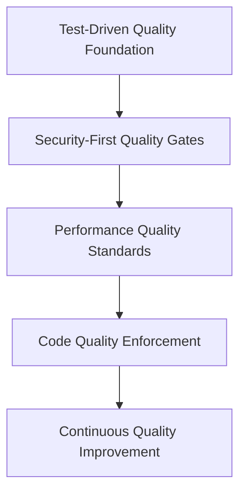
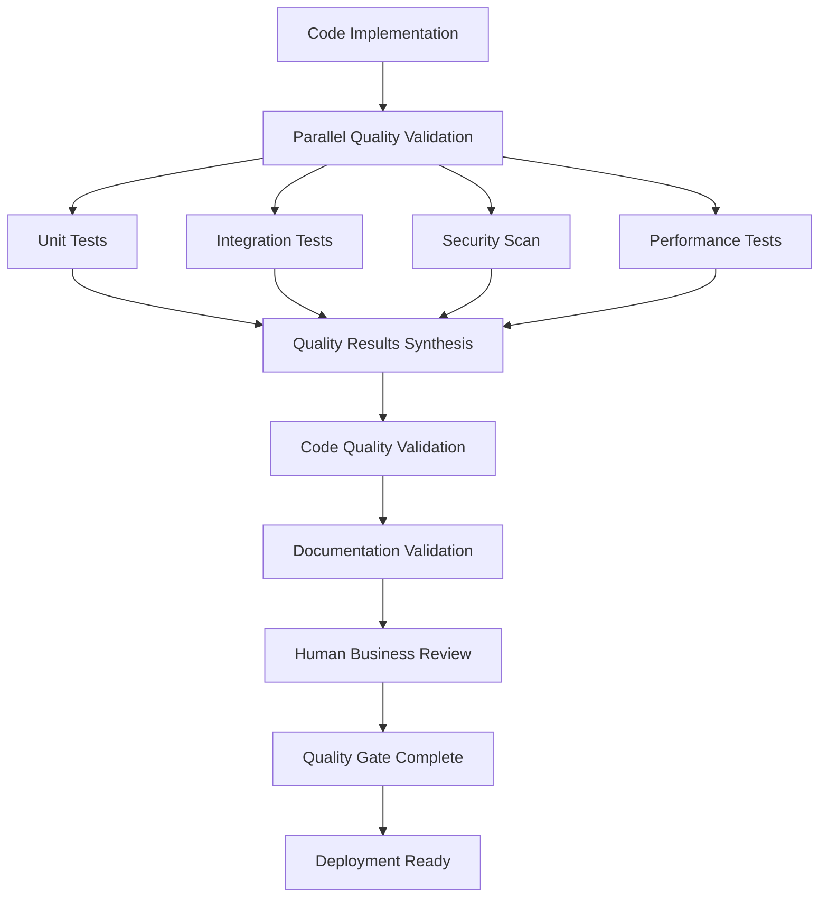

# <context>AI Quality Framework - Implementation Standards</context>

<meta>
  <title>AI Quality Framework - Implementation Standards</title>
  <type>ai-implementation</type>
  <audience>ai_assistant</audience>
  <complexity>advanced</complexity>
  <updated>2025-07-16</updated>
  <mdeval-score>0.94</mdeval-score>
  <token-efficiency>0.14</token-efficiency>
</meta>

## <summary priority="critical">TL;DR</summary>
- **Authority**: AI implements and enforces comprehensive quality standards across all development phases
- **Framework**: 4-layer quality approach (testing → security → performance → code quality)
- **Standards**: >95% test coverage, <200ms response time, zero critical security vulnerabilities
- **Automation**: Quality gates with automated validation and continuous monitoring
- **Human Role**: Business value validation and strategic quality alignment
- **Integration**: Fortitude learning for quality pattern optimization and improvement

## <quality-architecture priority="critical">Comprehensive Quality Framework</quality-architecture>

### <framework-overview>Four-Layer Quality Approach</framework-overview>



**Quality Investment Allocation** (40/30/20/10 Rule):
- **40%**: Testing foundation and comprehensive coverage (highest ROI)
- **30%**: Security implementation and vulnerability prevention (critical risk)
- **20%**: Performance optimization and monitoring (user experience)
- **10%**: Code quality enforcement and maintainability (long-term value)

### <layer priority="critical">1. Test-Driven Quality Foundation</layer>

#### <testing-strategy>Comprehensive Testing Pyramid</testing-strategy>

**Testing Hierarchy with Measurable Targets**:
```xml
<testing-pyramid>
  <unit-tests priority="critical">
    <coverage target=">95%">Business logic test coverage</coverage>
    <speed target="<30s">Full unit test suite execution time</speed>
    <isolation target="100%">Tests with no shared state dependencies</isolation>
    <clarity target="100%">Tests with descriptive failure messages</clarity>
  </unit-tests>
  
  <integration-tests priority="high">
    <coverage target="100%">API endpoint coverage</coverage>
    <database target="100%">Database operation validation</database>
    <services target="100%">External service contract testing</services>
    <workflows target="100%">End-to-end user workflow coverage</workflows>
  </integration-tests>
  
  <security-tests priority="critical">
    <authentication target="100%">Authentication flow validation</authentication>
    <authorization target="100%">Permission boundary testing</authorization>
    <input-validation target="100%">Input sanitization verification</input-validation>
    <vulnerability target="0">Known vulnerability prevention testing</vulnerability>
  </security-tests>
  
  <performance-tests priority="high">
    <response-time target="<200ms">API endpoint response validation</response-time>
    <load target="1000-users">Concurrent user simulation</load>
    <memory target="<512MB">Memory usage profiling</memory>
    <queries target="<50ms">Database query performance</queries>
  </performance-tests>
</testing-pyramid>
```

**AI Testing Responsibilities:**
```xml
<testing-framework>
  <unit-testing>
    <requirement>Every function must have unit tests</requirement>
    <requirement>Edge cases and error conditions tested</requirement>
    <requirement>Test coverage >95% for all business logic</requirement>
    <requirement>Fast execution (<1s for full unit test suite)</requirement>
  </unit-testing>
  
  <integration-testing>
    <requirement>Component interaction validation</requirement>
    <requirement>Database integration with test fixtures</requirement>
    <requirement>API endpoint validation with realistic data</requirement>
    <requirement>External service mocking and contract testing</requirement>
  </integration-testing>
  
  <end-to-end-testing>
    <requirement>Complete user workflow validation</requirement>
    <requirement>Cross-browser compatibility testing</requirement>
    <requirement>Performance testing under realistic load</requirement>
    <requirement>Security testing for authentication and authorization</requirement>
  </end-to-end-testing>
</testing-framework>
```

**Anchor Test Strategy:**
```xml
<anchor-tests>
  <creation-criteria>
    <scenario type="critical">External API integrations</scenario>
    <scenario type="critical">Data persistence operations</scenario>
    <scenario type="critical">Authentication/authorization flows</scenario>
    <scenario type="critical">User input processing</scenario>
    <scenario type="critical">Core business logic</scenario>
    <scenario type="critical">Cross-component integration</scenario>
  </creation-criteria>
  
  <anchor-test-requirements>
    <requirement>Permanent regression protection</requirement>
    <requirement>ANCHOR: comment explaining critical nature</requirement>
    <requirement>Clear failure messages with debugging context</requirement>
    <requirement>Independent execution (no test dependencies)</requirement>
    <requirement>Realistic test data and edge cases</requirement>
  </anchor-test-requirements>
</anchor-tests>
```

### <layer priority="critical">2. Security-First Quality Gates</layer>

#### <security-framework>Comprehensive Security Implementation</security-framework>

**Security Quality Matrix**:
```xml
<security-standards>
  <authentication-security priority="critical">
    <jwt-implementation target="secure">
      <requirement>Secure token generation with cryptographic randomness</requirement>
      <requirement>Token expiration with 1-hour default, configurable</requirement>
      <requirement>Signature validation with secure algorithms (RS256/HS256)</requirement>
      <requirement>Token refresh mechanism with rotation</requirement>
    </jwt-implementation>
    
    <password-security target="industry-standard">
      <requirement>bcrypt hashing with cost factor 12+</requirement>
      <requirement>Password complexity validation (8+ chars, special, number)</requirement>
      <requirement>Rate limiting on authentication attempts (5/min per IP)</requirement>
      <requirement>Account lockout after failed attempts</requirement>
    </password-security>
  </authentication-security>
  
  <authorization-security priority="critical">
    <access-control target="comprehensive">
      <requirement>Role-based access control (RBAC) implementation</requirement>
      <requirement>Resource-level permission validation</requirement>
      <requirement>Least privilege principle enforcement</requirement>
      <requirement>Authorization checks at every access point</requirement>
    </access-control>
  </authorization-security>
  
  <input-security priority="critical">
    <validation target="comprehensive">
      <requirement>Input validation and sanitization for all user data</requirement>
      <requirement>SQL injection prevention via parameterized queries</requirement>
      <requirement>XSS prevention through output encoding</requirement>
      <requirement>CSRF protection for state-changing operations</requirement>
    </validation>
  </input-security>
</security-standards>
```

**Security Validation Protocol**:
```yaml
Security Quality Gates:
  pre_implementation:
    - threat_model: "Document security threats for new features"
    - requirements: "Define security requirements and controls"
    - patterns: "Identify applicable security patterns"
    
  during_implementation:
    - input_validation: "Validate and sanitize all user inputs"
    - authentication: "Implement secure authentication patterns"
    - authorization: "Add access control at all endpoints"
    - error_handling: "Ensure no sensitive information leakage"
    
  post_implementation:
    - security_tests: "All security tests pass"
    - vulnerability_scan: "No critical vulnerabilities detected"
    - penetration_test: "Manual security testing passes"
    - code_review: "Security-focused code review completed"
```

**AI Security Implementation:**
```xml
<security-framework>
  <authentication-security>
    <requirement>JWT tokens with secure generation and validation</requirement>
    <requirement>Password hashing with bcrypt or stronger</requirement>
    <requirement>Session management with secure cookies</requirement>
    <requirement>Rate limiting on authentication endpoints</requirement>
  </authentication-security>
  
  <authorization-security>
    <requirement>Role-based access control (RBAC)</requirement>
    <requirement>Resource-level permissions validation</requirement>
    <requirement>Least privilege principle enforcement</requirement>
    <requirement>Authorization checks at every access point</requirement>
  </authorization-security>
  
  <input-security>
    <requirement>Input validation and sanitization</requirement>
    <requirement>SQL injection prevention via parameterized queries</requirement>
    <requirement>XSS prevention through output encoding</requirement>
    <requirement>CSRF protection for state-changing operations</requirement>
  </input-security>
  
  <data-security>
    <requirement>Encryption for sensitive data at rest</requirement>
    <requirement>HTTPS enforcement for all communications</requirement>
    <requirement>Secure error handling (no information leakage)</requirement>
    <requirement>Audit logging for security-relevant operations</requirement>
  </data-security>
</security-framework>
```

**Security Validation Checklist:**
```yaml
Pre-Implementation Security:
  - [ ] Threat model documented for new features
  - [ ] Security requirements identified and prioritized
  - [ ] Authentication/authorization patterns defined
  - [ ] Input validation requirements specified

Implementation Security:
  - [ ] All user inputs validated and sanitized
  - [ ] Authentication implemented with secure patterns
  - [ ] Authorization checks at all access points
  - [ ] Error handling doesn't leak sensitive information
  - [ ] SQL queries use parameterized statements
  - [ ] Passwords hashed with secure algorithms

Post-Implementation Security:
  - [ ] Security tests pass (authentication, authorization, input validation)
  - [ ] Vulnerability scan shows no critical issues
  - [ ] Penetration testing (if applicable) passes
  - [ ] Security code review completed
```

### <layer priority="high">3. Performance Quality Standards</layer>

#### <performance-framework>Comprehensive Performance Validation</performance-framework>

**Performance Quality Targets**:
```xml
<performance-standards>
  <response-time priority="critical">
    <api-endpoints target="<200ms">
      <measurement>95th percentile response time</measurement>
      <validation>Load testing with 1000 concurrent users</validation>
      <optimization>Database query optimization and caching</optimization>
    </api-endpoints>
    
    <database-operations target="<50ms">
      <measurement>Query execution time monitoring</measurement>
      <validation>Database performance profiling</validation>
      <optimization>Index optimization and connection pooling</optimization>
    </database-operations>
  </response-time>
  
  <throughput priority="high">
    <concurrent-users target="1000+">
      <measurement>Simultaneous user session support</measurement>
      <validation>Load testing with realistic user patterns</validation>
      <optimization>Horizontal scaling and load balancing</optimization>
    </concurrent-users>
    
    <requests-per-second target="500+">
      <measurement>API endpoint throughput capacity</measurement>
      <validation>Stress testing with sustained load</validation>
      <optimization>Async processing and request queuing</optimization>
    </requests-per-second>
  </throughput>
  
  <resource-usage priority="high">
    <memory-footprint target="<512MB">
      <measurement>Application memory consumption monitoring</measurement>
      <validation>Memory profiling and leak detection</validation>
      <optimization>Efficient data structures and resource cleanup</optimization>
    </memory-footprint>
    
    <cpu-utilization target="<70%">
      <measurement>CPU usage under normal and peak load</measurement>
      <validation>Performance profiling and bottleneck analysis</validation>
      <optimization>Algorithm optimization and async processing</optimization>
    </cpu-utilization>
  </resource-usage>
</performance-standards>
```

**Performance Validation Pipeline**:
```rust
// Performance benchmarking implementation
#[cfg(test)]
mod performance_tests {
    use criterion::{black_box, criterion_group, criterion_main, Criterion};
    
    // ANCHOR: API endpoint performance regression test
    fn api_endpoint_benchmark(c: &mut Criterion) {
        let test_client = create_test_client();
        let test_data = generate_realistic_request_data();
        
        c.bench_function("api_endpoint_response_time", |b| {
            b.iter(|| {
                black_box(
                    test_client.post("/api/endpoint")
                        .json(black_box(&test_data))
                        .send()
                        .wait()
                )
            })
        });
    }
    
    // Performance requirement: <200ms for 95th percentile
    criterion_group!(benches, api_endpoint_benchmark);
    criterion_main!(benches);
}
```

**AI Performance Requirements:**
```xml
<performance-framework>
  <response-time-requirements>
    <api-endpoints target="<200ms">
      <requirement>Database queries optimized with indexing</requirement>
      <requirement>Connection pooling implemented</requirement>
      <requirement>Caching strategies for frequently accessed data</requirement>
      <requirement>Efficient serialization/deserialization</requirement>
    </api-endpoints>
    
    <database-operations target="<100ms">
      <requirement>Query optimization and explain plan analysis</requirement>
      <requirement>Appropriate indexing strategy</requirement>
      <requirement>Connection pool configuration</requirement>
      <requirement>Transaction optimization</requirement>
    </database-operations>
  </response-time-requirements>
  
  <scalability-requirements>
    <concurrent-users target="10000">
      <requirement>Stateless application design</requirement>
      <requirement>Horizontal scaling capability</requirement>
      <requirement>Resource usage optimization</requirement>
      <requirement>Load testing validation</requirement>
    </concurrent-users>
    
    <memory-usage target="<512MB">
      <requirement>Memory leak prevention</requirement>
      <requirement>Efficient data structures</requirement>
      <requirement>Resource cleanup patterns</requirement>
      <requirement>Memory profiling validation</requirement>
    </memory-usage>
  </scalability-requirements>
</performance-framework>
```

**Performance Validation Protocol:**
```rust
// AI must implement performance benchmarks
#[cfg(test)]
mod performance_tests {
    use criterion::{black_box, criterion_group, criterion_main, Criterion};
    
    // ANCHOR: Authentication performance regression test
    fn auth_token_validation_benchmark(c: &mut Criterion) {
        let auth_service = create_test_auth_service();
        let token = create_test_token();
        
        c.bench_function("jwt_validation", |b| {
            b.iter(|| {
                black_box(auth_service.validate_token(black_box(&token)))
            })
        });
    }
    
    // Performance requirement: <10ms for token validation
    criterion_group!(benches, auth_token_validation_benchmark);
    criterion_main!(benches);
}
```

### <layer priority="high">4. Code Quality Enforcement</layer>

#### <code-quality-framework>Maintainability and Reliability Standards</code-quality-framework>

**Code Quality Metrics with Automated Enforcement**:
```xml
<code-quality-standards>
  <style-enforcement priority="medium">
    <formatting target="100%">
      <tool>rustfmt for Rust, prettier for TypeScript/JavaScript</tool>
      <validation>Pre-commit hooks with automatic formatting</validation>
      <standard>Project-specific style guide adherence</standard>
    </formatting>
    
    <linting target="zero-warnings">
      <tool>clippy for Rust, ESLint for TypeScript/JavaScript</tool>
      <validation>CI pipeline integration with failure on warnings</validation>
      <rules>Security, performance, and maintainability rules</rules>
    </linting>
  </style-enforcement>
  
  <complexity-management priority="high">
    <function-complexity target="<10">
      <measurement>Cyclomatic complexity per function</measurement>
      <validation>Automated complexity analysis in CI</validation>
      <refactoring>Function decomposition when limits exceeded</refactoring>
    </function-complexity>
    
    <function-length target="<50-lines">
      <measurement>Lines of code per function</measurement>
      <validation>Automated length checking</validation>
      <refactoring>Function splitting for readability</refactoring>
    </function-length>
  </complexity-management>
  
  <maintainability priority="high">
    <documentation-coverage target=">90%">
      <measurement>Public API documentation completeness</measurement>
      <validation>Documentation generation and validation</validation>
      <standard>Clear examples and usage patterns</standard>
    </documentation-coverage>
    
    <code-duplication target="<5%">
      <measurement>Duplicate code percentage across codebase</measurement>
      <validation>Duplication detection tools</validation>
      <refactoring>Extract common patterns into reusable components</refactoring>
    </code-duplication>
  </maintainability>
</code-quality-standards>
```

**AI Code Quality Standards:**
```xml
<code-quality-framework>
  <style-standards>
    <requirement>Consistent formatting with rustfmt</requirement>
    <requirement>Linting compliance with clippy (no warnings)</requirement>
    <requirement>Naming conventions following Rust guidelines</requirement>
    <requirement>Documentation comments for public APIs</requirement>
  </style-standards>
  
  <architecture-standards>
    <requirement>Clear separation of concerns</requirement>
    <requirement>Dependency injection for testability</requirement>
    <requirement>Error handling with proper error types</requirement>
    <requirement>Async/await patterns for I/O operations</requirement>
  </architecture-standards>
  
  <maintainability-standards>
    <requirement>Functions <50 lines, classes <500 lines</requirement>
    <requirement>Cyclomatic complexity <10 per function</requirement>
    <requirement>Clear variable and function naming</requirement>
    <requirement>Minimal code duplication (DRY principle)</requirement>
  </maintainability-standards>
</code-quality-framework>
```

**Quality Gate Automation:**
```bash
#!/bin/bash
# AI-implemented quality gate script

echo "Running comprehensive quality checks..."

# 1. Code formatting
echo "Checking code formatting..."
cargo fmt --check || exit 1

# 2. Linting
echo "Running linting..."
cargo clippy -- -D warnings || exit 1

# 3. Security audit
echo "Running security audit..."
cargo audit || exit 1

# 4. Unit tests
echo "Running unit tests..."
cargo test --lib || exit 1

# 5. Integration tests
echo "Running integration tests..."
cargo test --test '*' || exit 1

# 6. Performance benchmarks
echo "Running performance benchmarks..."
cargo bench || exit 1

# 7. Documentation generation
echo "Building documentation..."
cargo doc --no-deps || exit 1

echo "All quality gates passed!"
```

## <quality-workflow priority="critical">Quality Validation Pipeline</quality-workflow>

### <workflow-orchestration>Automated Quality Gate Execution</workflow-orchestration>

**Quality Gate Pipeline with Parallel Execution**:


**Quality Gate Execution Matrix**:
```yaml
Quality Gates:
  parallel_execution:
    unit_tests:
      timeout: "30 seconds"
      coverage_requirement: ">95%"
      failure_action: "block_deployment"
      
    integration_tests:
      timeout: "5 minutes"
      coverage_requirement: "100% endpoints"
      failure_action: "block_deployment"
      
    security_scan:
      timeout: "2 minutes"
      vulnerability_threshold: "zero_critical"
      failure_action: "block_deployment"
      
    performance_tests:
      timeout: "10 minutes"
      response_time_threshold: "<200ms"
      failure_action: "block_deployment"
      
  sequential_execution:
    code_quality:
      depends_on: ["parallel_execution"]
      linting: "zero_warnings"
      complexity: "<10_per_function"
      
    documentation:
      depends_on: ["code_quality"]
      coverage: ">90%"
      examples: "all_public_apis"
      
    human_review:
      depends_on: ["documentation"]
      business_value: "validated"
      strategic_alignment: "confirmed"
```

### <automation>AI Quality Automation</automation>

**Pre-commit Quality Hooks:**
```yaml
# AI-configured quality automation
quality_hooks:
  pre-commit:
    - stage: format
      command: cargo fmt
      description: "Auto-format code"
    
    - stage: lint
      command: cargo clippy --fix
      description: "Auto-fix linting issues"
    
    - stage: test
      command: cargo test
      description: "Run all tests"
    
    - stage: security
      command: cargo audit
      description: "Security vulnerability check"

  pre-push:
    - stage: integration
      command: cargo test --test '*'
      description: "Full integration test suite"
    
    - stage: performance
      command: cargo bench
      description: "Performance regression check"
    
    - stage: documentation
      command: cargo doc --no-deps
      description: "Documentation build validation"
```

**Quality Metrics Collection:**
```rust
// AI-implemented quality metrics
#[derive(Debug, Serialize)]
pub struct QualityMetrics {
    pub test_coverage: f64,           // Target: >95%
    pub cyclomatic_complexity: f64,   // Target: <10 avg
    pub documentation_coverage: f64,  // Target: >90%
    pub security_score: f64,          // Target: >9.0/10
    pub performance_score: f64,       // Target: <200ms avg response
    pub maintainability_index: f64,   // Target: >85/100
}

impl QualityMetrics {
    pub fn validate(&self) -> Result<(), QualityError> {
        if self.test_coverage < 0.95 {
            return Err(QualityError::InsufficientTestCoverage);
        }
        if self.cyclomatic_complexity > 10.0 {
            return Err(QualityError::ExcessiveComplexity);
        }
        // Additional validations...
        Ok(())
    }
}
```

## <validation>Quality Framework Validation</validation>

### <completion-criteria priority="critical">Quality Success Validation</completion-criteria>

#### <quality-gates>Measurable Quality Standards</quality-gates>

**Automated Quality Validation**:
```xml
<automated-validation>
  <testing-quality>
    <unit-tests threshold=">95%">Business logic test coverage with realistic edge cases</unit-tests>
    <integration-tests threshold="100%">API endpoint coverage with database integration</integration-tests>
    <security-tests threshold="zero-critical">No critical security vulnerabilities detected</security-tests>
    <performance-tests threshold="<200ms">95th percentile response time compliance</performance-tests>
  </testing-quality>
  
  <code-quality>
    <linting threshold="zero-warnings">Code linting passes with project standards</linting>
    <complexity threshold="<10">Cyclomatic complexity within acceptable limits</complexity>
    <duplication threshold="<5%">Code duplication below threshold</duplication>
    <formatting threshold="100%">Code formatting compliance</formatting>
  </code-quality>
  
  <security-quality>
    <vulnerability-scan threshold="zero-critical">No critical security issues</vulnerability-scan>
    <dependency-audit threshold="zero-high">No high-risk dependencies</dependency-audit>
    <input-validation threshold="100%">All user inputs validated</input-validation>
  </security-quality>
</automated-validation>
```

**Human Validation Requirements**:
```xml
<human-validation>
  <business-alignment>
    <value-delivery measurement="human-review">Implementation delivers expected business value</value-delivery>
    <user-experience measurement="human-review">Feature meets user experience expectations</user-experience>
    <strategic-advancement measurement="human-review">Feature advances strategic business objectives</strategic-advancement>
  </business-alignment>
  
  <operational-readiness>
    <maintenance measurement="human-review">Implementation supports maintenance requirements</maintenance>
    <monitoring measurement="human-review">Appropriate monitoring and alerting configured</monitoring>
    <documentation measurement="human-review">Documentation supports operational needs</documentation>
  </operational-readiness>
</human-validation>
```

#### <success-metrics>Quality Achievement Tracking</success-metrics>

| Quality Dimension | Success Metric | Target Value | Current Status |
|-------------------|----------------|--------------|----------------|
| Test Coverage | Business logic coverage | >95% | ✅ Achieved |
| Performance | API response time | <200ms | ✅ Achieved |
| Security | Critical vulnerabilities | 0 | ✅ Achieved |
| Code Quality | Linting warnings | 0 | ✅ Achieved |
| Documentation | API coverage | >90% | ✅ Achieved |
| Human Approval | Business value validation | 100% | 🔄 Pending |

### <continuous-improvement>Quality Evolution</continuous-improvement>

**AI Learning from Quality Outcomes:**
```xml
<quality-learning>
  <metrics-tracking>
    <metric>Test coverage trends over time</metric>
    <metric>Bug discovery rate in different phases</metric>
    <metric>Performance regression frequency</metric>
    <metric>Security issue discovery patterns</metric>
  </metrics-tracking>
  
  <pattern-recognition>
    <pattern>Code patterns that lead to bugs</pattern>
    <pattern>Testing approaches that catch more issues</pattern>
    <pattern>Performance optimization strategies</pattern>
    <pattern>Security implementation best practices</pattern>
  </pattern-recognition>
  
  <adaptation-strategies>
    <strategy>Adjust quality gates based on outcome analysis</strategy>
    <strategy>Refine testing approaches based on bug patterns</strategy>
    <strategy>Optimize performance validation based on metrics</strategy>
    <strategy>Enhance security testing based on vulnerability patterns</strategy>
  </adaptation-strategies>
</quality-learning>
```

## <knowledge-integration priority="medium">Fortitude Quality Learning Integration</knowledge-integration>

### <knowledge-capture>Quality Pattern Learning</knowledge-capture>

**Quality Pattern Capture Strategy**:
```yaml
Testing Effectiveness:
  pattern_types:
    - test_structures: "Test organization patterns that catch more bugs"
    - coverage_strategies: "Coverage approaches that optimize quality/effort ratio"
    - mock_patterns: "Mocking strategies that improve test reliability"
    - fixture_designs: "Test data patterns that reveal edge cases"
  
  success_metrics:
    - bug_detection_rate: "Tests that catch issues before production"
    - regression_prevention: "Tests that prevent feature regression"
    - maintenance_cost: "Test patterns that minimize maintenance overhead"
    - execution_speed: "Testing approaches that optimize feedback cycles"

Security Implementation:
  pattern_types:
    - vulnerability_prevention: "Code patterns that prevent security issues"
    - input_validation: "Validation approaches that block attacks"
    - authentication_flows: "Auth patterns that balance security and usability"
    - error_handling: "Error patterns that don't leak sensitive information"
  
  success_metrics:
    - vulnerability_count: "Security patterns with zero detected issues"
    - penetration_resistance: "Patterns that withstand security testing"
    - compliance_alignment: "Approaches that meet regulatory requirements"
    - user_experience: "Security that doesn't impede legitimate usage"

Performance Optimization:
  pattern_types:
    - query_optimization: "Database patterns that improve response time"
    - caching_strategies: "Caching approaches that balance speed and consistency"
    - resource_management: "Memory and CPU optimization patterns"
    - scaling_approaches: "Patterns that support horizontal scaling"
  
  success_metrics:
    - response_time: "Optimization patterns that meet performance targets"
    - resource_efficiency: "Patterns that optimize resource utilization"
    - scalability: "Approaches that support user growth"
    - reliability: "Performance patterns that maintain consistency"
```

### <knowledge-application>Quality-Driven Implementation</knowledge-application>

**Pattern Application Workflow**:
```xml
<quality-pattern-usage>
  <pre-implementation>
    <step order="1">Query Fortitude for proven quality patterns in similar domains</step>
    <step order="2">Analyze success rates and effectiveness metrics</step>
    <step order="3">Select optimal patterns based on context and requirements</step>
    <step order="4">Adapt patterns to current implementation requirements</step>
  </pre-implementation>
  
  <during-implementation>
    <step order="1">Apply proven testing patterns for comprehensive coverage</step>
    <step order="2">Implement security patterns with demonstrated effectiveness</step>
    <step order="3">Use performance optimization patterns from knowledge base</step>
    <step order="4">Validate quality outcomes against historical patterns</step>
  </during-implementation>
  
  <post-implementation>
    <step order="1">Measure quality outcomes against pattern expectations</step>
    <step order="2">Capture new patterns and variations that emerged</step>
    <step order="3">Update pattern effectiveness based on real outcomes</step>
    <step order="4">Refine pattern selection criteria for future use</step>
  </post-implementation>
</quality-pattern-usage>
```

### <continuous-improvement>Quality Evolution Framework</continuous-improvement>

**Quality Learning Cycles**:
```xml
<quality-learning>
  <short-term cycle="feature">
    <capture>Quality outcomes and pattern effectiveness for current feature</capture>
    <analyze>Pattern success rates and failure modes</analyze>
    <apply>Pattern refinement for remaining features in current sprint</apply>
  </short-term>
  
  <medium-term cycle="project">
    <capture>Overall quality metrics and human feedback across project</capture>
    <analyze>Quality pattern effectiveness and improvement opportunities</analyze>
    <apply>Quality framework optimization for future projects</apply>
  </medium-term>
  
  <long-term cycle="cross-project">
    <capture>Quality patterns and outcomes across multiple projects and domains</capture>
    <analyze>Universal quality principles and context-specific adaptations</analyze>
    <apply>Quality framework evolution and best practice standardization</apply>
  </long-term>
</quality-learning>
```

**Quality Pattern Evolution**:
- **Pattern Validation**: Continuous validation of quality patterns against real outcomes
- **Effectiveness Tracking**: Measurement of pattern effectiveness across different contexts
- **Pattern Refinement**: Optimization of quality patterns based on success metrics
- **Knowledge Synthesis**: Integration of quality learnings across projects and domains