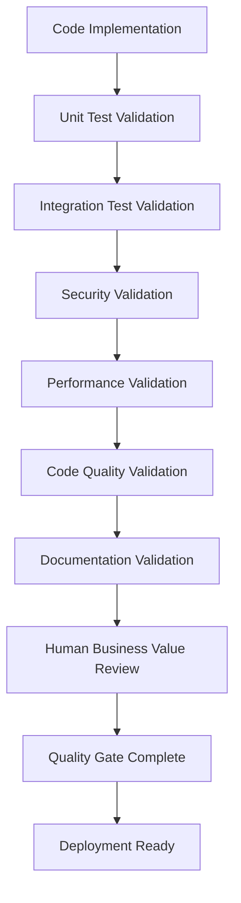

# <context>AI Quality Framework - Implementation Standards</context>

## <summary priority="critical">AI Quality Authority</summary>

**Role Definition**: AI implements and enforces comprehensive quality standards throughout all development phases under human strategic validation.

**Human Oversight**: Humans validate business value and strategic alignment of quality outcomes.

**Scope**: Quality gates, testing frameworks, security standards, performance validation, and continuous improvement

## <method>Comprehensive Quality Standards</method>

### <layer priority="critical">1. Test-Driven Quality Foundation</layer>

**AI Testing Responsibilities:**
```xml
<testing-framework>
  <unit-testing>
    <requirement>Every function must have unit tests</requirement>
    <requirement>Edge cases and error conditions tested</requirement>
    <requirement>Test coverage >95% for all business logic</requirement>
    <requirement>Fast execution (<1s for full unit test suite)</requirement>
  </unit-testing>
  
  <integration-testing>
    <requirement>Component interaction validation</requirement>
    <requirement>Database integration with test fixtures</requirement>
    <requirement>API endpoint validation with realistic data</requirement>
    <requirement>External service mocking and contract testing</requirement>
  </integration-testing>
  
  <end-to-end-testing>
    <requirement>Complete user workflow validation</requirement>
    <requirement>Cross-browser compatibility testing</requirement>
    <requirement>Performance testing under realistic load</requirement>
    <requirement>Security testing for authentication and authorization</requirement>
  </end-to-end-testing>
</testing-framework>
```

**Anchor Test Strategy:**
```xml
<anchor-tests>
  <creation-criteria>
    <scenario type="critical">External API integrations</scenario>
    <scenario type="critical">Data persistence operations</scenario>
    <scenario type="critical">Authentication/authorization flows</scenario>
    <scenario type="critical">User input processing</scenario>
    <scenario type="critical">Core business logic</scenario>
    <scenario type="critical">Cross-component integration</scenario>
  </creation-criteria>
  
  <anchor-test-requirements>
    <requirement>Permanent regression protection</requirement>
    <requirement>ANCHOR: comment explaining critical nature</requirement>
    <requirement>Clear failure messages with debugging context</requirement>
    <requirement>Independent execution (no test dependencies)</requirement>
    <requirement>Realistic test data and edge cases</requirement>
  </anchor-test-requirements>
</anchor-tests>
```

### <layer priority="critical">2. Security-First Quality Gates</layer>

**AI Security Implementation:**
```xml
<security-framework>
  <authentication-security>
    <requirement>JWT tokens with secure generation and validation</requirement>
    <requirement>Password hashing with bcrypt or stronger</requirement>
    <requirement>Session management with secure cookies</requirement>
    <requirement>Rate limiting on authentication endpoints</requirement>
  </authentication-security>
  
  <authorization-security>
    <requirement>Role-based access control (RBAC)</requirement>
    <requirement>Resource-level permissions validation</requirement>
    <requirement>Least privilege principle enforcement</requirement>
    <requirement>Authorization checks at every access point</requirement>
  </authorization-security>
  
  <input-security>
    <requirement>Input validation and sanitization</requirement>
    <requirement>SQL injection prevention via parameterized queries</requirement>
    <requirement>XSS prevention through output encoding</requirement>
    <requirement>CSRF protection for state-changing operations</requirement>
  </input-security>
  
  <data-security>
    <requirement>Encryption for sensitive data at rest</requirement>
    <requirement>HTTPS enforcement for all communications</requirement>
    <requirement>Secure error handling (no information leakage)</requirement>
    <requirement>Audit logging for security-relevant operations</requirement>
  </data-security>
</security-framework>
```

**Security Validation Checklist:**
```yaml
Pre-Implementation Security:
  - [ ] Threat model documented for new features
  - [ ] Security requirements identified and prioritized
  - [ ] Authentication/authorization patterns defined
  - [ ] Input validation requirements specified

Implementation Security:
  - [ ] All user inputs validated and sanitized
  - [ ] Authentication implemented with secure patterns
  - [ ] Authorization checks at all access points
  - [ ] Error handling doesn't leak sensitive information
  - [ ] SQL queries use parameterized statements
  - [ ] Passwords hashed with secure algorithms

Post-Implementation Security:
  - [ ] Security tests pass (authentication, authorization, input validation)
  - [ ] Vulnerability scan shows no critical issues
  - [ ] Penetration testing (if applicable) passes
  - [ ] Security code review completed
```

### <layer priority="high">3. Performance Quality Standards</layer>

**AI Performance Requirements:**
```xml
<performance-framework>
  <response-time-requirements>
    <api-endpoints target="<200ms">
      <requirement>Database queries optimized with indexing</requirement>
      <requirement>Connection pooling implemented</requirement>
      <requirement>Caching strategies for frequently accessed data</requirement>
      <requirement>Efficient serialization/deserialization</requirement>
    </api-endpoints>
    
    <database-operations target="<100ms">
      <requirement>Query optimization and explain plan analysis</requirement>
      <requirement>Appropriate indexing strategy</requirement>
      <requirement>Connection pool configuration</requirement>
      <requirement>Transaction optimization</requirement>
    </database-operations>
  </response-time-requirements>
  
  <scalability-requirements>
    <concurrent-users target="10000">
      <requirement>Stateless application design</requirement>
      <requirement>Horizontal scaling capability</requirement>
      <requirement>Resource usage optimization</requirement>
      <requirement>Load testing validation</requirement>
    </concurrent-users>
    
    <memory-usage target="<512MB">
      <requirement>Memory leak prevention</requirement>
      <requirement>Efficient data structures</requirement>
      <requirement>Resource cleanup patterns</requirement>
      <requirement>Memory profiling validation</requirement>
    </memory-usage>
  </scalability-requirements>
</performance-framework>
```

**Performance Validation Protocol:**
```rust
// AI must implement performance benchmarks
#[cfg(test)]
mod performance_tests {
    use criterion::{black_box, criterion_group, criterion_main, Criterion};
    
    // ANCHOR: Authentication performance regression test
    fn auth_token_validation_benchmark(c: &mut Criterion) {
        let auth_service = create_test_auth_service();
        let token = create_test_token();
        
        c.bench_function("jwt_validation", |b| {
            b.iter(|| {
                black_box(auth_service.validate_token(black_box(&token)))
            })
        });
    }
    
    // Performance requirement: <10ms for token validation
    criterion_group!(benches, auth_token_validation_benchmark);
    criterion_main!(benches);
}
```

### <layer priority="high">4. Code Quality Enforcement</layer>

**AI Code Quality Standards:**
```xml
<code-quality-framework>
  <style-standards>
    <requirement>Consistent formatting with rustfmt</requirement>
    <requirement>Linting compliance with clippy (no warnings)</requirement>
    <requirement>Naming conventions following Rust guidelines</requirement>
    <requirement>Documentation comments for public APIs</requirement>
  </style-standards>
  
  <architecture-standards>
    <requirement>Clear separation of concerns</requirement>
    <requirement>Dependency injection for testability</requirement>
    <requirement>Error handling with proper error types</requirement>
    <requirement>Async/await patterns for I/O operations</requirement>
  </architecture-standards>
  
  <maintainability-standards>
    <requirement>Functions <50 lines, classes <500 lines</requirement>
    <requirement>Cyclomatic complexity <10 per function</requirement>
    <requirement>Clear variable and function naming</requirement>
    <requirement>Minimal code duplication (DRY principle)</requirement>
  </maintainability-standards>
</code-quality-framework>
```

**Quality Gate Automation:**
```bash
#!/bin/bash
# AI-implemented quality gate script

echo "Running comprehensive quality checks..."

# 1. Code formatting
echo "Checking code formatting..."
cargo fmt --check || exit 1

# 2. Linting
echo "Running linting..."
cargo clippy -- -D warnings || exit 1

# 3. Security audit
echo "Running security audit..."
cargo audit || exit 1

# 4. Unit tests
echo "Running unit tests..."
cargo test --lib || exit 1

# 5. Integration tests
echo "Running integration tests..."
cargo test --test '*' || exit 1

# 6. Performance benchmarks
echo "Running performance benchmarks..."
cargo bench || exit 1

# 7. Documentation generation
echo "Building documentation..."
cargo doc --no-deps || exit 1

echo "All quality gates passed!"
```

## <implementation>Quality Validation Workflow</implementation>

### <workflow>Continuous Quality Validation</workflow>



### <automation>AI Quality Automation</automation>

**Pre-commit Quality Hooks:**
```yaml
# AI-configured quality automation
quality_hooks:
  pre-commit:
    - stage: format
      command: cargo fmt
      description: "Auto-format code"
    
    - stage: lint
      command: cargo clippy --fix
      description: "Auto-fix linting issues"
    
    - stage: test
      command: cargo test
      description: "Run all tests"
    
    - stage: security
      command: cargo audit
      description: "Security vulnerability check"

  pre-push:
    - stage: integration
      command: cargo test --test '*'
      description: "Full integration test suite"
    
    - stage: performance
      command: cargo bench
      description: "Performance regression check"
    
    - stage: documentation
      command: cargo doc --no-deps
      description: "Documentation build validation"
```

**Quality Metrics Collection:**
```rust
// AI-implemented quality metrics
#[derive(Debug, Serialize)]
pub struct QualityMetrics {
    pub test_coverage: f64,           // Target: >95%
    pub cyclomatic_complexity: f64,   // Target: <10 avg
    pub documentation_coverage: f64,  // Target: >90%
    pub security_score: f64,          // Target: >9.0/10
    pub performance_score: f64,       // Target: <200ms avg response
    pub maintainability_index: f64,   // Target: >85/100
}

impl QualityMetrics {
    pub fn validate(&self) -> Result<(), QualityError> {
        if self.test_coverage < 0.95 {
            return Err(QualityError::InsufficientTestCoverage);
        }
        if self.cyclomatic_complexity > 10.0 {
            return Err(QualityError::ExcessiveComplexity);
        }
        // Additional validations...
        Ok(())
    }
}
```

## <validation>Quality Framework Validation</validation>

### <completion-criteria>Quality Success Standards</completion-criteria>

```xml
<quality-validation>
  <automated-quality>
    <criterion>All unit tests pass with >95% coverage</criterion>
    <criterion>All integration tests pass with realistic data</criterion>
    <criterion>Security tests pass with no critical vulnerabilities</criterion>
    <criterion>Performance tests meet response time requirements</criterion>
    <criterion>Code quality tools pass with zero warnings</criterion>
  </automated-quality>
  
  <human-validation>
    <criterion>Business requirements fully satisfied</criterion>
    <criterion>User experience meets expectations</criterion>
    <criterion>Strategic goals advanced by implementation</criterion>
    <criterion>Maintenance and operational requirements addressed</criterion>
  </human-validation>
  
  <documentation-quality>
    <criterion>API documentation complete with examples</criterion>
    <criterion>Code comments explain business logic</criterion>
    <criterion>Deployment and configuration documented</criterion>
    <criterion>Troubleshooting guides comprehensive</criterion>
  </documentation-quality>
</quality-validation>
```

### <continuous-improvement>Quality Evolution</continuous-improvement>

**AI Learning from Quality Outcomes:**
```xml
<quality-learning>
  <metrics-tracking>
    <metric>Test coverage trends over time</metric>
    <metric>Bug discovery rate in different phases</metric>
    <metric>Performance regression frequency</metric>
    <metric>Security issue discovery patterns</metric>
  </metrics-tracking>
  
  <pattern-recognition>
    <pattern>Code patterns that lead to bugs</pattern>
    <pattern>Testing approaches that catch more issues</pattern>
    <pattern>Performance optimization strategies</pattern>
    <pattern>Security implementation best practices</pattern>
  </pattern-recognition>
  
  <adaptation-strategies>
    <strategy>Adjust quality gates based on outcome analysis</strategy>
    <strategy>Refine testing approaches based on bug patterns</strategy>
    <strategy>Optimize performance validation based on metrics</strategy>
    <strategy>Enhance security testing based on vulnerability patterns</strategy>
  </adaptation-strategies>
</quality-learning>
```

## <integration>Fortitude Integration for Quality Management</integration>

**Quality Knowledge Capture:**
- Successful quality gate configurations and validation approaches
- Testing patterns that effectively catch bugs and regressions
- Security implementation patterns and vulnerability prevention
- Performance optimization strategies and measurement approaches

**Quality Knowledge Usage:**
- Apply proven testing patterns for comprehensive coverage
- Reuse security patterns for consistent vulnerability prevention
- Leverage performance optimization patterns from knowledge base
- Use quality gate configurations that have proven effective

**Quality Continuous Learning:**
- Refine quality standards based on bug discovery patterns
- Improve testing approaches based on effectiveness metrics
- Optimize performance targets based on real-world usage
- Enhance security patterns based on threat landscape evolution